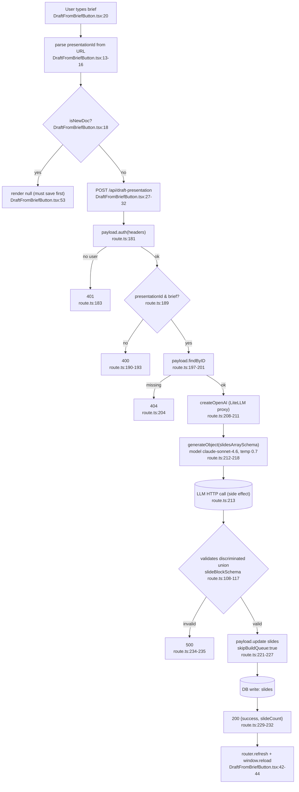

# Flowchart — ai-draft-generation

**Entry:** UI `DraftFromBriefButton.tsx:20` (`handleGenerate`) → `route.ts:176` (`POST`)

**Zod schemas** (`route.ts`): cover `:9-17`, section `:19-25`, statement `:27-33`, twoCols `:35-49`, cardGrid `:51-66`, stats `:68-81`, quotes `:83-96`, cta `:98-106`; union `:108-117`; `slidesArraySchema` min 3 max 20 `:119-121`. **`markdown` is intentionally NOT in the union** (admin-only block). `SYSTEM_PROMPT :123-174` forces cover-first/cta-last, 8–15 slides.
**External deps:** auth-and-access (`payload.auth`), content-authoring (writes `slides`), build-pipeline (sets `skipBuildQueue` to avoid requeue — but note: write itself won't trigger build since hook also needs `status===published`).
**Confidence:** High for control flow. Gap: LLM output variance under temp 0.7; only Zod-validated, no semantic post-check.
