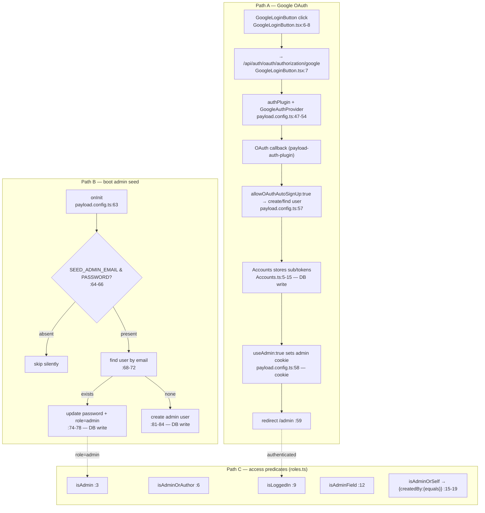

# Flowchart — auth-and-access

**Entry:** authPlugin `payload.config.ts:46-62`; seed `onInit :63-90`; predicates `src/access/roles.ts:3-19`.

**Wiring:** Presentations (`isAdminOrSelf`/`isLoggedIn`/`isAdmin`), ShareLinks (`isAdminOrAuthor`/`isAdmin`), Media (`isLoggedIn`/`isAdmin`), MarkdownBlock fields (`isAdminField`), Accounts (`isLoggedIn`/`isAdmin`). Users default role `author` (`Users.ts:20`).
**External deps:** content-storage (user upsert), `payload-auth-plugin` (`withAccountCollection`, `GoogleAuthProvider`).
**Confidence:** High for config/seed/predicates. Medium for OAuth internals (abstracted by plugin).
