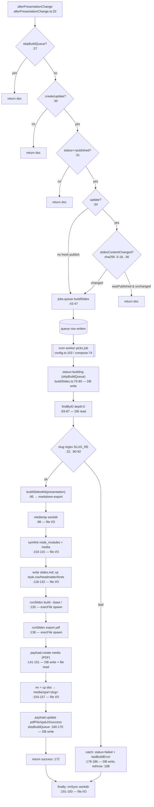

# Flowchart — build-pipeline

**Entry:** `afterPresentationChange.ts:20` (gate) → `buildSlides.ts:69` (job handler). Cron `*/1 * * * *` (`payload.config.ts:103`) + worker `docker-compose.yaml:74`.

**Constants** (`buildSlides.ts`): `SLUG_RE :22`, `SLIDEV_WORKSPACE :23`, `EXPORT_DIR :24`, `MEDIA_DIR :25`, `runSlidev :33-47` (strips `ANTHROPIC_API_KEY`, 5-min timeout, uses `node_modules/.bin/slidev` not npx).
**External deps:** markdown-export (`buildSlidesMd`), media (PDF create), content-storage (status/artifact patches), deployment (worker + shared media volume).
**Confidence:** High. Gaps: success inferred from file existence not Slidev exit code; `slidesHash` only hashes `doc.slides` (title/surface-only changes won't rebuild).
