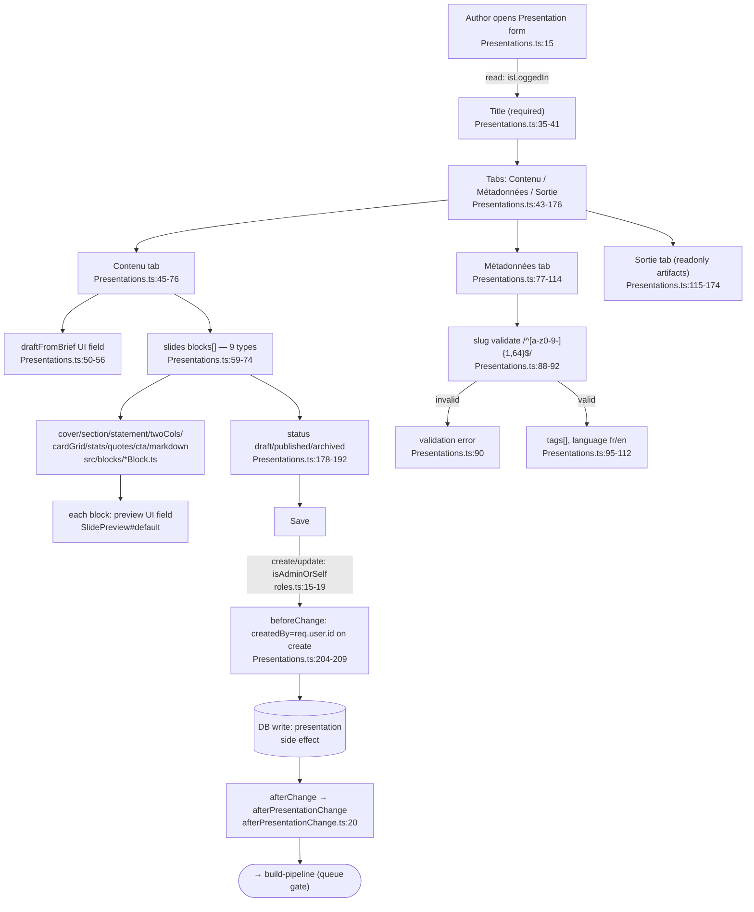

# Flowchart — content-authoring

**Entry:** `src/collections/Presentations.ts:15` · **Hooks:** `createdBy` beforeChange `:204–209`, `afterChange → afterPresentationChange` `:31–32`

**External deps:** auth-and-access (`isLoggedIn`/`isAdminOrSelf`/`isAdmin` `roles.ts:3-19`), media (block `image` upload fields), preview (`SlidePreview#default` per block), build-pipeline (afterChange handoff).
**Access:** create/update `isAdminOrSelf`, read `isLoggedIn`, delete `isAdmin` (`Presentations.ts:25-30`). MarkdownBlock fields gated by `isAdminField`.
**Confidence:** High. Gap: Payload admin form internals out of scope.
