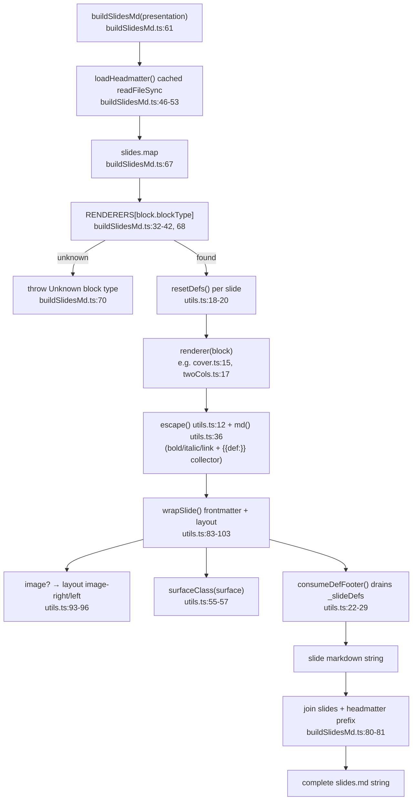

# Flowchart — markdown-export (render core)

**Entry:** `src/export/buildSlidesMd.ts:61` (`buildSlidesMd`). Pure except one cached file read.

**Core fns:** `buildSlidesMd :61`, `loadHeadmatter :46`, `RENDERERS :32-42`, `resetDefs utils.ts:18`, `wrapSlide utils.ts:83`, `consumeDefFooter utils.ts:22`, `escape utils.ts:12`, `md utils.ts:36`, `surfaceClass utils.ts:55`. Module-level mutable state `_slideDefs utils.ts:16` reset per slide.
**External deps:** none (pure). Consumed by build-pipeline + preview.
**Confidence:** High. Note: `RENDERERS` map here is the **canonical** of three copies (others in preview/page.tsx + SlidePreview.tsx) — duplication evidence.
