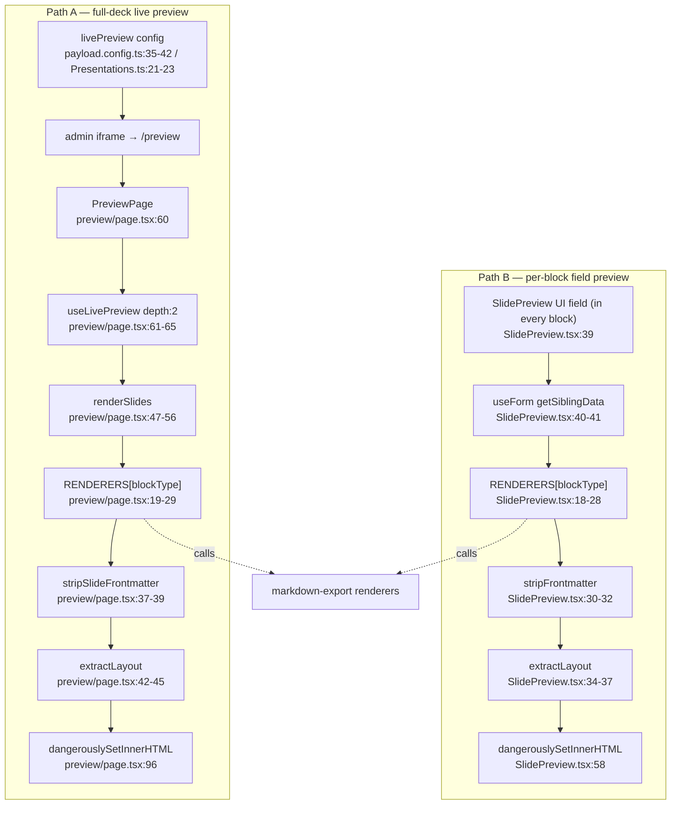

# Flowchart — preview

**Entry A (full deck):** `preview/page.tsx:60` (`PreviewPage`). **Entry B (per-block):** `SlidePreview.tsx:39`.

## ⚠️ Duplication evidence (within feature + vs markdown-export)
| Construct | Copy 1 | Copy 2 | Copy 3 |
|---|---|---|---|
| `RENDERERS` map | `preview/page.tsx:19-29` | `SlidePreview.tsx:18-28` | `buildSlidesMd.ts:32-42` |
| strip frontmatter | `stripSlideFrontmatter preview/page.tsx:37-39` | `stripFrontmatter SlidePreview.tsx:30-32` | — |
| `extractLayout` | `preview/page.tsx:42-45` | `SlidePreview.tsx:34-37` | — |

All three RENDERERS maps are byte-identical 9-key records of the same imported renderer fns. `strip*` and `extractLayout` are identical logic, one renamed.

**External deps:** markdown-export (renderers), auth-and-access (admin-gated). `@payloadcms/live-preview-react` (`useLivePreview`), `@payloadcms/ui` (`useForm`).
**Confidence:** High.
