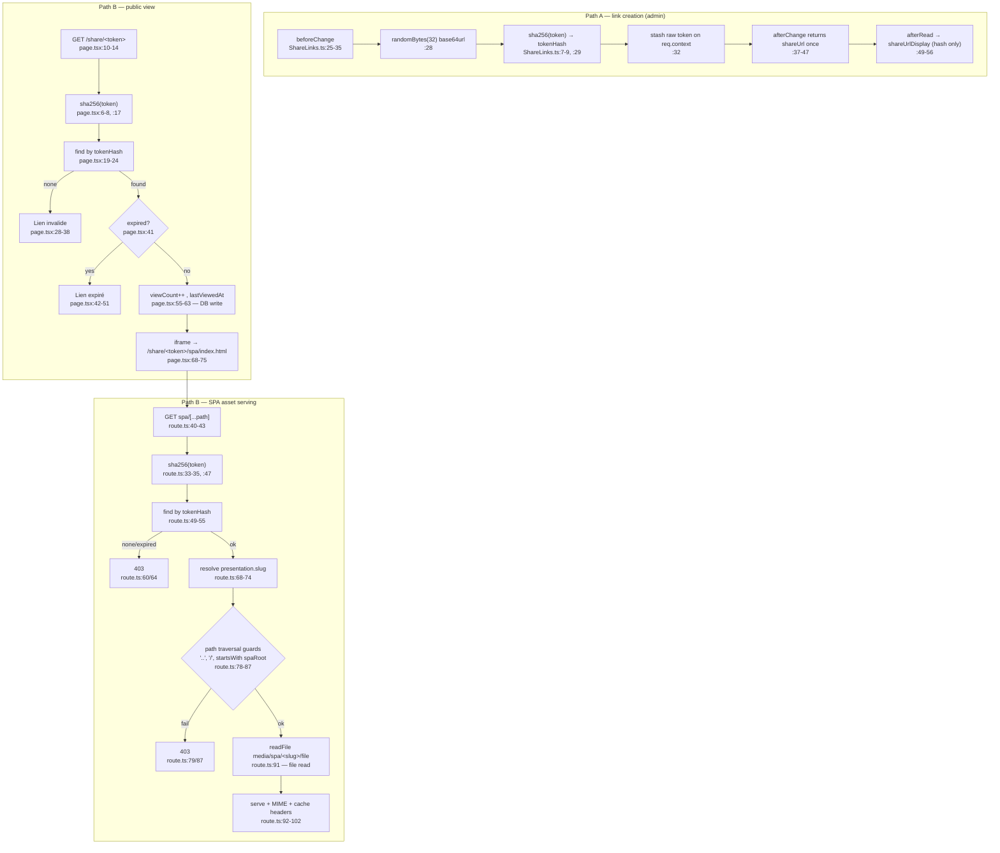

# Flowchart — share-links

**Entry:** collection `ShareLinks.ts:11`; public page `share/[token]/page.tsx:10`; SPA route `share/[token]/spa/[...path]/route.ts:40`.

## ⚠️ Duplication evidence
| Construct | Loc 1 | Loc 2 | Loc 3 |
|---|---|---|---|
| `sha256()` helper | `ShareLinks.ts:7-9` | `page.tsx:6-8` | `route.ts:33-35` |
| expiry check `new Date(expiresAt) < new Date()` | `page.tsx:41` | `route.ts:63` | — |
| tokenHash lookup `find({where:{tokenHash:{equals}}})` | `page.tsx:19-24` | `route.ts:49-55` | — |

**External deps:** auth-and-access (`isAdminOrAuthor`/`isAdmin` create/read/update `ShareLinks.ts:18-22`), content-storage (link lookup, viewCount), build-pipeline output (`media/spa/<slug>/`).
**Security notes:** 256-bit token entropy (adequate); only `sha256(token)` stored; path-traversal double-guarded; rate-limit TODO noted `route.ts:37-38`.
**Confidence:** High.
