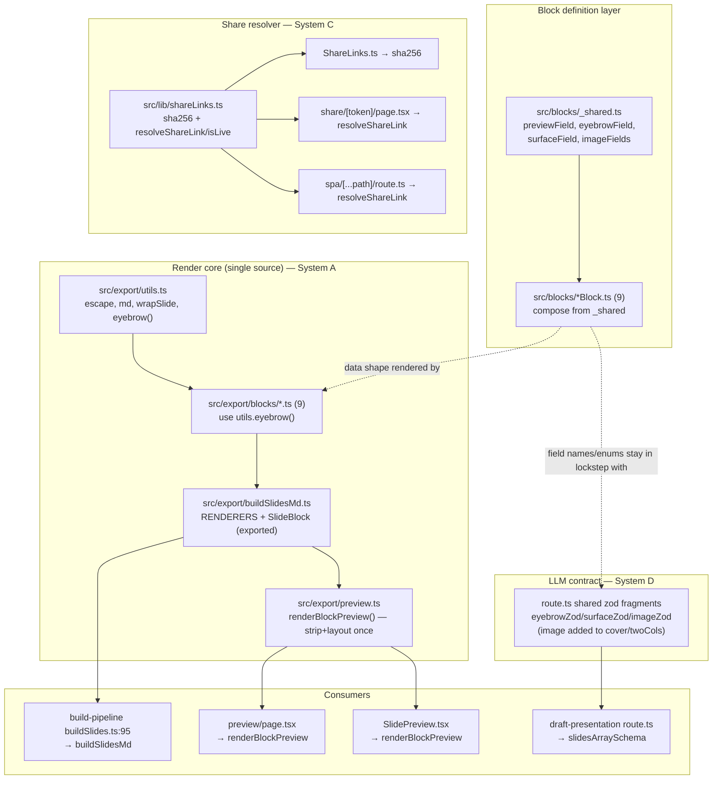

# 03 — Unified Proposal

Targets the 🔴 accidental and 🟡 structural duplications from `02-duplication-report.md`. The 🟢 items (D9 `_reusable`, D10 wrap/strip asymmetry, D11 `skipBuildQueue`) are **left as-is** — they are legitimate.

Each proposal names ONE consolidated component with ONE entry point, shows what each old call site becomes, and notes any capability loss. Deliberately avoided: new "flexibility" layers, feature flags, registries/factories where a plain shared export works, and block codegen.

---

## System A — Single render core (the export module is the only source of rendering)

**Consolidates:** D1 (RENDERERS ×3), D2 (`stripFrontmatter`/`extractLayout` ×2). Also retires layer (iv) of D8 by keeping the `SlideBlock` union in one place.

**Component:** `src/export/buildSlidesMd.ts` stays canonical; add a thin sibling for preview consumers.

- Export the existing `RENDERERS` map and `SlideBlock` union from `buildSlidesMd.ts:16-42` (currently module-private).
- New `src/export/preview.ts` exporting **one** function:
  ```ts
  // renders a single block to display-ready HTML for the admin surfaces
  export function renderBlockPreview(block: SlideBlock): { html: string; layout: string }
  ```
  It internally calls `RENDERERS[block.blockType]`, strips frontmatter, extracts layout. The strip/extract regexes live here once (move from the two components).

**Call sites become:**
| Old | New |
|---|---|
| `preview/page.tsx:19-29` local `RENDERERS` | deleted — import nothing; use `renderBlockPreview` |
| `preview/page.tsx:37-45` `stripSlideFrontmatter`+`extractLayout` | deleted |
| `preview/page.tsx:47-56` `renderSlides` | `slides.map(renderBlockPreview).filter(Boolean)` |
| `SlidePreview.tsx:18-28` local `RENDERERS` | deleted |
| `SlidePreview.tsx:30-37` `stripFrontmatter`+`extractLayout` | deleted |
| `SlidePreview.tsx:45-50` inline render | `const {html,layout} = renderBlockPreview(data)` |

**Capability loss:** none. Both surfaces already produce identical HTML; this just removes the copies. The unknown-blockType behavior unifies to one place (return `null`/skip, matching current preview behavior).

---

## System B — Shared block field kit (block schemas compose from one set of fields)

**Consolidates:** D5 (`preview` field ×9), D6 (`eyebrow`/`surface`/`image`+`imagePosition` repeated), D7 (renderer `eyebrow` fragment ×8).

**Component:** `src/blocks/_shared.ts` — plain exported field objects/factories (NOT a class hierarchy, NOT a block base-class).
```ts
export const previewField: Field            // the SlidePreview ui field
export const eyebrowField: Field            // {name:'eyebrow', type:'text', label:'Accroche', …}
export function surfaceField(opts?: { gradient?: boolean }): Field   // dark/light [+gradient]
export function imageFields(): Field[]       // [image upload, imagePosition select w/ condition]
```
Plus one renderer helper in `src/export/utils.ts`:
```ts
export function eyebrow(text: string | null | undefined, marginClass = 'mb-8'): string
```

**Call sites become:**
| Old | New |
|---|---|
| 9× inline `preview` field (`CoverBlock.ts:75` … `MarkdownBlock.ts:40`) | `previewField` (spread/append) |
| 7× inline `eyebrow` (`CoverBlock.ts:9` …) | `eyebrowField` |
| `surface` in `CoverBlock.ts:40` / `SectionBlock.ts:28` / `StatsBlock.ts:22` | `surfaceField({gradient:true})` for cover, `surfaceField()` for section/stats |
| `image`+`imagePosition` in `CoverBlock.ts:51-71` / `SectionBlock.ts:38-58` / `TwoColsBlock.ts:54-74` | `...imageFields()` |
| 8× renderer eyebrow ternary (`cover.ts:24` …) | `eyebrow(block.eyebrow, 'mb-6')` |

**Capability loss:** none — `surfaceField({gradient})` parameterizes the one legitimate variation (cover offers gradient, others don't). Margin-class variation in `eyebrow()` is a parameter. The differing card markup in cardGrid/twoCols/quotes is **left inline** (genuinely different shapes — not forced into a helper).

---

## System C — Share-link resolver (one place hashes + validates a token)

**Consolidates:** D3 (`sha256` ×3), D4 (lookup + expiry ×2).

**Component:** `src/lib/shareLinks.ts`
```ts
export function sha256(value: string): string
// returns the live link or null (handles hash + lookup + expiry in one place)
export async function resolveShareLink(payload, token: string): Promise<ShareLink | null>
```

**Call sites become:**
| Old | New |
|---|---|
| `ShareLinks.ts:7-9` local `sha256` | import `sha256` |
| `share/[token]/page.tsx:6-8` `sha256` + `:17-24` lookup + `:41` expiry | `const link = await resolveShareLink(payload, token)` → null ⇒ render invalid/expired |
| `spa/[...path]/route.ts:33-35` `sha256` + `:47-55` lookup + `:63` expiry | `const link = await resolveShareLink(payload, token)` → null ⇒ 403 |

**Capability loss / nuance:** the page distinguishes *invalid* vs *expired* (two messages); the route returns 403 for both. Keep `resolveShareLink` returning `null` for both, and let the page do its own expiry-vs-missing distinction only if product wants the two messages — i.e. return `{ link, expired }` or expose a tiny `isExpired(link)`. Pick the **simpler**: return the raw link if found and a shared `isLive(link)` predicate; page keeps its two-message UX, route collapses to one. No behavior lost.

---

## System D — Close the block-shape drift (targeted, NOT codegen)

**Consolidates:** D8. This is 🟡 — only the *drift* is accidental; the three runtime representations are legitimately separate.

**Two concrete, minimal moves (reject full codegen for 9 stable blocks):**

1. **Fix the live correctness bug now:** add `image`/`imagePosition` to the cover and twoCols Zod schemas (`route.ts:9-17`, `:35-49`) so AI drafts can carry images — OR add an explicit `// image fields intentionally excluded from AI drafting` comment if that's the real intent. Today the omission is silent and undocumented (the Block + renderer support images; the LLM contract can't express them).

2. **Mirror System B on the Zod side:** `src/app/(payload)/api/draft-presentation/route.ts` gets shared zod fragments that pair 1:1 with System B's field kit — `eyebrowZod`, `surfaceZod({gradient})`, `imageZod` — so the same "shared field" concept exists once per runtime and review catches mismatches. Keep each block's Zod object hand-written from those fragments (explicit > generated for 9 blocks).

**Explicitly rejected:** a single `BlockDescriptor` that generates Payload fields + TS type + Zod. For 9 stable, visually-distinct blocks the generator would be more code than it deletes and would obscure the admin field config — the "new abstraction for flexibility" anti-pattern. Revisit only if block count grows materially or blocks become user-defined.

**Capability loss:** none; this *adds* missing capability (AI image drafting) and makes the `CLAUDE.md` 6-place invariant safer without hiding it.

---

## Combined unified flowchart



## Net effect
- 3 RENDERERS maps → 1 exported map + 1 `renderBlockPreview`.
- 2 strip/extract pairs → 0 (inside `preview.ts`).
- 3 `sha256` + 2 lookup/expiry → 1 resolver.
- 9 `preview` fields + repeated eyebrow/surface/image → 1 field kit.
- 8 renderer eyebrow ternaries → 1 `eyebrow()` helper.
- Silent Zod image-drift → fixed + shared fragments.
- ~No new abstraction layers; mostly **deletion + a few small shared exports**.
