# F1 — Presentation Authoring & Collection

The Presentation authoring happy path starts in the Payload admin form for the `Presentations` collection, where access rules gate create/read/update/delete, the admin form exposes a title plus three tabs (`Contenu`, `Métadonnées`, `Sortie`), authors edit slide blocks and metadata, then save. On create, the readonly sidebar `createdBy` relationship is stamped from `req.user?.id` before persistence; Payload then writes the document, and the registered `afterChange` hook hands off to the external build-trigger feature (F2) without this flowchart entering the build internals. The `Sortie` tab contains readonly build artifact fields (`lastBuildStatus`, `spaUrl`, `pdfFile`, `coverImage`, `lastBuildError`) and mounts `BuildStatusField`, which polls the saved document and renders live build state, web link, or failure text.

```mermaid
flowchart TD
  A["Admin form opens<br/>src/collections/Presentations.ts:18"] --> B["Collection admin title/columns/preview<br/>src/collections/Presentations.ts:21"]
  B --> C["Access rules gate authoring<br/>src/collections/Presentations.ts:28"]
  C --> D["Title field outside tabs<br/>src/collections/Presentations.ts:39"]
  D --> E["Tabs container<br/>src/collections/Presentations.ts:46"]

  E --> F["Contenu tab<br/>src/collections/Presentations.ts:49"]
  F --> G["AI draft UI field<br/>src/collections/Presentations.ts:53"]
  G --> H["DraftFromBriefButton renders<br/>src/components/DraftFromBriefButton.tsx:15"]
  H --> I["Existing doc can POST brief<br/>src/components/DraftFromBriefButton.tsx:27"]
  F --> J["Slides blocks field<br/>src/collections/Presentations.ts:62"]
  J --> K["Layout block choices<br/>src/collections/Presentations.ts:66"]

  E --> L["Métadonnées tab<br/>src/collections/Presentations.ts:81"]
  L --> M["Slug field required unique<br/>src/collections/Presentations.ts:85"]
  M --> N["Auto slug beforeValidate<br/>src/collections/Presentations.ts:97"]
  N --> O["Slug max constant<br/>src/lib/slug.ts:1"]
  M --> P["Slug format validation<br/>src/collections/Presentations.ts:113"]
  P --> Q["Slug regex helper<br/>src/lib/slug.ts:3"]
  L --> R["Tags field<br/>src/collections/Presentations.ts:120"]
  L --> S["Language select<br/>src/collections/Presentations.ts:127"]

  E --> T["Sortie tab<br/>src/collections/Presentations.ts:141"]
  T --> U["BuildStatusField UI mount<br/>src/collections/Presentations.ts:145"]
  U --> V["BuildStatusField polls document<br/>src/components/BuildStatusField.tsx:27"]
  V --> W["Poll presentations API depth 0<br/>src/components/BuildStatusField.tsx:37"]
  W --> X["Render status from lastBuildStatus<br/>src/components/BuildStatusField.tsx:58"]
  X --> Y["Render spaUrl success link<br/>src/components/BuildStatusField.tsx:93"]
  X --> Z["Render lastBuildError failure<br/>src/components/BuildStatusField.tsx:103"]

  T --> AA["Readonly lastBuildStatus field<br/>src/collections/Presentations.ts:154"]
  AA --> AB["Build status constants<br/>src/lib/status.ts:1"]
  T --> AC["Readonly spaUrl field<br/>src/collections/Presentations.ts:170"]
  T --> AD["Readonly pdfFile upload field<br/>src/collections/Presentations.ts:179"]
  T --> AE["Readonly coverImage field<br/>src/collections/Presentations.ts:189"]
  T --> AF["Readonly lastBuildError field<br/>src/collections/Presentations.ts:199"]

  E --> AG["Sidebar status select<br/>src/collections/Presentations.ts:212"]
  AG --> AH["Presentation status constants<br/>src/lib/status.ts:2"]
  E --> AI["Readonly createdBy sidebar field<br/>src/collections/Presentations.ts:228"]

  J --> AJ["Author edits blocks<br/>src/collections/Presentations.ts:62"]
  M --> AK["Author edits metadata<br/>src/collections/Presentations.ts:85"]
  AG --> AL["Author edits publication status<br/>src/collections/Presentations.ts:212"]
  AJ --> AM["Author saves form<br/>src/collections/Presentations.ts:37"]
  AK --> AM
  AL --> AM

  AM --> AN["createdBy beforeChange hook<br/>src/collections/Presentations.ts:238"]
  AN --> AO["Create operation stamps req.user id<br/>src/collections/Presentations.ts:240"]
  AN --> AP["Update operation leaves createdBy unchanged<br/>src/collections/Presentations.ts:241"]
  AO --> AQ["DB persist presentation<br/>src/collections/Presentations.ts:18"]
  AP --> AQ
  AQ --> AR["afterChange hook registered<br/>src/collections/Presentations.ts:35"]
  AR --> AS["External queue trigger edge -> F2<br/>src/collections/Presentations.ts:16"]
```

## Side effects

- **DB write on save** — saving persists the `Presentations` document (`src/collections/Presentations.ts:18`), including title, tabs fields, sidebar `status`, and create-only `createdBy`.
- **Create-only author stamp** — `createdBy` `beforeChange` returns `req.user?.id` on create (`src/collections/Presentations.ts:240`), `undefined` on update (`:241`).
- **Slug normalization** — empty slug derived from title in `beforeValidate` (`:97`), using `SLUG_MAX` (`src/lib/slug.ts:1`).
- **Hook trigger** — registers `afterChange: [afterPresentationChange]` (`:35`). External edge into F2; build internals not diagrammed.
- **Admin polling** — `BuildStatusField` polls `/api/presentations/${id}?depth=0` (`src/components/BuildStatusField.tsx:37`) every `POLL_MS` (`:21`); read-only, not part of save path.
- **AI draft button** — out-of-path; can POST `/api/draft-presentation` (`src/components/DraftFromBriefButton.tsx:34`) for saved docs (F6).

## External dependencies

- **F2 build trigger** — `afterPresentationChange` imported `:16`, registered `:35` (edge only).
- **F6 AI draft** — `DraftFromBriefButton` mounted `:53`, implemented `src/components/DraftFromBriefButton.tsx:15`.
- **F4 blocks** — `slides` blocks field `:62`, block types `:66`.
- **Auth helpers** — `isLoggedIn`/`isAdminOrSelf`/`isAdmin` imported `:3`, wired `:28`.
- **Media collection** — readonly `pdfFile`/`coverImage` relate to `COLLECTIONS.media` (`:181`, `:191`).

## Sources consulted
- `src/collections/Presentations.ts:1-247`, `src/components/DraftFromBriefButton.tsx:1-139`, `src/components/BuildStatusField.tsx:1-122`, `src/components/ShareUrlField.tsx:1-136` (skimmed), `src/lib/slug.ts:1-3`, `src/lib/status.ts:1-4`.

## Confidence + gaps
High. Grounded in full reads + grep cross-check. Intentional gaps: `afterPresentationChange` internals belong to F2; individual block schemas belong to F4.
