# F2 — Build Trigger → Job → Artifact Publishing

## Summary

The F2 pipeline starts when the `Presentations` collection `afterChange` hook runs. The hook avoids queueing when the request context includes `skipBuildQueue`, only proceeds for `create`/`update`, only queues published presentations, and skips updates where the previous doc was already published and the slides hash did not change. If guards pass, it queues a Payload job with task slug `buildSlides` and input `{ presentationId }`.

The `buildSlides` handler marks the presentation `building`, fetches the full presentation, validates the slug, calls `buildSlidesMd()` (external F3 node), prepares a temp Slidev workdir, runs Slidev build + PDF export via `execFile`, uploads the PDF to Media, copies the SPA `dist/` to `media/spa/<slug>/`, then patches `pdfFile`/`spaUrl`/`lastBuildStatus: success`. Every patch uses `context: { skipBuildQueue: true }`, short-circuiting the hook and preventing requeue loops. On failure it patches `lastBuildStatus: failed` + `lastBuildError` and rethrows. The temp workdir is removed in `finally` on both paths.

## Mermaid Flowchart

```mermaid
flowchart TD
  A["Presentation create/update afterChange<br/>src/hooks/afterPresentationChange.ts:24"] --> B{"skipBuildQueue set?<br/>src/hooks/afterPresentationChange.ts:31"}
  B -- "yes" --> Z0["Terminal: skipped by context<br/>src/hooks/afterPresentationChange.ts:31"]
  B -- "no" --> C{"operation create or update?<br/>src/hooks/afterPresentationChange.ts:34"}
  C -- "no" --> Z1["Terminal: skipped non-create/update<br/>src/hooks/afterPresentationChange.ts:34"]
  C -- "yes" --> D{"status published?<br/>src/hooks/afterPresentationChange.ts:35<br/>src/lib/status.ts:2"}
  D -- "no" --> Z2["Terminal: skipped unpublished<br/>src/hooks/afterPresentationChange.ts:35"]
  D -- "yes" --> E{"update with previousDoc?<br/>src/hooks/afterPresentationChange.ts:38"}
  E -- "create" --> H["Queue task buildSlides<br/>src/hooks/afterPresentationChange.ts:47"]
  E -- "update" --> F["Compute wasPublished + slidesContentChanged<br/>src/hooks/afterPresentationChange.ts:39"]
  F --> G{"was published and slides unchanged?<br/>src/hooks/afterPresentationChange.ts:43"}
  G -- "yes" --> Z3["Terminal: skipped unchanged slides<br/>src/hooks/afterPresentationChange.ts:43"]
  G -- "no" --> H

  H --> I["Job input presentationId<br/>src/hooks/afterPresentationChange.ts:49"]
  I --> J["buildSlidesTask registered<br/>src/payload.config.ts:104"]
  J --> K["Cron autoRun every min, limit 5<br/>src/payload.config.ts:106"]
  K --> M["buildSlidesTask handler<br/>src/jobs/buildSlides.ts:74"]

  M --> N["Patch lastBuildStatus building<br/>src/jobs/buildSlides.ts:80"]
  N --> Nctx["Patch uses skipBuildQueue<br/>src/jobs/buildSlides.ts:84<br/>src/lib/context.ts:1"]
  Nctx -. "requeue-prevention" .-> B

  Nctx --> O["Fetch presentation depth 0<br/>src/jobs/buildSlides.ts:88"]
  O --> P["Read slug<br/>src/jobs/buildSlides.ts:94"]
  P --> Q{"slug valid?<br/>src/jobs/buildSlides.ts:95<br/>src/lib/slug.ts:2"}
  Q -- "no" --> X["Throw invalid slug<br/>src/jobs/buildSlides.ts:96"]
  Q -- "yes" --> R["External F3 buildSlidesMd()<br/>src/jobs/buildSlides.ts:100"]

  R --> S["Create temp workdir<br/>src/jobs/buildSlides.ts:103"]
  S --> T["Symlink slidev-workspace node_modules<br/>src/jobs/buildSlides.ts:108"]
  T --> U["Optional symlink media dir<br/>src/jobs/buildSlides.ts:117"]
  U --> V["Write slides.md<br/>src/jobs/buildSlides.ts:123"]
  V --> W["Copy style.css + headmatter.yaml<br/>src/jobs/buildSlides.ts:126"]
  W --> Y["Optional copy fonts<br/>src/jobs/buildSlides.ts:132"]

  Y --> AA["execFile Slidev build<br/>src/jobs/buildSlides.ts:142"]
  AA --> AD["execFile Slidev export PDF<br/>src/jobs/buildSlides.ts:145"]
  AD --> AE["Read slides.pdf<br/>src/jobs/buildSlides.ts:148"]
  AE --> AF["Create Media doc with PDF<br/>src/jobs/buildSlides.ts:149"]
  AF --> AG["Resolve media/spa/slug target<br/>src/jobs/buildSlides.ts:161<br/>src/lib/paths.ts:6"]
  AG --> AH["Remove prior SPA target<br/>src/jobs/buildSlides.ts:163"]
  AH --> AI["Copy dist to media/spa/slug<br/>src/jobs/buildSlides.ts:164"]
  AI --> AJ["Patch pdfFile/spaUrl/success<br/>src/jobs/buildSlides.ts:167"]
  AJ --> AJctx["Success patch skipBuildQueue<br/>src/jobs/buildSlides.ts:179"]
  AJctx -. "requeue-prevention" .-> B
  AJctx --> AK["Return success<br/>src/jobs/buildSlides.ts:182"]
  AK --> AL["Finally cleanup workdir<br/>src/jobs/buildSlides.ts:199"]
  AL --> ZS["Terminal: SUCCESS artifacts published<br/>src/jobs/buildSlides.ts:182"]

  X --> FA["Catch + stringify error<br/>src/jobs/buildSlides.ts:183"]
  AA -. "exec failure" .-> FA
  AD -. "exec failure" .-> FA
  AF -. "upload failure" .-> FA
  AI -. "copy failure" .-> FA
  FA --> FB["Patch failed + lastBuildError<br/>src/jobs/buildSlides.ts:188"]
  FB --> FBctx["Failure patch skipBuildQueue<br/>src/jobs/buildSlides.ts:195"]
  FBctx -. "requeue-prevention" .-> B
  FBctx --> FC["Rethrow error<br/>src/jobs/buildSlides.ts:198"]
  FC --> FD["Finally cleanup workdir<br/>src/jobs/buildSlides.ts:199"]
  FD --> ZF["Terminal: FAILED status recorded<br/>src/jobs/buildSlides.ts:192"]
```

## Key guards
1. `skipBuildQueue` short-circuit — `afterPresentationChange.ts:31` (key: `lib/context.ts:1`)
2. create/update only — `afterPresentationChange.ts:34`
3. published only — `afterPresentationChange.ts:35` (`lib/status.ts:2`)
4. already-published unchanged slides skip — `afterPresentationChange.ts:39-43`
5. slug validation — `buildSlides.ts:95` (`lib/slug.ts:2`)
6. requeue prevention on all 3 job patches — `buildSlides.ts:84`, `:179`, `:195`

## Side effects
- **Process spawns (x2):** Slidev build `buildSlides.ts:142`, PDF export `:145` (via `runSlidev`/`execFile` `:38-46`)
- **File I/O:** temp workdir `:103`, symlinks `:108`/`:117`, write `slides.md` `:123`, copy css/yaml `:126`/`:129`, optional fonts `:132`, read PDF `:148`, remove+copy SPA `:163`/`:164`, cleanup `:199`
- **DB writes:** queue job `afterPresentationChange.ts:47`; presentation patches building `:80`, success `:167`, failure `:188`; Media create `:149`

## External dependencies
- **F3 markdown** — `buildSlidesMd()` `buildSlides.ts:100` (import `:17`), treated as opaque node
- **F1 presentation doc** — hook payload `afterPresentationChange.ts:24-28`; job fetch `buildSlides.ts:88`
- **Media collection** — PDF upload to `COLLECTIONS.media` `:149`
- **Slidev workspace** — local binary `:42`, workspace path `:29`
- **Paths lib** — `MEDIA_DIR`/`spaDir`/`spaUrl`/artifact names `lib/paths.ts:3-8`

## Confidence + gaps
High. Direct reads of hook + job + config + lib constants. F3 internals intentionally not traced (single node). Media schema out of scope. `afterChange`-on-job-patch behavior is guarded explicitly via `skipBuildQueue`.
