# F3 — Export Renderers & Markdown Build

## Summary

F3 is the shared rendering core that converts Payload presentation block data into Slidev-flavored markdown. The fan-out point is `RENDERERS` in `src/export/renderers.ts`, a registry keyed by `blockType` importing all nine block renderers. Two paths reuse it:

1. **Build path** — `buildSlidesMd()` maps `presentation.slides` through `RENDERERS[block.blockType]`, builds deck headmatter, merges the first slide's frontmatter into the headmatter block, and joins slides with blank lines.
2. **Preview path** — `renderBlockPreview()` looks up the same registry, renders one block, strips the slide frontmatter fence, extracts layout, returns `{ html, layout }`.

**Key finding:** eight `*BlockData` types are hand-defined locally in `src/export/blocks/*.ts`; only `StatementBlockData` is imported from the spec (`src/blocks/spec/statement.ts:69`).

## Mermaid Flowchart

```mermaid
flowchart TD
  PayloadBlock["Payload slide block data<br/>src/export/renderers.ts:11"] --> SlideBlockUnion["SlideBlock union of 9 types<br/>src/export/renderers.ts:11"]
  SlideBlockUnion --> Registry["RENDERERS keyed by blockType<br/>src/export/renderers.ts:22"]

  Registry --> CoverRenderer["renderCover<br/>src/export/blocks/cover.ts:16"]
  Registry --> SectionRenderer["renderSection<br/>src/export/blocks/section.ts:14"]
  Registry --> StatementRenderer["renderStatement<br/>src/export/blocks/statement.ts:7"]
  Registry --> TwoColsRenderer["renderTwoCols<br/>src/export/blocks/twoCols.ts:18"]
  Registry --> CardGridRenderer["renderCardGrid<br/>src/export/blocks/cardGrid.ts:17"]
  Registry --> StatsRenderer["renderStats<br/>src/export/blocks/stats.ts:15"]
  Registry --> QuotesRenderer["renderQuotes<br/>src/export/blocks/quotes.ts:15"]
  Registry --> CtaRenderer["renderCta<br/>src/export/blocks/cta.ts:14"]
  Registry --> MarkdownRenderer["renderMarkdown<br/>src/export/blocks/markdown.ts:9"]

  CoverRenderer --> WrapSlide["wrapSlide emits frontmatter/body<br/>src/export/utils.ts:100"]
  SectionRenderer --> WrapSlide
  StatementRenderer --> WrapSlide
  TwoColsRenderer --> WrapSlide
  CardGridRenderer --> WrapSlide
  StatsRenderer --> WrapSlide
  QuotesRenderer --> WrapSlide
  CtaRenderer --> WrapSlide
  MarkdownRenderer --> MarkdownFrontmatter["Passthrough frontmatter/content<br/>src/export/blocks/markdown.ts:18"]

  KTokens["K class token SSOT<br/>src/export/classNames.ts:9"] --> WrapSlide
  Utils["escape/md/eyebrow/surface/grid<br/>src/export/utils.ts:16"] --> WrapSlide

  Registry --> BuildDispatch["buildSlidesMd dispatch<br/>src/export/buildSlidesMd.ts:38"]
  BuildDispatch --> UnknownBuild["Throw unknown block type<br/>src/export/buildSlidesMd.ts:40"]
  BuildDispatch --> ResetDefs["resetDefs before each slide<br/>src/export/buildSlidesMd.ts:43"]
  BuildDispatch --> HeadmatterLoad["load headmatter.yaml<br/>src/export/buildSlidesMd.ts:17"]
  HeadmatterLoad --> HeadOpen["Deck headmatter title + YAML<br/>src/export/buildSlidesMd.ts:55"]
  BuildDispatch --> FirstFmMerge["Merge first slide frontmatter<br/>src/export/buildSlidesMd.ts:61"]
  FirstFmMerge --> JoinSlides["join [head, ...rest] blank lines<br/>src/export/buildSlidesMd.ts:67"]

  Registry --> PreviewDispatch["renderBlockPreview lookup<br/>src/export/preview.ts:13"]
  PreviewDispatch --> UnknownPreview["null for unknown<br/>src/export/preview.ts:14"]
  PreviewDispatch --> PreviewTry["errors degrade to null<br/>src/export/preview.ts:16"]
  PreviewTry --> StripFrontmatter["Strip per-slide frontmatter<br/>src/export/preview.ts:22"]
  PreviewTry --> ExtractLayout["Extract layout or default<br/>src/export/preview.ts:23"]
  StripFrontmatter --> PreviewResult["Return html + layout<br/>src/export/preview.ts:24"]
  ExtractLayout --> PreviewResult

  BuildConsumer["F2 build job consumes buildSlidesMd<br/>src/jobs/buildSlides.ts:100"] --> BuildDispatch
  FrontendPreview["F-Preview consumes renderBlockPreview<br/>src/app/(frontend)/preview/page.tsx:19"] --> PreviewDispatch
  AdminPreview["Admin SlidePreview consumes renderBlockPreview<br/>src/components/SlidePreview.tsx:28"] --> PreviewDispatch
```

## TYPE SOURCE SPLIT

| Block | Renderer | `*BlockData` source | Kind | Evidence |
|---|---|---|---|---|
| `cover` | renderCover | `src/export/blocks/cover.ts:4` | **Local** | `export type CoverBlockData = {` |
| `section` | renderSection | `src/export/blocks/section.ts:4` | **Local** | `export type SectionBlockData = {` |
| `statement` | renderStatement | `src/blocks/spec/statement.ts:69` (imported at `src/export/blocks/statement.ts:1`) | **Spec-derived** | `import type { StatementBlockData } from '../../blocks/spec/statement'` |
| `twoCols` | renderTwoCols | `src/export/blocks/twoCols.ts:4` | **Local** | `export type TwoColsBlockData = {` |
| `cardGrid` | renderCardGrid | `src/export/blocks/cardGrid.ts:4` | **Local** | `export type CardGridBlockData = {` |
| `stats` | renderStats | `src/export/blocks/stats.ts:4` | **Local** | `export type StatsBlockData = {` |
| `quotes` | renderQuotes | `src/export/blocks/quotes.ts:4` | **Local** | `export type QuotesBlockData = {` |
| `cta` | renderCta | `src/export/blocks/cta.ts:4` | **Local** | `export type CtaBlockData = {` |
| `markdown` | renderMarkdown | `src/export/blocks/markdown.ts:1` | **Local** | `export type MarkdownBlockData = {` |

**`statement` is the only block whose renderer data contract is not duplicated** — it imports from the spec. The other 8 hand-define the same shape that also exists in their Payload config and the AI route schema.

## Slidev separator nuance
`buildSlidesMd` does NOT join with literal `---`. Each renderer already starts with its own `---` frontmatter fence; adding another would create an empty frontmatter block. Effective separator = the per-renderer frontmatter fence; slides joined with `\n\n` (`buildSlidesMd.ts:67`).

## Side effects
**None persistent.** Renderers return strings. `wrapSlide`/`md` mutate in-memory slide-scoped `_slideDefs` state (`utils.ts:46`). `buildSlidesMd` reads + module-caches `headmatter.yaml` (`buildSlidesMd.ts:15`, `:20`) — read/cache only, no write. `buildSlidesMd` throws on unknown block (`:40`); `renderBlockPreview` catches → null (`preview.ts:16`).

## External dependencies
- **Consumed by:** F2 build (`buildSlides.ts:100`), F-Preview page (`preview/page.tsx:19`), admin `SlidePreview` (`SlidePreview.tsx:28`)
- **Depends on:** block data contracts (8 local + 1 spec-derived), `classNames.ts:9`, `utils.ts:16/44/100`, `ARTIFACTS.headmatter` (`lib/paths.ts:11`), `gray-matter` (parse.ts), node `fs/path/url` (buildSlidesMd.ts:1-3)

## Confidence + gaps
High. All 9 renderer files read. Type-source split confirmed.
