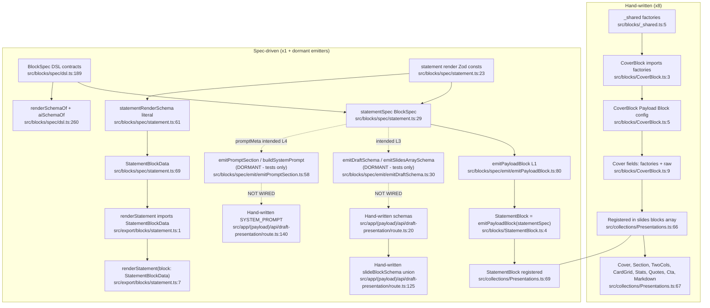

# F4+F5 — Content Authoring Blocks + Block Spec DSL Emitters

## Summary

Two block-authoring paths run side by side:

1. **Hand-written path (8 registered blocks)** — `src/blocks/*Block.ts` import field factories from `_shared.ts`, export a `Block` config directly, registered into the `slides` blocks field.
2. **Spec-driven path (1 production block + dormant emitters)** — `statement` is the pilot. `spec/statement.ts` authors render-Zod consts + `BlockSpec` + render-schema literal. Production uses the spec for **L1 Payload config** (`emitPayloadBlock`) and **L2 renderer type** (`StatementBlockData`) only. The **L3 AI schema** and **L4 prompt** emitters exist with tests but are NOT wired into the production draft route.

## Mermaid flowchart



## SSOT COVERAGE (what the spec actually drives in production today)

| Layer | Hand-written blocks (x8) | `statement` (spec pilot) |
|---|---|---|
| **L1 Payload config** | Hand-written (`CoverBlock.ts:5` … `MarkdownBlock.ts:6`) | **Spec-driven** via `emitPayloadBlock(statementSpec)` (`StatementBlock.ts:4`) |
| **L2 renderer type** | Hand-written local types (`export/blocks/cover.ts:4`) | **Spec-driven** `StatementBlockData` (`statement.ts:69` → `export/blocks/statement.ts:1`) |
| **L3 AI schema** | Hand-written (`route.ts:20-124`) | **NOT spec-driven** — `statementSchema` hand-written at `route.ts:38`; emitter `emitDraftSchema.ts:30` dormant |
| **L4 prompt** | Hand-written (`route.ts:140`) | **NOT spec-driven** — statement prompt lines hand-written `route.ts:159`; emitter `emitPromptSection.ts:58` dormant |

So the spec drives **2 of 4 layers for exactly 1 of 9 blocks.**

## Dormant emitter grep evidence

```sh
rg -n "import .*emitDraftSchema|import .*emitSlidesArraySchema|import .*emitPromptSection|import .*buildSystemPrompt" src
```

```text
src/blocks/spec/emit/__tests__/emitDraftSchema.test.ts:12:import { emitDraftSchema, emitSlidesArraySchema } from '../emitDraftSchema';
src/blocks/spec/emit/__tests__/emitPromptSection.test.ts:4:import { buildSystemPrompt, emitPromptSection } from '../emitPromptSection';
```

**Only test files import the L3/L4 emitters.** No production importer under `src`. Confirmed dormant.

## Side effects
None (build-time/config architecture only).

## External dependencies
- **F3** — consumes L2 `StatementBlockData`; target for the other 8 hand-written renderer types
- **F6** — target for dormant L3 schema + L4 prompt emitters (currently bypassed)
- **Presentations** — registration site `Presentations.ts:62-76`

## Confidence + gaps
High. Files read directly; registration + dormant status verified via grep. Representative hand-written block = Cover; spec pilot = Statement. Did not read all 8 hand-written renderer bodies (F3 covers those).
