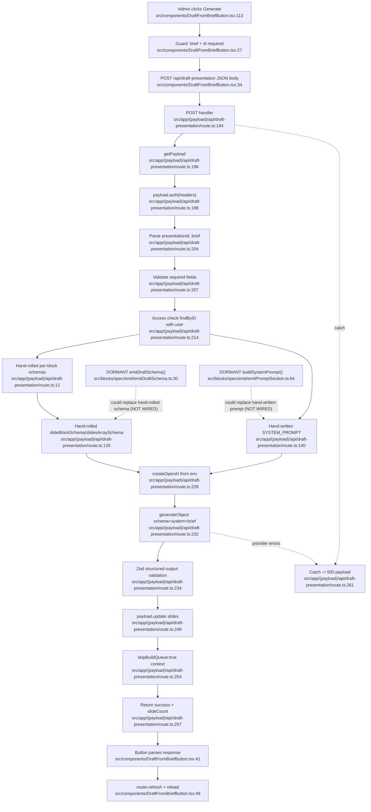

# F6 — AI Draft Generation

## Summary

Admin authors use `DraftFromBriefButton` to send a saved presentation id + natural-language brief to `POST /api/draft-presentation`. The route authenticates via Payload, verifies access, uses a **hand-rolled** Zod union plus a **hand-written** system prompt, calls `generateObject` through an OpenAI-compatible endpoint (`OPENAI_BASE_URL`/`OPENAI_API_KEY`), then patches `presentation.slides` with `context: { skipBuildQueue: true }`. The button refreshes + reloads the admin form.

The F5 emitter files exist but are **not** imported by the route (grep for `emitDraftSchema`/`emitPromptSection`/`buildSystemPrompt` in the route returned no matches).

## Mermaid

## Duplication targets vs F5 emitters
- **Schema:** route hand-rolls `slideBlockSchema`/`slidesArraySchema` (`route.ts:120-138`); `emitDraftSchema()`/`emitSlidesArraySchema()` (`emitDraftSchema.ts:30`/`:41`) are designed to replace this but are dormant.
- **Prompt:** route hand-writes `SYSTEM_PROMPT` (`route.ts:140-192`); `buildSystemPrompt()`/`emitPromptSection()` (`emitPromptSection.ts:64`/`:58`) dormant.
- **Import confirmation:** route imports only Next/Payload/AI-SDK/Zod/`COLLECTIONS`/`CTX` (`route.ts:1-10`); grep for emitter names in route = no matches.

## skipBuildQueue rationale
The AI patch sets `skipBuildQueue:true` (`route.ts:254`) so replacing draft slides does not immediately enqueue a build (F2 hook short-circuits). Authors inspect/edit AI blocks before publishing/building.

## Side effects
- **External HTTP:** browser POST (`DraftFromBriefButton.tsx:34`); server LLM call `generateObject` (`route.ts:232`)
- **DB reads:** auth (`route.ts:198`), presentation access lookup (`route.ts:214`)
- **DB write:** slides patch (`route.ts:249`, field `slides: object.slides` `:252`)
- **UI:** loading/error state, `router.refresh()` + `window.location.reload()` (`DraftFromBriefButton.tsx:49-52`)

## External dependencies
- **F1** — `COLLECTIONS.presentations` read+write (`route.ts:216`, `:250`)
- **F5 dormant emitters** — intended-but-unused source (`emitDraftSchema.ts:30`, `emitPromptSection.ts:64`)
- **Auth** — `payload.auth` (`route.ts:198`)
- **lib/context** `CTX.skipBuildQueue` (`route.ts:254`); **lib/collections** `COLLECTIONS` (`route.ts:216`)
- **AI SDK** — `createOpenAI`/`generateObject` (`route.ts:5-6`, `:228-246`)

## Confidence + gaps
High. Line-level reads of button + route + emitter files; import absence grep-confirmed. `afterPresentationChange` internals not re-traced (belong to F2); skipBuildQueue effect inferred from explicit flag + F2 guard.
