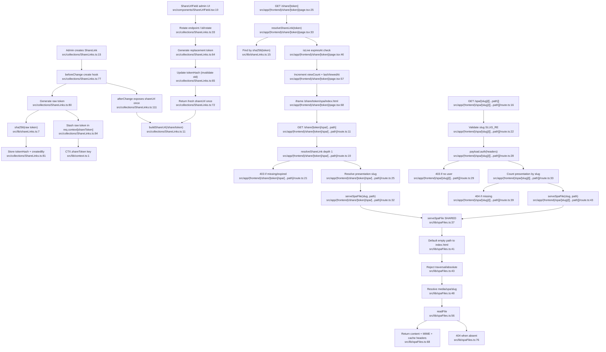

# F7 — Sharing & SPA Serving

## Summary

F7 implements two access models for the same built Slidev SPA artifacts:

1. **Share-link creation/rotation** — generates an opaque raw token, stores only `sha256(token)`, exposes the raw URL once (on create or after rotate).
2. **Public viewing** — `/share/[token]` hashes the incoming token, resolves the link, checks expiry, increments analytics, iframes a token-gated SPA route.
3. **Private viewing** — `/spa/[slug]/...` validates slug, authenticates a Payload user, checks the presentation exists, serves the same SPA path.

The two SPA routes diverge **only** in access checks and converge on `serveSpaFile` (`src/lib/spaFiles.ts`), which does traversal-safe reads from `media/spa/<slug>/`.

## Mermaid

## DIVERGENCE note
**token-gated vs auth-gated; converge at serveSpaFile.** Public route: token resolve + expiry + slug extraction (`share/[token]/spa/[...path]/route.ts:19-32`). Private route: slug validation + Payload auth + presentation existence (`spa/[slug]/[[...path]]/route.ts:22-43`). Both call `serveSpaFile` (`lib/spaFiles.ts:37`). **Verdict: LEGITIMATE SPECIALIZATION** — different trust models, shared low-level serving.

## Side effects
- **DB writes:** share create (token gen `ShareLinks.ts:80`, store hash `:81`), rotate (`:64-65`), public-view analytics `viewCount`/`lastViewedAt` (`share/[token]/page.tsx:57-61`)
- **File I/O:** `serveSpaFile` reads `media/spa/<slug>/` (`spaFiles.ts:56`, root `:48`), 404 on missing (`:76`)

## External dependencies
- **Auth** — role helpers (`ShareLinks.ts:5`), rotate ownership check (`:36`), private route `payload.auth` (`spa/[slug]/.../route.ts:28`)
- **F2 artifacts** — both routes need built SPA under `media/spa/<slug>/` (`spaFiles.ts:30`)
- **Lib** — `shareLinks.ts` (hash/resolve/isLive), `spaFiles.ts` (serve), `CTX.shareToken` (`context.ts:1`), `spaDir`/`INDEX_HTML` from `lib/paths`

## Confidence + gaps
High. Scope read directly; convergence on `serveSpaFile` explicit in both routes. `spaDir`/`INDEX_HTML` from `lib/paths` outside read scope.
