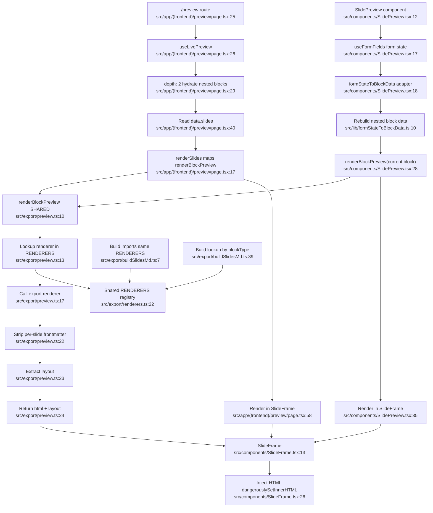

# F8 — Live Preview & Inline Slide Preview

## Summary

Two browser-side preview entry points converge on the same preview adapter:

1. **Live preview page** — `/preview` subscribes via `useLivePreview({ depth: 2 })`, maps hydrated blocks through `renderBlockPreview`, renders each in `SlideFrame`.
2. **Inline admin preview** — `SlidePreview` subscribes to Payload form state, uses `formStateToBlockData` to rebuild the current block into saved-document shape, passes it to `renderBlockPreview`, renders in `SlideFrame`.

Both reuse `renderBlockPreview` (`src/export/preview.ts`), which imports the same `RENDERERS` registry (`src/export/renderers.ts:22`) the build path uses (`src/export/buildSlidesMd.ts:7`). **The preview path adds only a browser wrapper that strips per-slide frontmatter and extracts layout — no renderer duplication.**

## Mermaid

## Shared-core note
`preview.ts` imports `RENDERERS` (`preview.ts:1`) and dispatches by blockType (`:13`); registry is `renderers.ts:22`. Build path imports the same registry (`buildSlidesMd.ts:7`) and dispatches (`:39`). **Preview and build share the same renderer registry** — preview only adds frontmatter-stripping + layout extraction for browser display.

## Inline-only adapter
`formStateToBlockData` is unique to the admin inline path — imported `SlidePreview.tsx:7`, called `:18`, implemented `lib/formStateToBlockData.ts:10`. It rebuilds nested block data from Payload's flat form-state map so renderers receive the same shape as saved data.

## Side effects
**None beyond client rendering.** No persistence, mutations, jobs, file writes, or Slidev invocation. Browser-only: `useLivePreview` subscription (`preview/page.tsx:26`), `useFormFields` subscription (`SlidePreview.tsx:17`), in-memory markdown→HTML (`preview.ts:10`), `dangerouslySetInnerHTML` (`SlideFrame.tsx:26`).

## External dependencies
- **F3 shared core** — `renderers.ts:22` registry; preview wrapper `preview.ts:1`; build path `buildSlidesMd.ts:7`/`:39`
- **F1 presentation/form data** — `PresentationData.slides` (`preview/page.tsx:40`); form state via `useFormFields` (`SlidePreview.tsx:17`)
- **lib/formStateToBlockData** — `formStateToBlockData.ts:10` (inline path only)

## Confidence + gaps
High. All scoped files read + `renderers.ts`/`buildSlidesMd.ts` verified for shared-registry confirmation. Individual renderer internals (F3) and the admin field config mounting `SlidePreview` out of scope.
