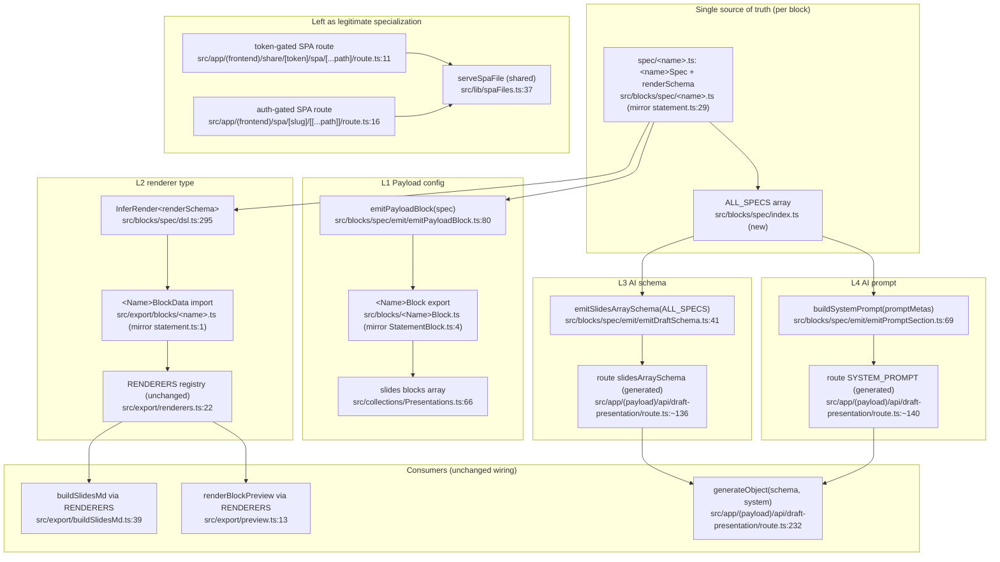

# Unified Proposal

This document is the orchestrator's synthesis. Phases 0–2 described what **is**; this describes what **should be**. The guiding principle: **finish the migration the codebase already started.** The `src/blocks/spec/` DSL is not a new abstraction to introduce — it exists, is documented, and has passing tests. The fix is to *adopt* it everywhere and *delete* the parallel hand-maintained copies. No new layers, no feature flags, no registries-for-flexibility.

The legitimately-specialized concern (D4, the two SPA routes) is explicitly left untouched.

---

## Unified system: one `BlockSpec` per block drives all four projections

### Consolidated component
- **Single entry point per block:** `src/blocks/spec/<name>.ts` exporting `<name>Spec: BlockSpec` + `<name>RenderSchema` + `<Name>BlockData` (the exact shape `statement.ts` already demonstrates).
- **Four projections, all existing, all pure:**
  - **L1 Payload config** ← `emitPayloadBlock(spec)` (`src/blocks/spec/emit/emitPayloadBlock.ts:80`)
  - **L2 renderer type** ← `InferRender<typeof <name>RenderSchema>` (`src/blocks/spec/dsl.ts:295`)
  - **L3 AI Zod schema** ← `emitSlidesArraySchema(allSpecs)` (`src/blocks/spec/emit/emitDraftSchema.ts:41`)
  - **L4 AI prompt** ← `buildSystemPrompt(allSpecs.map(s => s.promptMeta))` (`src/blocks/spec/emit/emitPromptSection.ts:69`)
- **One spec registry:** `src/blocks/spec/index.ts` (new, ~12 lines) exporting `ALL_SPECS: BlockSpec[]`. This is the single array that L3 and L4 iterate. It is a plain array literal, not a factory.

### What each old call site becomes

**Resolves D1, D7 (block shape), D8, D10 (raw-field & schema repetition):**

| Old (per block, ×8) | New |
|---|---|
| `src/blocks/CoverBlock.ts` hand-written `Block` (`:5-33`) | `export const CoverBlock = emitPayloadBlock(coverSpec)` (mirrors `StatementBlock.ts:4`) |
| `src/export/blocks/cover.ts:4-14` local `CoverBlockData` | `import type { CoverBlockData } from '../../blocks/spec/cover'` (mirrors `statement.ts:1`) |
| `src/app/(payload)/api/draft-presentation/route.ts:26-118` per-block Zod | deleted — generated by `emitSlidesArraySchema(ALL_SPECS)` |
| `route.ts:120-138` hand-rolled union | deleted — `emitSlidesArraySchema` returns it |
| `route.ts:140-192` hand-written prompt | deleted — `buildSystemPrompt(...)` returns it |
| `_shared.ts` raw-field boilerplate (D8) | folded into spec `rawField(...)` authoring |

**Resolves D2 (AI schema):** in `route.ts`, replace the local `slidesArraySchema` const with:
```ts
import { emitSlidesArraySchema } from '@/blocks/spec/emit/emitDraftSchema';
import { ALL_SPECS } from '@/blocks/spec';
const slidesArraySchema = emitSlidesArraySchema(ALL_SPECS);
```
The `generateObject({ schema: slidesArraySchema, ... })` call at `route.ts:234` is unchanged.

**Resolves D3 (AI prompt):** in `route.ts`, replace the `SYSTEM_PROMPT` constant with:
```ts
import { buildSystemPrompt } from '@/blocks/spec/emit/emitPromptSection';
const SYSTEM_PROMPT = buildSystemPrompt(ALL_SPECS.flatMap(s => s.promptMeta ? [s.promptMeta] : []));
```
The `generateObject({ system: SYSTEM_PROMPT, ... })` at `route.ts:235` is unchanged. (Prereq: author `promptMeta` for the 7 not-yet-migrated AI-draftable blocks, mirroring `statement.ts:52-57`.)

**Resolves D5 (`InferRender`):** `src/blocks/spec/emit/renderType.ts:17` re-exports from the DSL instead of redeclaring:
```ts
export type { InferRender } from '../dsl';
```
keeping only its test-only `Equal`/`Expect`.

**Resolves D6 (`adminFetch`):** delete `src/lib/adminFetch.ts`, OR adopt it in `DraftFromBriefButton.tsx:34` and `ShareUrlField.tsx:32` (both hand-roll `fetch` with credentials today). Pathfinder recommends **adopt** — it removes two more bits of fetch boilerplate.

**Resolves D9 (eyebrow):** route `cover.ts:24`, `cardGrid.ts:18`, `quotes.ts:19`, `cta.ts:15` through `renderEyebrow` (`utils.ts:20`), extending the helper for the CTA dark variant.

### What stays exactly as-is
- **`src/export/renderers.ts:22`** — the `RENDERERS` registry and `SlideBlock` union remain a thin one-liner-per-block map. Build (`buildSlidesMd.ts:39`) and preview (`preview.ts:13`) already share it. No change beyond importing spec-derived types.
- **`src/collections/Presentations.ts:66-76`** — block registration stays a flat array of emitted `Block`s. One line per block.
- **D4 SPA routes** — `share/[token]/spa/.../route.ts` and `spa/[slug]/.../route.ts` keep their distinct access checks; both keep calling `serveSpaFile` (`spaFiles.ts:37`). **Untouched.**

### Loss of capability — assessed
- **None functional.** All four projections already work for `statement`; extending to 8 more blocks is mechanical.
- **Risk:** the spec migration must preserve the AI-side media omission (`route.ts:25`/`:52`) — handled by the DSL's `ai: false` per-field flag (`dsl.ts:161-162`, see `image`/`preview` handling). Verify via the existing parity tests in `spec/emit/__tests__/` and the `pnpm test` suite (Vitest, `src/**/__tests__/**/*.test.ts`).
- **Risk:** `payload-types.ts` field order is load-bearing (`dsl.ts:186-188`). Migrated specs must preserve field order; run `pnpm generate:types` and diff after each block.

---

## After-state: combined Mermaid



## Sequencing rationale
Do D2 + D3 **first** (cheap, wire two existing emitters, prove they match the hand-rolled output via tests) — this de-risks the big migration. Then migrate the 8 blocks (D1/D7), which mechanically dissolves D8/D10 and lets you delete the per-block route schemas. D5/D6/D9 are trivial cleanups that can land anytime. The handoff prompts in `04-handoff-prompts.md` are ordered accordingly.
