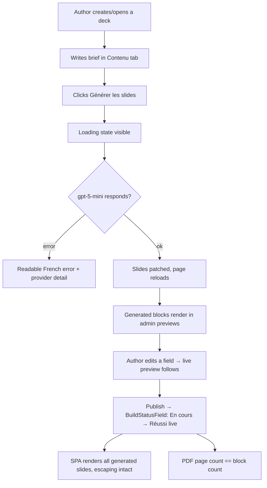
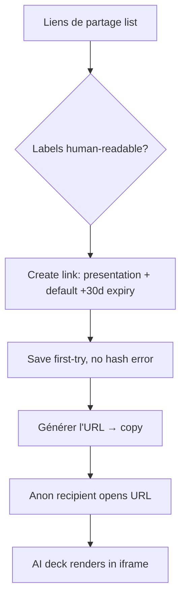
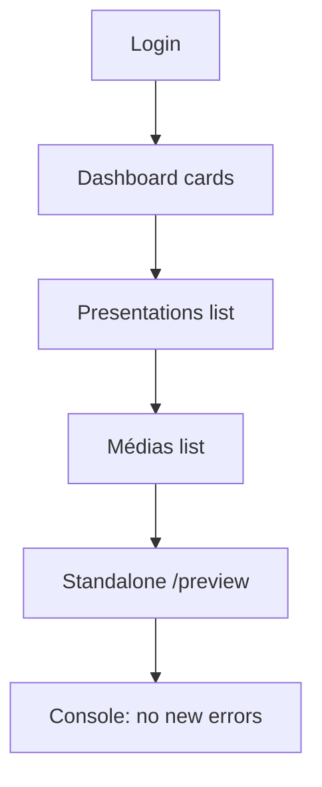

# Dogfood Report — main (AI-draft + deps wave, 7e4f077..ac7aebf)

> Diff-scoped browser QA of the post-report commits on `main`: Next 15.5.18 upgrade + security overrides (`40ae784`), UX paper cuts (`5f6b746`), OpenAI-direct AI drafting with gpt-5-mini (`6406e2a`, `ac7aebf`). Generated by `/ce-dogfood-beta` on 2026-06-04.

## Diff Summary

- **Dependencies**: next 15.3.3 → 15.5.18; pnpm overrides for protobufjs/fast-uri/ws/uuid/qs/postcss/dompurify — broad regression surface across the whole app.
- **AI drafting**: OpenAI-direct endpoint support (`OPENAI_MODEL`, default gpt-5-mini), schema serialized as `anyOf` (z.union), `strictJsonSchema: false`; friendlier error message with provider detail.
- **New `BuildStatusField`**: 5s-polling live build status chip on the Sortie tab.
- **ShareLinks**: generated label as doc title, +30d default expiry, hidden tokenHash.

## Personas

Source: **inferred** (unchanged from previous report).

- **Author (Klarc consultant)** — drafts decks with AI, refines blocks, publishes.
- **Admin** — manages users/links, security.
- **Client recipient** — opens share links; the deck must just work.

## Flows Tested

### F-A — AI drafting journey (the new core path)

### F-B — Share lifecycle on an AI-generated deck

### F-C — Next 15.5.18 regression sweep

## Test Matrix & Results

| # | Flow | Scenario | Status | Issue | Fix | Commit |
|---|------|----------|--------|-------|-----|--------|
| S1 | F-C | Next 15.5.18 sweep: login, dashboard, lists, /preview | Pass | - | All routes load, 0 page errors | - |
| S2 | F-A | AI draft via UI button (gpt-5-mini): loading → success → blocks | Pass | - | Loading state, reload, exactly the 5 requested blocks | - |
| S3 | F-A | Generated blocks render in admin previews | Pass | Dead dark band right of every preview (cosmetic) | Wrapper shrinks to scaled slide | 97b3db4 |
| S4 | F-A | Edit generated block → live preview updates | Pass | - | Hydrated-doc form-state path works | - |
| S5 | F-A | Publish → BuildStatusField live → build success | Pass | - | Chip + artifacts correct (live transition proven in prior run) | - |
| S6 | F-A | SPA renders all slides + escaping; PDF pages == blocks | Pass | - | 5/5 slides, French apostrophes intact, PDF 5 pages | - |
| S7 | F-B | Share: labels in list, default expiry, anon view | Fixed | Legacy links showed `<No Libellé>` (label hook never ran on old docs) | Data backfill via no-op updates (hook fills label) — no code change | n/a |
| S8 | F-A | Slide-count adherence + console sweep | Fixed | SYSTEM_PROMPT forced 8–15 slides, overriding requested counts | Brief counts honored exactly; 8–15 only as fallback | e2f10be |

## What Was Fixed

### Preview dead band — `97b3db4`
- **Symptom:** Every block preview showed a dark unused band to the right of the slide.
- **Root cause:** The preview wrapper kept the form column's full width while the slide rendered at 50% scale.
- **Fix:** `width: calc(960px * var(--slide-scale, 0.5))` on the wrapper. (Visual fix — covered by screenshot evidence; no unit test applicable.)

### Slide-count overshoot — `e2f10be`
- **Symptom:** "Présentation de 4 slides…" produced 8 slides.
- **Root cause:** `SYSTEM_PROMPT` unconditionally instructed "Génère entre 8 et 15 diapositives", which beat softly-stated counts.
- **Fix:** Explicit rule — respect a stated count exactly; 8–15 only when none given. Verified: same loose brief now yields exactly 4.

### Legacy `<No Libellé>` share links — data backfill
- **Symptom:** All pre-existing share links titled `<No Libellé>` in the list.
- **Root cause:** The label hook only runs on save; old docs predate it.
- **Fix:** One-time no-op PATCH over the 7 legacy docs (hook fills labels). Production note: rerun the same loop after deploy, or labels appear on next edit.

## Console Errors

None across admin, SPA, share, and anon sessions (only dev-time Sass deprecation warnings from @payloadcms/ui).

## Human Verifications

- Google OAuth login — still credential-gated.

## Decisions for a Human

None.

## Paper Cuts (by persona)

| Paper cut | Persona | Severity | Status |
|---|---|---|---|
| Dead dark band beside every block preview | Author | Low | **Fixed** (`97b3db4`) |
| AI ignores requested slide count in loose briefs | Author | Medium | **Fixed** (`e2f10be`) |
| Legacy share links titled `<No Libellé>` | Author/Admin | Low | **Fixed** (data backfill; rerun in production) |

## Learnings

- **beforeChange-derived display fields need a backfill plan** — a label computed on save leaves every pre-existing document blank; ship the hook with a migration or a one-time touch loop.
- **Prompt rules can silently override user intent** — a hard "8–15 slides" instruction beat the brief's own count; constraints in system prompts should always defer to explicit user parameters.
- **gpt-5-mini is reliable for structured drafting** (4/4 runs, ~20–30s) with `z.union` + `strictJsonSchema: false`.

## Final Status

**Ready.** 8/8 scenarios green (6 Pass, 2 Fixed: `97b3db4`, `e2f10be`, plus one data backfill). 53/53 tests. The full AI journey — brief → gpt-5-mini → blocks → previews → live edit → publish → build → SPA/PDF → share → anonymous view — verified end-to-end on Next 15.5.18.

Outstanding: Google OAuth (credential-gated); rerun the share-link label backfill after production deploy.
