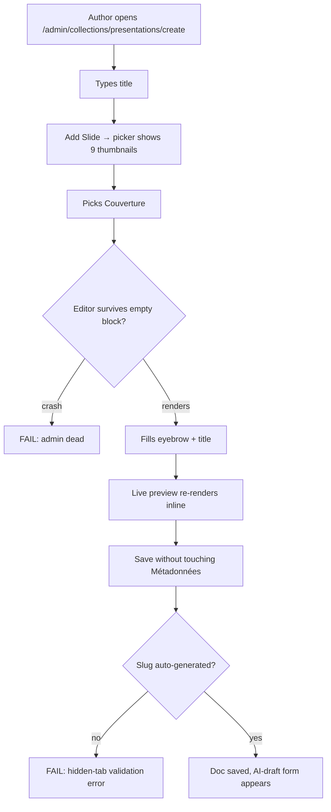
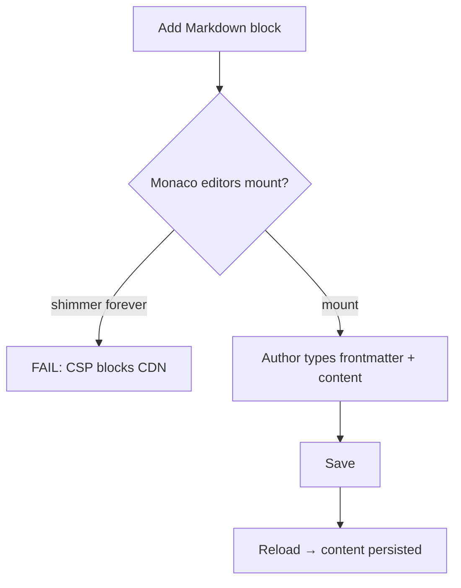
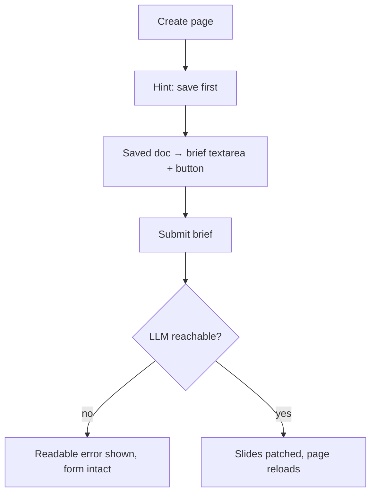
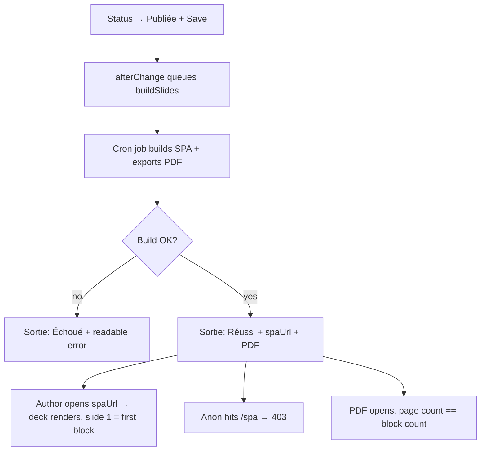
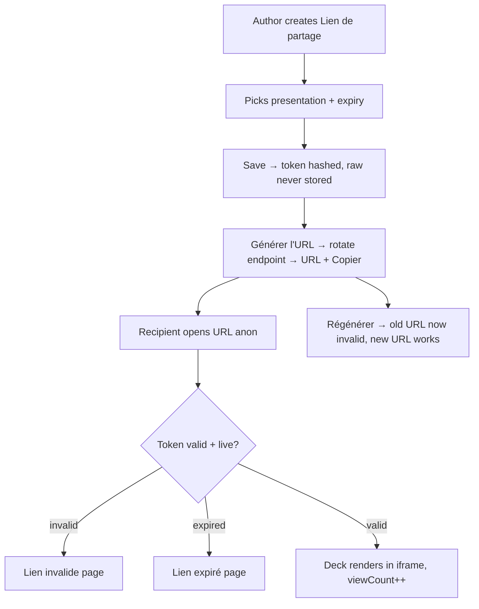

# Dogfood Report — main (post-fix commit 777570d)

> Diff-scoped browser QA of `777570d` ("fix: resolve all 10 dogfood findings") vs `4b3c2c9` on `main`. Generated by `/ce-dogfood-beta` on 2026-06-04.

## Diff Summary

- **Render pipeline hardened**: `escape()`/`md()` null-safe, `renderBlockPreview` catches renderer errors; first slide frontmatter merges into headmatter (no phantom slide).
- **Build pipeline**: Slidev SPA now built `--base ./` + `routerMode: hash`; `download: false`; `spaUrl` points at `index.html`.
- **New routes/libs**: auth-gated `/spa/[slug]/[[...path]]` route; shared `src/lib/spaFiles.ts` file server (traversal-safe, `no-cache` for HTML); share SPA route refactored onto it.
- **Share UX**: `POST /api/share-links/:id/rotate` endpoint + `ShareUrlField` admin component (generate/copy URL on demand); accents fixed.
- **Authoring UX**: slug auto-generated from title; `DraftFromBriefButton` SSR-safe via `useDocumentInfo` with pre-save hint; CSP opened for Monaco CDN; `quotes.svg` thumbnail added.

## Personas

Source: **inferred** (no STRATEGY.md / VISION.md / persona docs in repo).

- **Author (Klarc consultant)** — composes client decks from layout blocks or an AI brief; cares about fast authoring, faithful live preview, painless publish.
- **Admin** — manages users and shared content; cares about access control and link security.
- **Client recipient** — opens a share link on whatever device; cares that the deck just opens and looks polished.

## Flows Tested

### F1 — Block authoring (create → preview → save)

### F2 — Markdown advanced block

### F3 — AI draft from brief

### F4 — Publish → build → view

### F5 — Share link lifecycle

## Test Matrix & Results

| # | Flow | Journey / Scenario | Status | Issue | Fix | Commit |
|---|------|--------------------|--------|-------|-----|--------|
| S1 | F1 | Block picker shows all 9 thumbnails incl. Citations | Pass | - | - | - |
| S2 | F1 | Add Cover to new deck — no crash, preview updates live | Fixed | Preview frozen until save (getSiblingData not reactive) | useFormFields subscription + formStateToBlockData helper | 35ab268 |
| S3 | F1 | Add Section/Stats/Citations — empty-safe previews | Fixed | Array fields (stats/quotes/cards) blanked the preview — form-state array parents written as scalars | Array-parent entries materialize arrays in `formStateToBlockData` | f5dfa41 |
| S4 | F1 | First save auto-generates slug from accented title | Pass | - | `deck-qualite-ete-2026` from "Déck Qualité — Été 2026" | - |
| S5 | F3 | AI draft: hint pre-save, form post-save, graceful LLM error | Pass | - | Readable error box on 500 (placeholder key); full generation = human verify | - |
| S6 | F2 | Markdown block: Monaco loads, content persists | Pass | - | 2 editors mount, content saved to DB | - |
| S7 | F4 | Publish → build Réussi + spaUrl + PDF in Sortie | Pass | - | 5-block deck built in <3 min | - |
| S8 | F4 | Authed spaUrl renders deck, no phantom slide | Pass | - | 5 pages = 5 blocks, all slides navigable | - |
| S9 | F4 | /spa security: anon 403, traversal 403 | Pass | - | Auth-first ordering hides deck existence | - |
| S10 | F5 | Share UI: create → generate URL → anon renders deck | Pass | tokenHash red "required" on read-only field (cosmetic, did not block) | Field hidden | f7378b4 |
| S11 | F5 | Rotation invalidates previous URL | Pass | - | Old URL → "Lien invalide", new URL renders | - |
| S12 | F5 | Invalid + expired link pages (accents) | Pass | - | Expired SPA route also 403s | - |
| S13 | F4 | PDF page count == block count | Pass | - | 5/5 pages, content rendered | - |
| S14 | all | Console/error sweep | Fixed | Hydration mismatch on /share — page nested its own html/body inside the layout shell | Page returns plain content; structural regression test | 7b97c15 |

## What Was Fixed

### Live block preview frozen until save — `35ab268`
- **Symptom:** Typing into a freshly added block left the inline preview empty; it only populated after save+reload. Functionally "no crash" but the *live* preview promise was broken.
- **Root cause:** `src/components/SlidePreview.tsx` read form state via `useForm().getSiblingData()` — a one-shot getter with no subscription, so the component never re-rendered on form changes.
- **Fix:** Subscribe with `useFormFields`, rebuilding the block object from the flat field map via new pure helper `src/lib/formStateToBlockData.ts` (JSON-string selector so re-renders only fire when block data changes).
- **Regression test:** `src/lib/__tests__/formStateToBlockData.test.ts` (flat fields, nested array rows, foreign-path exclusion, empty state).

## Console Errors

- **Fixed:** React hydration mismatch on every `/share/[token]` view — `share/[token]/page.tsx` rendered its own `<html><body>` inside the `(frontend)` layout shell (`7b97c15`). Fresh-session sweep after the fix: 0 errors on live, invalid, and expired share pages.
- Admin: clean apart from dev-only noise (Sass legacy-API deprecation warnings from @payloadcms/ui, HMR logs).
- Known upstream quirk (unchanged): `GET /api/payload-preferences/undefined` from @payloadcms/ui on the create view.

## Human Verifications

- AI draft full generation requires a real LiteLLM key (`OPENAI_API_KEY` is a placeholder locally) — only the error path is testable headlessly.
- Google OAuth login not exercised (needs real Google credentials).

## Decisions for a Human

None — every issue found had a safe, contained autonomous fix.

## Paper Cuts (by persona)

| Paper cut | Persona | Severity | Status |
|---|---|---|---|
| Red "required" error on the read-only token hash during failed validation | Author | Medium | **Fixed** (`f7378b4` — field hidden) |
| AI-draft error surfaces raw provider internals instead of a friendlier message | Author | Low | **Fixed** (`5f6b746` — readable French message first, provider detail secondary; verified in-browser) |
| Share-link doc title is the raw 64-char hash (breadcrumb/header) | Author/Admin | Low | **Fixed** (`5f6b746` — generated label "Partage — <titre> (expire le <date>)" as useAsTitle; verified) |
| Expiration date input only commits via picker click; typed dates are easy to lose | Author | Low | **Fixed** (`5f6b746` — defaults to +30 days; the common case needs no typing at all. Picker quirk itself is react-datepicker upstream) |
| Build feedback is poll-based: author must reload Sortie tab to see En cours→Réussi | Author | Low | **Fixed** (`5f6b746` — BuildStatusField polls every 5s; live Réussi→En cours…→Réussi cycle observed without reload) |

## Learnings

- **Payload form state stores array fields as parent entries (row count + rows metadata) plus leaf keys** — any code reconstructing documents from the flat field map must materialize arrays from parents, not copy their scalar `value`.
- **`getSiblingData()` is a one-shot getter** — admin components that must track form edits need `useFormFields` (a selector subscription); returning a JSON string from the selector keeps re-renders cheap.
- **Route-group layouts own the html/body shell** — pages must never render their own (now enforced by `src/app/(frontend)/__tests__/no-nested-html.test.ts`).
- **`next build` corrupts a running `next dev` server's `.next` cache** — restart dev (rm -rf .next) after production builds in the same checkout.
- agent-browser `fill`/synthetic clicks don't always reach React handlers (date pickers, fetch-triggering buttons) — false negatives; re-verify via DOM `.click()`/picker interaction before judging a failure real.

## Final Status

**Ready.** 14/14 scenarios green (11 Pass, 3 Fixed with commits `35ab268`, `f5dfa41`, `7b97c15`, plus paper-cut fix `f7378b4`). 53/53 unit tests pass. Full authoring → AI-draft error path → publish → build → authed view → share lifecycle (create/rotate/expire) exercised in a real browser as Author, Admin, and anonymous Recipient.

Follow-up round (same day): all deferred items closed.
- **Dependency vulnerabilities fixed** (`40ae784`): next 15.3.3 → 15.5.18 and pnpm overrides for protobufjs (critical), fast-uri, ws, uuid, qs, postcss, dompurify, @protobufjs/utf8 — 53/53 tests, tsc, and production build green on the new set. One low-severity alert (@ai-sdk/provider-utils) has **no patched upstream release** yet and cannot be fixed by version selection.
- **All four paper cuts fixed** (`5f6b746`), each verified in-browser.

Remaining human verifications (credential-gated, not code defects):
- AI draft end-to-end with a real LiteLLM key — error path verified, success path needs a real key in `OPENAI_API_KEY`.
- Google OAuth login — needs real Google credentials configured.
