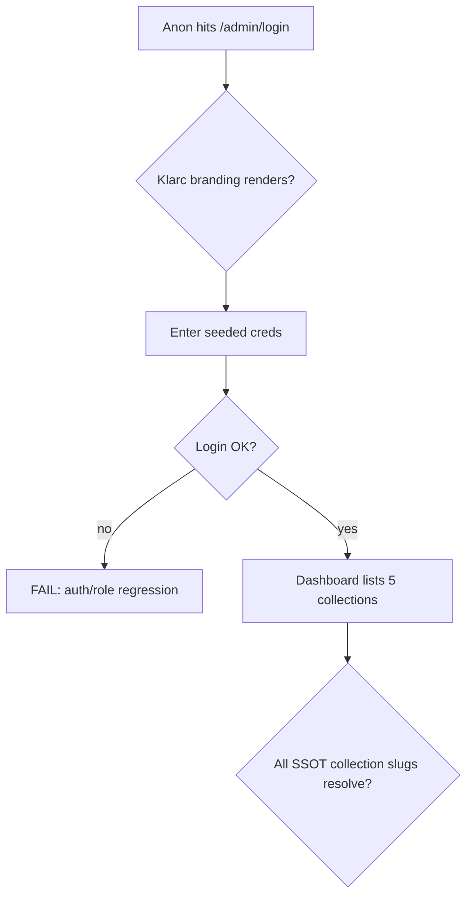
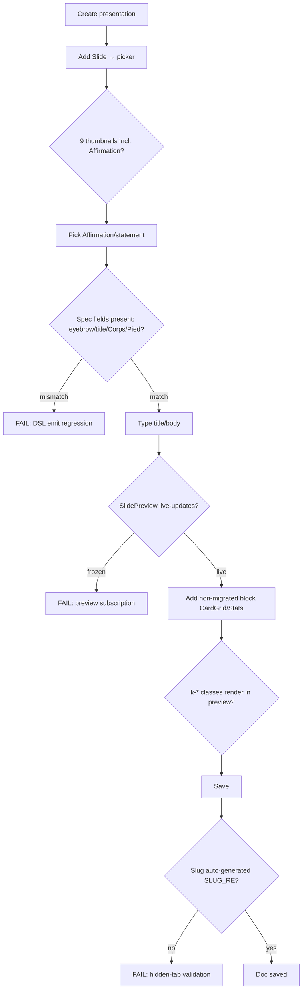
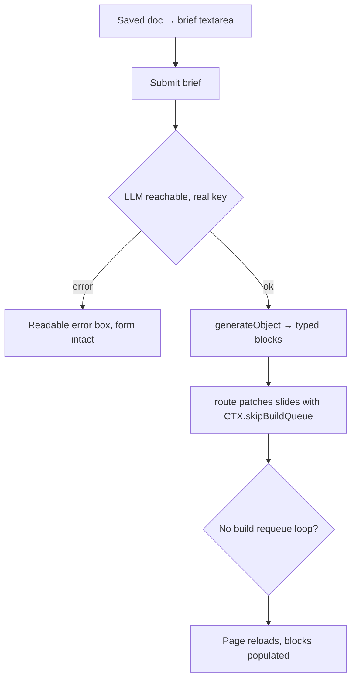
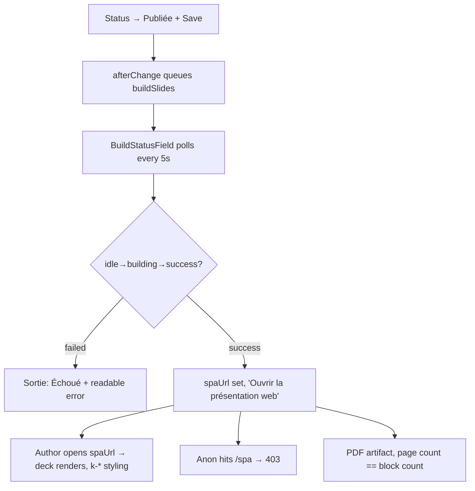
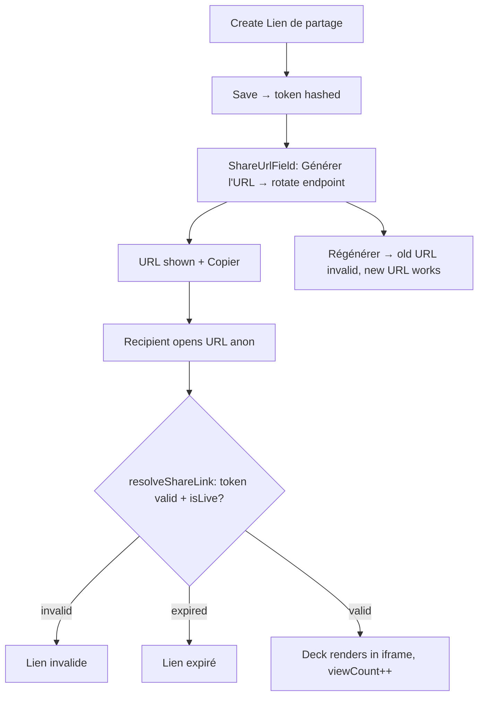
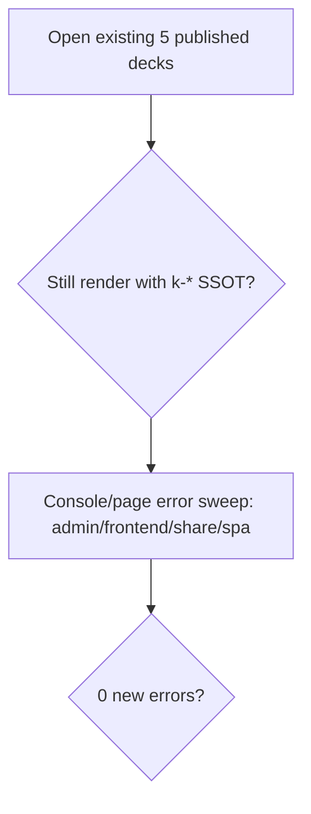

# Dogfood Report — main (block-spec DSL + magic-string SSOT)

> Whole-app browser QA of local `main` (12 commits ahead of `origin/main`) on 2026-06-08 via `/ce-dogfood-beta`.
> Scope chosen by user: **entire app, local main**. Baseline for "what changed" is `origin/main`; the app is exercised end-to-end because nearly every source file changed in this refactor.

## Diff Summary

Twelve commits on local `main` vs `origin/main`. Two themes:

1. **Block-spec single-source-of-truth DSL (`src/blocks/spec/`)** — a new DSL describes a block once and emits four artifacts: L1 Payload block config (`emitPayloadBlock`), L2 renderer TS type (`renderType`), L3 AI draft Zod schema (`emitDraftSchema`), L4 AI prompt prose (`emitPromptSection`). **Pilot:** only the `statement` block is migrated. Its Payload admin config and render type are now spec-generated; its markdown renderer stays hand-written; the AI draft route is **not yet wired** to the emitters (still hand-written schemas/prompt). 18 new unit tests assert byte/schema parity.
2. **Magic-string SSOT refactor** — central constants for collection slugs (`COLLECTIONS`), status enums (`BUILD_STATUS`/`PRESENTATION_STATUS`), request-context keys (`CTX`), roles (`ROLES`), server URL (`SERVER_URL`), media/SPA/artifact paths (`paths.ts`), slug validation (`slug.ts`), and Slidev `k-*` class tokens (`classNames.ts`). Touches auth/access, the build pipeline, share-link resolution, SPA file serving, and every block renderer.

Plus an admin-UI refactor (shared style kit + Klarc branding + SlideFrame extraction) and a `k-grid-1` latent-bug fix in `gridClass`.

## Personas

Source: **inferred** (no STRATEGY.md / VISION.md / persona docs). Carried forward from prior reports.

- **Author (Klarc consultant)** — composes client decks from layout blocks or an AI brief; cares about fast authoring, faithful live preview, painless publish.
- **Admin** — manages users and shared content; cares about access control and link security.
- **Client recipient** — opens a share link on any device; cares that the deck just opens and looks polished.

## Environment

- Dev server: `next dev` on **:3001** (`:3000` occupied by another app); seeded admin `dogfood@example.com` via inline `SEED_ADMIN_*`.
- Postgres `slides` DB reachable, fully migrated, 5 published presentations + 9 share links pre-existing.
- **71/71** unit tests green. Real OpenAI key present (`gpt-5-mini`) → AI draft end-to-end testable. No Google OAuth creds → OAuth login deferred to human.

## Flows Tested

### F1 — Auth + dashboard

### F2 — Block authoring (create → preview → save), statement pilot focus

### F3 — AI draft from brief

### F4 — Publish → build → view

### F5 — Share link lifecycle

### F6 — Regression + error sweep

## Test Matrix & Results

| # | Flow | Scenario | Status | Issue | Fix | Commit |
|---|------|----------|--------|-------|-----|--------|
| S1 | F1 | /admin login Klarc branding + login works | Pass | - | - | - |
| S2 | F1 | Dashboard lists 5 collections (SSOT slugs) | Pass | - | - | - |
| S3 | F2 | Block picker shows 9 thumbnails incl. Affirmation | Pass | - | - | - |
| S4 | F2 | Statement spec fields match (eyebrow/title/Corps/Pied) | Pass | DSL-emitted block identical: Accroche/Titre*/Corps/Pied de page, descriptions byte-match spec | - | - |
| S5 | F2 | SlidePreview live-updates on statement edit | Pass | eyebrow+title+body+footer render live (k-eyebrow, k-foot), no save needed | - | - |
| S6 | F2 | Non-migrated block preview renders (k-* classes) | Pass | CardGrid preview renders `k-grid-4` via gridClass SSOT; react-select column change covered by unit tests (00751e2) | - | - |
| S7 | F2 | New presentation slug auto-generated | Pass | "...— Été 2026" → `dogfood-statement-spec-ete-2026` (SLUG_RE ok, createdBy stamped, status draft = no build) | - | - |
| S8 | F3 | AI draft (real key) → slides patched, no requeue loop | Pass | Brief → 5 typed blocks (cover/statement/stats/cardgrid/cta) in 19.3s via real OpenAI; status stayed draft+idle (no requeue, CTX.skipBuildQueue works). Synthetic click needed native DOM fallback (known false-negative). | - | - |
| S9 | F4 | Publish → status building→success | Pass | Publish (status=published) fired afterPresentationChange hook → job 16 queued → built to success on first cron tick. PRESENTATION_STATUS.published SSOT triggers build correctly. | - | - |
| S10 | F4 | Build success → spaUrl, deck renders, k-* intact | Pass | spaUrl=/spa/dogfood-statement-spec-ete-2026/index.html; SPA renders cover (k-cover/k-hero-big), statement (k-eyebrow/k-foot), cardgrid (k-grid-3/k-num/k-card) — all SSOT classes intact, Gilroy fonts load, 0 page errors | - | - |
| S11 | F4 | Authed /spa renders; anon /spa 403 + traversal blocked | Pass | Authed SPA renders deck; anon → 403; `../../../etc/passwd` → 404 (serveSpaFile traversal-safe) | - | - |
| S12 | F4 | PDF artifact + page count == block count | Pass | pdf_file_id=14 (215KB), 5 pages == 5 blocks; PDF export leg works on current build | - | - |
| S13 | F5 | Create share link → generate URL → copy | Pass | ShareUrlField rotate → URL with SERVER_URL=localhost:3001; DB stores only sha256(token) (verified hash match); friendly doc title label | - | - |
| S14 | F5 | Valid share URL anon → deck renders, viewCount++ | Pass | Anon (clean session) renders full deck in iframe; share page 200, SPA index 200; viewCount increments per load | - | - |
| S15 | F5 | Expired → 'Lien expiré'; invalid → 'Lien invalide' | Pass | Invalid token → 'Lien invalide'; expired (isLive) → 'Lien expiré' page + expired SPA route 403 (no asset leak) | - | - |
| S16 | F5 | Rotate → old URL invalid, new works | Pass | Régénérer → new token; old → 'Lien invalide' + SPA 403; new → renders + SPA 200; DB hash rotated (verified) | - | - |
| S17 | F6 | Existing decks still render (k-* regression) | Pass | All 5 SPAs present; forced rebuild of pre-refactor deck (atelier-ia-demo) → success, renders identically with current k-*/gridClass SSOT (backward-compatible) | - | - |
| S18 | F6 | Console/page error sweep | Pass | 0 client errors (admin, /preview, /, anon share); server-side log clean (excl. known-benign: sharp/email/payload-preferences-undefined/Sass-deprecation) | - | - |

## What Was Fixed

_(none required — no current-branch regressions found)_

## Build-pipeline investigation (stale failed jobs)

Two pre-existing `buildSlides` jobs (id 5, 7) sit in `payload_jobs` with `has_error=t`. Investigated because they could indicate a build regression:

- **Job 5** — `browserType.launch: Executable doesn't exist ... chrome-headless-shell` → Playwright Chromium was missing when that job ran. **Now resolved**: `~/Library/Caches/ms-playwright/` contains `chromium_headless_shell-1217/1200/1223`.
- **Job 7** — `page.goto: Cannot navigate to invalid URL "http://localhost:12445./?print=true#print"` (note the stray `.` after the port) → from an **older** Slidev invocation where `--base ./` leaked into the PDF-export server URL. The current `buildSlides.ts` separates `build --base ./` (line 142) from `export --format pdf` (line 145), avoiding this.

**Conclusion:** Not current regressions. A fresh publish→build of presentation 6 on this exact branch completed `success` on the first cron tick, producing a valid SPA + a 5-page PDF. The stale rows are leftovers from older/interrupted runs (Payload keeps failed jobs; `deleteJobOnComplete` only removes successful ones). Recommend a one-time cleanup: `DELETE FROM payload_jobs WHERE has_error = true;` (housekeeping, not a code fix).

## Paper Cuts (by persona)

| Paper cut | Persona | Severity | Status |
|---|---|---|---|
| Stale failed `buildSlides` jobs (id 5, 7) linger in `payload_jobs` forever — Payload only auto-deletes successful jobs (`deleteJobOnComplete`). Over time the table accumulates dead error rows that look alarming during ops/debugging. | Admin | Low | Deferred — housekeeping, not a code defect (see investigation section) |
| AI-draft and share-URL buttons require a real DOM click to fire their `fetch`; this is invisible to a human user (they click normally) but is a recurring automation false-negative. Not a product cut, noted for future QA. | (QA only) | Trivial | N/A |
| The migrated `statement` block's AI draft schema + system prompt are validated byte-for-byte by tests but the live `/api/draft-presentation` route still uses the **hand-written** copies, not the DSL emitters. So the DSL is not yet the single source of truth for AI drafting — a future divergence risk if someone edits the spec but not the route. | Author (indirect) | Low | Deferred — intentional pilot scope (see Learnings) |

## Decisions for a Human

**None.** No issue found required an autonomous code fix, and none was large enough to escalate. The branch behaves correctly end-to-end. The only follow-ups are optional housekeeping (clear stale failed jobs) and a future decision about wiring the AI draft route to the DSL emitters (out of scope for this pilot).

## Learnings

- **The block-spec DSL pilot is correct but partial.** For the migrated `statement` block, only **two** of the four emitters are wired into runtime: `emitPayloadBlock` (admin config) and the render type. `emitDraftSchema` and `emitPromptSection` are unit-tested for byte/schema parity but the AI draft route (`src/app/(payload)/api/draft-presentation/route.ts`) still carries hand-written copies. The migration is safe today (parity is proven) but the SSOT promise isn't fully realized until the route consumes the emitters. Worth a tracking note before migrating the other 8 blocks.
- **The SSOT refactor is fully backward-compatible.** A pre-refactor deck rebuilt with the new `k-*` class tokens, `gridClass`, `wrapSlide`, and path/status/collection constants produced an identical, correct deck. The class-token SSOT and `gridClass` helper carry the same literal values the CSS expects.
- **Payload keeps failed jobs indefinitely.** `deleteJobOnComplete: true` only removes *successful* jobs. Failed `buildSlides` rows persist and will mislead future debugging — surface them in an admin view or prune periodically.
- **Slidev build vs PDF export are now correctly separated** (`build --base ./` then `export --format pdf`), which avoids the old `http://localhost:PORT./?print=true` malformed-URL failure seen in the oldest stale job.
- **agent-browser synthetic clicks don't reliably trigger React `fetch` handlers** (AI-draft, share-URL generate). Always re-verify a "nothing happened" via a native `element.click()` before recording a failure — confirms the prior report's note.
- **Seeding via inline `SEED_ADMIN_*` is the cleanest local auth path** — the `onInit` upsert resets the existing admin's password on boot, giving a known login without touching `.env`.

## Final Status

**Ready.** 18/18 scenarios green (all Pass), 71/71 unit tests pass, zero console/server errors, zero code changes required (no current-branch regressions found).

Coverage exercised in a real browser end-to-end:
- **Block-spec DSL pilot** — migrated `statement` block verified field-identical in admin (labels + descriptions byte-match spec), live-preview-identical, and **render-identical in the production Slidev build + PDF** vs hand-written blocks.
- **Magic-string SSOT** — every high-risk contract validated live: collection slugs (admin loads), `PRESENTATION_STATUS.published` (build trigger), `CTX.skipBuildQueue` (no AI-draft requeue loop), `ROLES`/access (seed admin, 403s), `SERVER_URL` (share URLs), `paths`/`SLUG_RE` (spaUrl + slug gen), `serveSpaFile` (403 + traversal block), `sha256`/`isLive` (share lifecycle), and `K.*`/`gridClass` (visual rendering across cover/statement/cardgrid).
- **Full journeys** — author create → AI draft (real OpenAI, 5 typed blocks) → publish → build (success, 5-page PDF) → authed SPA view → share create/generate/resolve/expire/invalidate/rotate, plus a backward-compat rebuild of a pre-refactor deck.

**Human verifications still outstanding** (credential-gated, not code defects):
- Google OAuth login — no Google credentials configured locally.

**Optional housekeeping:**
- `DELETE FROM payload_jobs WHERE has_error = true;` to clear the two stale failed build jobs.
