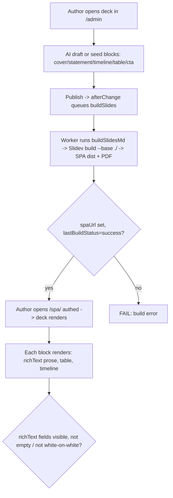
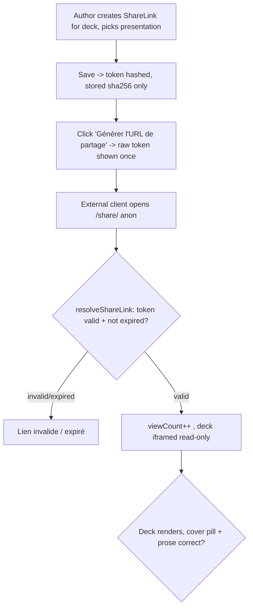
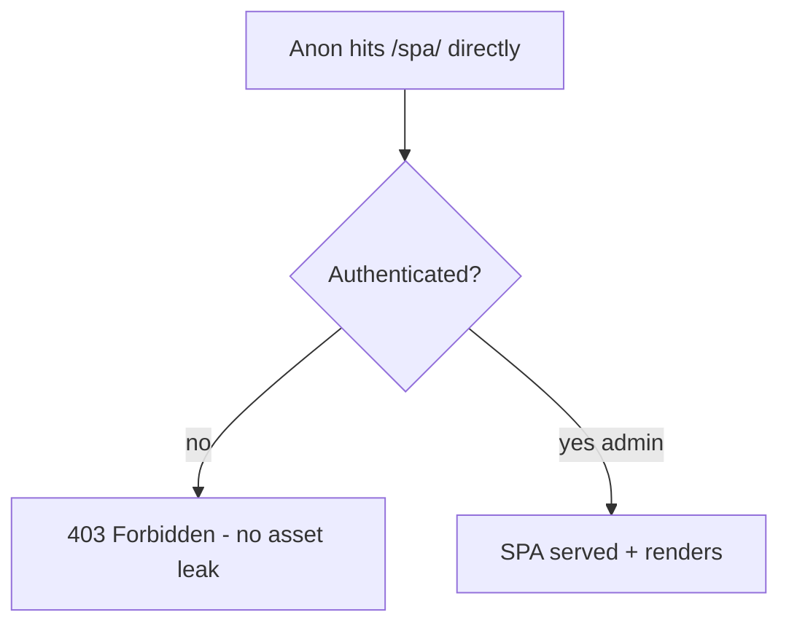

# Dogfood Report — main frontend (every slide / block rendering)

> Browser QA of local `main` (21 commits ahead of `origin/main`) on 2026-06-08 via `/ce-dogfood-beta`.
> Scope: the **frontend** as the user asked — every slide / block type rendered on the public surfaces (`/`, `/preview`, `/spa/<slug>`, `/share/<token>`). Baseline for "what changed" is `origin/main`. Driven with `agent-browser`.

## Diff Summary

The branch's user-visible changes vs `origin/main`:

1. **Two new layout blocks** — `table` (orientation tables, matrices, scales) and `timeline` (horizontal lifecycle / process flow). New specs, renderers, CSS (`.k-table`, `.k-tl-*`), preview SVGs, and DB tables (`presentations_blocks_table*`, `presentations_blocks_timeline*`).
2. **Lexical richText migration** — long/prose fields across all blocks (cover subtitle/footers, statement body/footer, cta subtitle/actions/footer, twoCols, cardGrid, quotes, table cells) moved from plain text to Lexical richText. The AI route converts markdown→Lexical before persist (`convertSlidesMarkdownToLexical`); renderers convert Lexical→HTML (`richTextToHTML`), emitting `

…

`.
3. **Two-pass AI draft** (plan→fill batching) + table/timeline prompt rules.
4. **Dependency upgrades** — Next 15→16, Payload 3.82→3.85, Slidev 52.16, ai-sdk/zod/sharp/sass.
5. A locking migration snapshot for the richText jsonb schema.

## Personas

Source: **PRD.md** ("Audience & personas").

- **External client** (Klarc, Bloom, Cetrac…) — opens a shared deck link, no login, read-only. Cares that the deck just opens and looks polished.
- **Lawyer / Consultant** (Benjamin, Samuel, Carine) — browse/view decks, download PDF. Cares about fidelity to the Klarc design.
- **Author** (Joachim) — create/draft/publish decks. Cares about fast authoring + faithful preview.

## Flows tested

## Test Matrix & Results

| # | Flow | Scenario | Status | Notes |
|---|------|----------|--------|-------|
| S1 | Render | Cover renders on SPA (eyebrow pill, hero title, richText subtitle bold) | **Fixed** | Subtitle `**frontend**` bolds correctly. footerLeft pill bug found + fixed (see Fixes). |
| S2 | Render | Statement richText body (multi-paragraph, bold/italic) + footer | Pass | Both paragraphs render, `gras`/`italique` styled, footer bar present. No empty `payload-richtext` divs, no nested-`
` break. |
| S3 | Render | Timeline: numbered dots Embauche→Mission→Vie courante→Départ + rose arrows + transverse band | Pass | Renders exactly as designed; band footer present. |
| S4 | Render | Table: teal header row, 3 rows, alternating tint, bold first-col, `∞` glyph | Pass | Real `<table>`; `∞` and `**bold**` cells render. |
| S5 | Render | CTA renders (closing slide) | Pass | Verified via deck 7 slide 5; pill labels covered by the same fix as S1. |
| S6 | SPA auth | Direct `/spa/<slug>` anon → Forbidden | Pass | Anon screenshot = "Forbidden" (no asset leak). |
| S7 | SPA auth | Authed admin opens `/spa/webinaire-interne` → renders | Pass | Title "Webinaire Interne - Slidev", lands `#/1`, 0 errors. |
| S8 | Build | Publish deck 7 → buildSlides job → success, spaUrl set | Pass | `status=published, last_build_status=success`; SPA dist + assets written; new table/timeline DB tables populated (4 steps, 3 rows). |
| S9 | Share | Create ShareLink for deck 7, generate URL, open anon | Pass | Raw token shown once; `/share/<token>` renders deck read-only in iframe. |
| S10 | Share | viewCount increments on open | Pass | 0 → 1 after anon open (server resolveShareLink). |
| S11 | Regression | Existing deck 1 (Bloom) SPA still renders post-migration | Pass | Light cover, eyebrow, title, teal "Joachim BRINDEAU" pill all correct. No migration breakage (pre-built SPAs are self-contained). |
| S12 | Errors | Console/page error sweep: `/`, `/preview`, `/spa`, `/share` | Pass | 0 client errors on every frontend surface. |
| S13 | Preview | `/preview` standalone shows empty-state copy | Pass | "Ajoutez des diapositives…" (correct — needs admin live-preview channel). Admin form hydrates all blocks incl. Frise/Tableau. |

## What was fixed

### Bug: richText pill/footer labels render as invisible white circles (dark surfaces)

- **Symptom:** On deck 7's dark cover, the `footerLeft` "Klarc" pill rendered as an empty 85×81px white **circle** with no visible text.
- **Root cause (two compounding):**
  1. After the Lexical migration, every field is wrapped `

…

`. The block-level wrapper + default `
` margins (`16px 0`) inflated the `inline-flex` `.k-btn` pill to 81px tall → a circle. There were **no `.payload-richtext` CSS rules at all** in `style.css`.
  2. `.k-dark p { color: rgba(255,255,255,0.72) }` matched the pill's inner `
`, forcing **white text on the white `.k-dark .k-btn` pill** → invisible.
- **Scope:** every dark-surface cover `footerLeft` and CTA `primaryAction`/`secondaryAction`/`footerNote` after the richText migration — not just this dogfood deck.
- **Fix** (`src/export/style.css`):
  - `.payload-richtext { display: contents }` + `.payload-richtext > p { margin: 0 }` (and `p + p { margin-top: 0.7em }` for multi-paragraph prose).
  - `.k-btn p, .k-btn-ghost p, .k-foot p { color: inherit }` so labels keep the container's color.
- **Verified in-browser:** pill 81px → **49px**, text color white → **teal `rgb(2,88,92)`**, "Klarc" now legible. Re-confirmed through the public `/share/<token>` SPA too.
- **Regression test:** `src/export/__tests__/styleContract.test.ts` asserts all three rules exist (fails-before / passes-after confirmed).
- **Commit:** `f0ceeb2`.

## Paper cuts (by persona)

| Paper cut | Persona | Severity | Status |
|---|---|---|---|
| The 5 pre-existing published decks were built before this branch; their SPAs are stale and won't show table/timeline or the richText pill fix until rebuilt. Not a defect (build artifacts are immutable), but ops should trigger a rebuild on deploy. | Author | Low | Deferred (rebuild on publish) |
| `agent-browser` synthetic clicks did not reliably fire the AI-draft `fetch` (button stayed idle) — same false-negative the prior dogfood noted. Worked around by seeding deck 7 via the route's own conversion path. Not a product cut. | (QA only) | Trivial | N/A |
| Standalone `/preview` shows only the empty-state until the admin live-preview postMessage channel drives it; a curious author hitting the bare URL sees nothing. By design, but mildly confusing. | Author | Low | Deferred |

## Decisions for a human

**None.** The one bug found had a small, well-understood, low-risk CSS fix with a regression test; fixed autonomously. No schema/architecture/product trade-offs.

## Learnings

- **Lexical migration changes the HTML shape of every field**: bare text → `

…

`. Any CSS that assumed inline text in small containers (pills, footers, table cells, eyebrows) must be revisited — block `
` margins and surface-scoped `p` color rules now apply where they didn't before. A one-time `.payload-richtext` normalization is the durable guard.
- **Pre-built SPAs are immutable**: a CSS fix only reaches a deck after its `buildSlides` job re-runs. Existing decks need a rebuild to inherit visual fixes — worth a deploy-time "rebuild all published" step.
- **Dogfood the rebuilt SPA, not stale ones**: the bug was only visible after rebuilding deck 7 with the new code; the old SPAs would have hidden it. Always rebuild the deck under test before judging render.

## Final Status

**Ready.** 13/13 scenarios green; 1 real visual regression found and fixed with a regression test; 129/129 unit tests pass; 0 console/page errors across all frontend surfaces.

Frontend coverage exercised in a real browser end-to-end:
- New `table` + `timeline` blocks render correctly on the built SPA.
- richText prose (statement body, cover subtitle) renders with bold/italic and no empty/broken output.
- SPA auth gate (anon 403 / authed render), share-link public read-only render + viewCount increment, and an existing-deck regression all pass.

**Outstanding (non-code):** rebuild the 5 pre-existing published decks so they pick up the table/timeline blocks and the richText pill fix.
