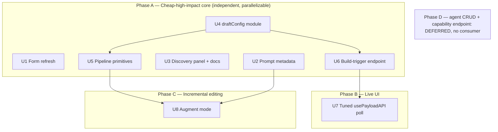

# feat: Agent-native architecture improvements

## Summary

A prior agent-native audit surfaced concrete weaknesses in this Payload CMS + Slidev portal's AI draft feature. This plan delivers the high-value subset of the audit's recommendations as eight dependency-ordered units (U1–U8): a **cheap-high-impact core** (form refresh, prompt context, discovery, config extraction, pipeline decomposition, on-demand build trigger), a **tuned live build-status** poll, and **incremental slide editing**. The goal is concrete author payoff — drafts that don't nuke form state, are deck-aware, can extend an existing deck, and rebuild on demand.

Two heavier items from the original draft were dropped after review: the agent-as-operator CRUD surface (no consumer exists — see Scope Boundaries) and a hand-rolled SSE endpoint (Payload ships no native push for external-process writes, so a tuned `usePayloadAPI` poll is the lower-LOC win — see U7).

The plan does **not** touch product framing, the block-spec DSL design, Slidev build internals (beyond adding a trigger seam), or the in-flight Lexical richText migration (it builds on top of it).

---

## Problem Frame

The audit found the agent surface (the AI draft route + `draftPresentationSlides`) strong on **shared workspace** (100% — it patches the live `slides` array, no shadow tables) and decent on **prompt-native** (67%) and **tools-as-primitives** (62%), but weak everywhere a user expects an agent to behave like a collaborator:

- **UI Integration (20%)** — after a draft writes slides, `DraftFromBriefButton` does `router.refresh()` **then** `window.location.reload()` (`src/components/DraftFromBriefButton.tsx`), nuking form state. Build status updates only via a 5s poll.
- **Context Injection (40%)** — the system prompt knows block schemas but nothing about *which deck it's drafting* (title, language, tags) or *what slides already exist*.
- **Capability Discovery (43%)** — one placeholder example; the `S1 — …` explicit-slide syntax is undocumented to users; available layouts are invisible.
- **Prompt-Native (67%)** — tunable knobs (`BATCH_SIZE`, slide `.min(3).max(40)`, brief/intent truncation slices) are hardcoded inline, so tuning behavior means editing code.
- **Action Parity (7%) / CRUD (0%)** — the agent can only `update` `presentation.slides`; it cannot create decks, manage share links, or trigger a rebuild programmatically.

These map cleanly to discrete, mostly-independent changes that share the same handful of files.

---

## Requirements

Each requirement traces to an audit recommendation (AR#) from the Top 10.

- **R1 (AR1)** — A completed draft must refresh the admin form **without** a full page reload that destroys form state.
- **R2 (AR2)** — The AI system prompt must include the target presentation's metadata (title, language, tags) so output is deck-aware.
- **R3 (AR6, AR8)** — Users must be able to discover available layouts, generation rules, and the `S1 — …` brief syntax from the authoring UI.
- **R4 (AR9)** — Tunable draft constants (batch size, slide min/max, truncation limits) must live in one config module, not scattered inline.
- **R5 (AR7)** — The two-pass pipeline must expose `draftOutline` and `draftBatch` as independently-callable primitives, with `draftPresentationSlides` as a thin orchestrator over them.
- **R6 (AR5)** — An authenticated, owner-scoped endpoint must let a caller trigger a rebuild of a presentation on demand and learn the job was queued.
- **R7 (AR4)** — Build-status changes must reach the open admin UI faster than today, with less code than the current manual poll.
- **R8 (AR3)** — The agent must be able to edit *existing* slides incrementally (augment a subset, preserving the rest verbatim) rather than only wholesale-replacing the deck.

*(The original R9 — agent CRUD/capability surface — is deferred; no consumer exists. See Scope Boundaries.)*

**Success criteria** (outcome-based, not rubric-based): a draft updates the form in place without losing unrelated edits (R1) and is steered by deck metadata (R2); authors can discover layouts + the `S1` syntax from the UI (R3); draft constants live in one config module (R4); the two passes are reusable primitives (R5); an owner can trigger a rebuild on demand (R6); build status updates within ~2s of a trigger with fewer lines than today (R7); a second draft pass extends a deck without rewriting kept slides — verified byte-identical (R8); no regression in the existing test suites; `pnpm build` + `pnpm generate:types` + `pnpm payload migrate:create` (for U6's field) stay green.

---

## Key Technical Decisions

- **KTD1 — Targeted form refresh over reload.** Replace the `window.location.reload()` in `DraftFromBriefButton` with a Payload-UI-native form refresh. Research found **no documented external-write refresh API** in `@payloadcms/ui@3.85`; the exact hook (`useForm().reset` / `useDocumentInfo().getDocPreferences` / `getDataByPath` + `dispatchFields`, or a `router.refresh()` that re-hydrates server props) is an **execution-time discovery** (see Deferred Unknowns). The decision here is the *outcome* (no nuclear reload), not the hook.
- **KTD2 — Metadata injected at the route, via `BuildSystemPromptOptions`.** The block-spec SSOT already exposes `buildSystemPrompt(metas, opts?: BuildSystemPromptOptions)` (`src/blocks/spec/emit/emitPromptSection.ts`) and the route already owns the presentation document. Inject metadata by prepending a deck-context block to the brief (cheap, no schema change) **and/or** threading an `intro` override through the options seam. Prefer prepending to the brief — it keeps `draftPresentationSlides` pure and use-case-agnostic per CLAUDE.md. Available fields are `title`, `language`, `tags`, `status` only — there is **no `name: 'client'` field** on the collection (the field list is title/slug/tags/language/status/createdBy). The `defaultColumns: ['title','client',…]` in `Presentations.ts` references a non-existent column and is **stale** — U2 should remove `'client'` from `defaultColumns` as an incidental cleanup (it would render a broken admin column). Do not inject `client`/`audience`; they don't exist.
- **KTD3 — New `src/lib/draftConfig.ts` const module.** Follows the established per-concern SSOT pattern (`src/lib/status.ts`, `src/lib/context.ts`, `src/lib/slug.ts`). Houses `BATCH_SIZE`, `MIN_SLIDES`, `MAX_SLIDES`, `BRIEF_CONTEXT_MAX`, `INTENT_MAX`, `BUILD_COOLDOWN_MS`. The emit-schema functions **import** these consts to replace the inline `.min(3).max(40)` — no `min`/`max` *parameters* are added (one call site; a parameter API would be generality with no consumer).
- **KTD4 — Decompose into exported primitives, preserve behavior.** `draftOutline(brief, opts)` and `draftBatch(stubs, context, opts)` become exported functions; `draftPresentationSlides` calls them. This is a pure refactor — the existing `draftPresentation.test.ts` must keep passing unchanged as the behavior contract.
- **KTD5 — Build trigger reuses the existing job, not a new path.** The trigger endpoint enqueues the **same** `buildSlidesTask` (`'buildSlides'`) via `payload.jobs.queue({ task, input, req })` exactly as `afterPresentationChange` does. It does not duplicate build logic. It must set the published-state expectations honestly (the build job builds regardless of status when invoked directly — decision in U6).
- **KTD6 — Live status via a tuned native `usePayloadAPI` poll; not SSE.** The build job runs in the **`payload-worker` process**, separate from the web server, so the web process cannot receive an in-process event. Research into Payload 3.85 confirmed **no native push reacts to an external-process DB write** (`useLivePreview` is `postMessage`-only/same-tab; `useDocumentEvents` tracks same-client edits; jobs have no status-subscription; no plugin beats custom SSE). A hand-rolled SSE endpoint *would* work but adds a route, a Traefik buffering caveat, an idle-stream cap, error-sanitization-in-stream, and connection-leak risk. The lower-LOC, first-party path is to replace the manual `fetch`/`useState`/`setInterval` in `BuildStatusField` with the native **`usePayloadAPI`** hook and tune the cadence (fast while `building`, stop on terminal). This deletes ~20 lines and adds zero server surface. True push (`LISTEN/NOTIFY`) stays a Future Consideration. *(This reverses the first draft's SSE decision — see U7.)*
- **KTD7 — Incremental edit via an optional `mode`, partitioning kept slides from new ones.** Add an optional `mode: 'replace' | 'augment'` to the draft request. In `augment` mode, kept slides are **spliced verbatim from the existing array** (never sent through the LLM — the pipeline's `alignBatch` would regenerate their bodies); only net-new/revised stubs are drafted and merged in. Default stays `replace`. This is the load-bearing correctness rule, detailed in U8.
- **KTD8 — Build-trigger ownership gate before enqueue.** U6 mirrors the `draft-presentation` route pattern (`getPayload`, `payload.auth({ headers })`, owner-or-admin check) and enqueues the existing job. The check runs **before** enqueue so an unauthorized caller never spawns a Chromium process. Errors stay sanitized and 404/403 stay lumped, matching the existing route. *(The broader agent-CRUD surface that this KTD originally covered is deferred — its settled design constraints are recorded in Scope Boundaries → Deferred.)*
- **KTD9 — Rate-limit the build-trigger via an enqueue-time timestamp, not the worker-written status.** There is no rate limiting anywhere today (the `/share/` route carries only a TODO). The build-trigger (U6) spawns a Chromium/Slidev process and **must** throttle. The obvious guard is **racy**: `lastBuildStatus` is set to `'building'` *inside the worker's job handler* (`buildSlidesTask` step 1), which runs on the next `*/1` cron tick — up to ~60s after enqueue. Between enqueue and pickup the status is still `idle`/`success`, so N rapid POSTs all pass a `=== 'building'` check and enqueue N builds. The guard must be **set atomically in the trigger endpoint at request time**: add a `lastBuildRequestedAt` timestamp field to Presentations, stamp it (with `skipBuildQueue` context) *before* enqueue, and reject (429) if `now - lastBuildRequestedAt < BUILD_COOLDOWN_MS`. This self-heals if a build crashes (a status-based lock would stick at `'building'` forever). **This is the plan's one schema change** — `pnpm payload migrate:create` + commit the migration pair + `pnpm generate:types`. The draft route's pre-existing lack of LLM-spend throttling stays deferred (U8 augment makes revisiting it more urgent).

---

## High-Level Technical Design

### Phase dependency graph



### Decomposed draft pipeline (U5) — directional, not implementation spec

```
draftPresentationSlides(brief, opts)        ← thin orchestrator (unchanged signature/behavior)
   ├─ stubs = parseSlideBySlideBrief(brief)  ← unchanged helper
   │           ?? await draftOutline(brief, opts)   ← NEW exported primitive
   └─ for each chunk(stubs, BATCH_SIZE):
          filled = await draftBatch(chunk, runningContext, opts)  ← NEW exported primitive
          aligned = alignBatch(chunk, filled)                     ← unchanged helper
```

### Build-status update path (U7) — crosses the process boundary

```
[payload-worker] --patches lastBuildStatus/spaUrl/pdfFile--> [Postgres]
[BuildStatusField] --usePayloadAPI re-fetch (tuned: fast while building, stop on terminal)--> [WEB /api/presentations/:id]
       (no native push exists for an external-process write in Payload 3.85 — a tuned poll is the lower-LOC path; see U7)
```

### Augment-mode partition (U8) — kept slides never round-trip the LLM

```
existing slides (already Lexical) ──┬── KEEP set ──────────────────────────┐ (spliced verbatim, untouched)
                                    └── NEW/REVISE stubs ─→ draftBatch ─→ convertSlidesMarkdownToLexical ─┤
                                                                                                          ▼
                                                                                merge (append / replace-by-index) → persist
```

---

## Implementation Units

### U1. Replace full-page reload with targeted form refresh

**Goal:** A completed draft updates the slides shown in the admin form without `window.location.reload()`.
**Requirements:** R1.
**Dependencies:** none.
**Files:**
- `src/components/DraftFromBriefButton.tsx` (modify success handler, lines ~28–54)
- `src/lib/__tests__/draftFromBriefButton.test.tsx` (new — if component testing is viable; otherwise document manual verification)

**Approach:** On a successful `adminPost('/api/draft-presentation', …)`, drop the `window.location.reload()` and instead trigger a Payload-UI form re-hydration so the new `slides` appear in place. The precise `@payloadcms/ui@3.85` mechanism is an execution-time discovery (see Deferred Unknowns) — try, in order: (a) `router.refresh()` alone re-hydrating server-rendered field props; (b) `useForm().reset(newData)` after re-fetching the doc; (c) `useAllFormFields` + `dispatchFields`.

**Verify the premise before committing the floor (adversarial caught this):** the current code's comment says a full reload was added *because* `router.refresh()` did not re-render the nested block fields. So rung (a) may show **stale** slides — which is worse than a reload that at least shows truth. **Gate:** the chosen mechanism must be confirmed to actually re-render the `slides` blocks array with new data. If none of (a)–(c) does so without a reload, the honest fallback is to **keep a scoped reload but preserve the user's unsaved metadata** (or accept the reload and instead just fix the feedback) — do not ship a "refresh" that silently displays old slides. R1's success bar is *correct slides shown without losing unrelated form state*, not merely "no reload."

**Interaction states (design-lens — these are part of the unit, not afterthoughts):**
- *In-progress:* the draft is a multi-second two-pass LLM call. The button enters a disabled spinner state with a clear label (e.g. "Génération en cours…") for the full duration; specify whether the brief textarea stays editable (recommend: disabled to prevent mid-flight edits). This replaces the visual signal the old page-flash provided.
- *Success feedback:* commit to one mechanism — prefer a Payload-native notification (check `@payloadcms/ui` for `useNotifications`/toast) over a bespoke element so it matches admin conventions; message states the outcome (e.g. "12 diapositives générées"). Define dismiss behavior.

**Patterns to follow:** `BuildStatusField.tsx` already fetches `/api/presentations/{id}?depth=0` with `credentials:'include'` — reuse that fetch shape to pull the refreshed doc if a re-fetch is needed.

**Test scenarios:**
- Happy path: after a successful draft, the slides field reflects the new slide **content** (not just count) without a full navigation, and unsaved metadata edits survive (assert no `window.location.reload`; assert form data updated to the new slides).
- Premise guard: assert the refresh mechanism actually replaces stale block-field data — a test (or documented manual check) that the displayed slides are the *new* ones, not the pre-draft ones.
- In-progress: while the request is pending, the button is disabled and shows the progress label (assert disabled state).
- Error path: a 4xx/5xx response leaves existing form state intact and surfaces the error box (current behavior preserved).
- Edge: drafting on a brand-new unsaved doc still shows the "save first" hint and never calls the endpoint.

**Verification:** In dev, draft into an existing deck; the **new** slides appear (verified by content, not count), other unsaved metadata edits are not lost, and a success notification confirms completion without a page flash.

---

### U2. Inject presentation metadata into the AI prompt

**Goal:** The agent drafts with awareness of the deck's title, language, and tags.
**Requirements:** R2.
**Dependencies:** none.
**Files:**
- `src/app/(payload)/api/draft-presentation/route.ts` (modify — assemble a deck-context preamble before calling `draftPresentationSlides`)
- `src/lib/draftPresentation.ts` (modify only if threading an `opts.deckContext` is cleaner than prepending to the brief)
- `src/collections/Presentations.ts` (modify — remove stale `'client'` from `defaultColumns`, incidental cleanup)
- `src/lib/__tests__/draftPresentation.test.ts` (extend)

**Approach:** The route already has the `presentation` document after its auth check. Build a short context block — e.g. `Titre: {title}\nLangue: {language}\nMots-clés: {tags}` — and prepend it to the user's brief (keeps `draftPresentationSlides` pure and use-case-agnostic). Only use fields that exist: `title`, `language`, `tags`, `status`. Omit empty fields. Do **not** invent `client`/`audience`.

**Patterns to follow:** Keep prompt prose use-case-agnostic per CLAUDE.md — inject the deck's *own* values, not industry vocabulary.

**Test scenarios:**
- Happy path: a presentation with title + French language + tags produces a brief sent to `draftObject` that contains those values (assert on the spied `draftObject` prompt argument).
- Edge: empty tags / missing title omit those lines cleanly (no `Titre: undefined`).
- Edge: `language: 'en'` surfaces in the context block so the model is steered to English.
- Regression: existing draft tests still pass (metadata prepend is additive).

**Verification:** Draft against an English-tagged deck with a bare brief; output language matches the deck's `language` more reliably than before.

---

### U3. Capability-discovery panel and brief documentation

**Goal:** Users can see available layouts, generation rules, and the `S1 — …` syntax from the authoring UI.
**Requirements:** R3.
**Dependencies:** none (reads `buildSystemPrompt` / `ALL_SPECS` for the layout list).
**Files:**
- `src/components/DraftFromBriefButton.tsx` (modify — add a collapsible help section; expand placeholder examples)
- `src/blocks/spec/emit/emitPromptSection.ts` (no change expected; may export the layout summary for reuse)
- `src/app/(payload)/admin/importMap.js` (regenerate via `pnpm generate:importmap` only if a new component path is added)

**Approach:** Add a collapsible "?" panel beside "Générer les slides" that lists the AI-draftable layouts (derived from `ALL_SPECS` where `aiDraftable`) and the generation rules (min/max slides, cover-first/cta-last), plus a one-line note documenting the `S1 — Titre …` explicit-slide syntax that `parseSlideBySlideBrief` already supports. Expand the single placeholder into 2–3 example briefs (narrative + explicit-slide). No new endpoint required — render from imported spec metadata at build time.

**Interaction states (design-lens):**
- *Default state:* **collapsed** — the Contenu tab already holds the brief textarea and draft button; an always-expanded layout/rules list would dominate the tab. Discoverability comes from the visible "?" affordance, not from occupying space by default. Persistence across sessions is optional (not required); if added, use `localStorage`.
- *Trigger + a11y:* implement as a native disclosure (`<details>/<summary>` or a button with `aria-expanded` controlling the region) so it is keyboard-operable and the click cannot bubble to dirty/submit the form. The "panel toggle does not submit the form" test below depends on this — specify the element type, not just "a `?`".

**Patterns to follow:** Reuse the existing dashed-hint box styling already in the component for the empty state. Prefer inline JSX inside `DraftFromBriefButton` (no new component path → no `generate:importmap` step).

**Test scenarios:**
- Happy path: the panel renders one entry per `aiDraftable` spec (assert count matches `ALL_SPECS.filter(s => s.aiDraftable).length`).
- Default state: panel renders collapsed on first load.
- Edge: toggling the panel open/closed does not submit the form or clear the brief textarea (depends on the disclosure-element choice above).
- A11y: the toggle is reachable and operable by keyboard (Enter/Space) with correct `aria-expanded`.
- Test expectation: layout-list correctness is the main behavioral assertion; styling is visual-only.

**Verification:** Open the Contenu tab; the help panel lists exactly the draftable layouts and shows the `S1` syntax example.

---

### U4. Extract tunable draft constants into `src/lib/draftConfig.ts`

**Goal:** Batch size, slide bounds, and truncation limits live in one config module.
**Requirements:** R4.
**Dependencies:** none.
**Files:**
- `src/lib/draftConfig.ts` (new)
- `src/lib/draftPresentation.ts` (modify — import `BATCH_SIZE`, `BRIEF_CONTEXT_MAX`, `INTENT_MAX` instead of inline literals)
- `src/blocks/spec/emit/emitDraftSchema.ts` (modify — replace inline `.min(3).max(40)` in `emitOutlineSchema`/`emitSlidesArraySchema` with imports of `MIN_SLIDES`/`MAX_SLIDES` from `draftConfig`)
- `src/lib/__tests__/draftConfig.test.ts` (new)

**Approach:** Create `draftConfig.ts` exporting `BATCH_SIZE`, `MIN_SLIDES`, `MAX_SLIDES`, `BRIEF_CONTEXT_MAX` (2400), `INTENT_MAX` (1600), and `BUILD_COOLDOWN_MS` (for U6) as named consts (mirroring `src/lib/status.ts` shape). Replace the inline `.min(3).max(40)` and `.slice(0, 2400)`/`.slice(0, 1600)` magic numbers with these consts. **Do not** add `min`/`max` *parameters* to the emit functions (scope-guardian): the config consts are the SSOT and the emit functions have exactly one call site — a parameter API would be generality with no consumer. Just import the consts.

**Patterns to follow:** `src/lib/status.ts`, `src/lib/slug.ts` — `as const` named exports, no default export.

**Test scenarios:**
- Happy path: `emitSlidesArraySchema(ALL_SPECS)` enforces `MIN_SLIDES`/`MAX_SLIDES` (a 2-slide array fails, a 3-slide passes, a 41 fails) — driven by the imported consts, not literals.
- Config drift: changing `MAX_SLIDES` in `draftConfig` changes the enforced bound (proves the const is the SSOT, no inline literal left).
- Regression: `draftPresentation.test.ts` still passes (BATCH_SIZE behavior unchanged at value 3).

**Verification:** `pnpm test` green; grep confirms no remaining inline `.min(3).max(40)` or `.slice(0, 2400)` literals in the draft path.

---

### U5. Decompose the draft pipeline into `draftOutline` and `draftBatch` primitives

**Goal:** The two passes are independently-callable exported functions; `draftPresentationSlides` orchestrates them.
**Requirements:** R5.
**Dependencies:** U4 (uses config consts).
**Files:**
- `src/lib/draftPresentation.ts` (refactor — extract `draftOutline(brief, opts)` and `draftBatch(stubs, context, opts)`; `draftPresentationSlides` calls both)
- `src/lib/__tests__/draftPresentation.test.ts` (extend with direct primitive tests; existing tests remain as the behavior contract)

**Approach:** Pure refactor. Pull the outline LLM call (currently inline in `draftPresentationSlides`) into `draftOutline`, returning `OutlineStub[]`. Pull the per-batch `draftObject` call into `draftBatch`, returning the filled-and-aligned slides for that chunk. Keep `parseSlideBySlideBrief`, `alignBatch`, `chunk` as-is. The orchestrator's observable behavior (and its mocked `draftObject` call count/args) must not change.
**Execution note:** Keep the existing `draftPresentation.test.ts` green throughout as the characterization contract before adding new primitive-level tests.

**Test scenarios:**
- Happy path: `draftOutline(brief)` returns stubs with valid `blockType`/`title`/`intent` (mock `draftObject`).
- Happy path: `draftBatch(stubs, ctx)` returns one filled slide per stub, with `blockType`/`title` aligned to the stubs.
- Integration: `draftPresentationSlides` over a multi-batch brief calls `draftBatch` once per chunk (assert call count = ceil(n/BATCH_SIZE)) — proves orchestration unchanged.
- Edge: a short brief (≤ one batch) with no explicit count skips `draftOutline` (existing fast-path preserved).

**Verification:** `pnpm test` green with the original assertions intact plus new primitive coverage.

---

### U6. On-demand build-trigger endpoint

**Goal:** An owner/admin can trigger a rebuild via an authenticated endpoint and learn the job was queued.
**Requirements:** R6.
**Dependencies:** U4 (uses `BUILD_COOLDOWN_MS` from `draftConfig`; can inline the const if sequenced first).
**Files:**
- `src/app/(payload)/api/presentations/[id]/build/route.ts` (new — POST handler) **or** a collection-level `endpoints` entry on `Presentations.ts` mirroring the ShareLinks `/:id/rotate` pattern
- `src/collections/Presentations.ts` (modify — add a `lastBuildRequestedAt` date field, sidebar/readOnly, for the cooldown — see Rate limiting)
- `src/migrations/` (new migration pair via `pnpm payload migrate:create` for the new field; regenerate `src/payload-types.ts`)
- `src/app/(payload)/api/presentations/[id]/build/__tests__/route.test.ts` (new, if route-level tests are feasible; otherwise unit-test the enqueue helper)

**Approach:** Mirror the `draft-presentation` route's auth shape: `getPayload`, `payload.auth({ headers })`, `findByID({ id, user, disableErrors:true })`, owner-or-admin check **before** enqueuing (matches the route's pre-LLM ownership gate — do not spend a Chromium process on an unauthorized caller). On success, enqueue the existing task: `payload.jobs.queue({ task: BUILD_SLIDES_TASK, input: { presentationId: id }, req })`. Return `{ queued: true, jobId? }` — capture the job id from the queue return if Payload v3 exposes it (execution-time check). Decide and document: a direct trigger builds **regardless of `status`** (unlike the publish-gated hook) — state this in the response/docs so callers aren't surprised.

**Rate limiting (required — KTD9, race-corrected):** do **not** gate on `lastBuildStatus === 'building'` — that flag is written by the worker on the next cron tick, so rapid triggers race past it. Instead: read `lastBuildRequestedAt`; if `now - lastBuildRequestedAt < cooldown` → 429; otherwise stamp `lastBuildRequestedAt = now` via `payload.update` with `context: { skipBuildQueue: true }` **before** enqueuing. This is atomic at request time and self-heals if a build crashes (unlike a status-based lock, which would stick at `'building'`). The cooldown window is a `draftConfig`-style const (e.g. `BUILD_COOLDOWN_MS`).
**Execution note:** ensure all response paths use `NextResponse.json(...)` (sets `Content-Type: application/json`) — including the 429 — so no error branch can reflect a user-supplied value as sniffable HTML.

**Patterns to follow:** `src/collections/ShareLinks.ts` `/:id/rotate` (collection endpoint) and `src/app/(payload)/api/draft-presentation/route.ts` (route handler, incl. its sanitized 401/403/404 responses and pre-work ownership check). Reuse `userIsAdmin`/owner check from `src/access/roles.ts`.

**Test scenarios:**
- Happy path: owner POSTs → `lastBuildRequestedAt` stamped, job enqueued (assert `jobs.queue` called with `BUILD_SLIDES_TASK` and correct `presentationId`), 200 with `{queued:true}`.
- Auth: unauthenticated → 401; authenticated non-owner non-admin → 403; missing presentation → 404 (lumped with forbidden, per existing convention).
- Rate limit (race-correct): two triggers within the cooldown window → the second returns 429 and `jobs.queue` is NOT called — **even though** `lastBuildStatus` is still non-`building` (worker hasn't run). This is the regression test for the race the status-based guard missed.
- Rate limit recovery: a trigger after the cooldown elapses succeeds (proves no permanent lock).
- Edge: triggering a `draft`-status deck still enqueues (documented behavior) — assert it does not silently no-op.

**Verification:** `curl` the endpoint as the owner in dev; the worker picks up the job on the next cron tick and `lastBuildStatus` transitions to `building` → `success`. A rapid double-trigger returns 429 on the second call within the cooldown.

---

### U7. Tune build-status polling via native `usePayloadAPI` (no SSE)

**Goal:** Build-status updates feel near-immediate after a trigger, with **less** code than today and no new endpoint.
**Requirements:** R7.
**Dependencies:** U6 (the trigger that makes a fast first poll worthwhile).

**Decision (revised after research):** the first draft proposed a hand-rolled SSE endpoint. Research into Payload 3.85 confirmed **no native push mechanism reacts to an external-process DB write** — `useLivePreview` is `window.postMessage`-only (same tab, form state, never the DB), `useDocumentEvents` only tracks same-client edits, jobs have no status-subscription, and no plugin is lighter than custom SSE. Since the writer is the separate `payload-worker` process, the honest minimal path is **not** SSE — it's to keep polling but collapse the manual `fetch`/`useState`/`setInterval`/try-catch in `BuildStatusField` into the native `@payloadcms/ui` hook **`usePayloadAPI`**, and tune the cadence. This *reduces* LOC (~20 lines removed), uses a first-party hook, and drops the SSE endpoint, the Traefik `X-Accel-Buffering` caveat, the idle-stream cap, the error-sanitization-in-stream concern, and the connection-leak risk entirely. ("Less LOC, more features.") True push (`LISTEN/NOTIFY`) stays a Future Consideration if sub-poll latency is ever required.

**Files:**
- `src/components/BuildStatusField.tsx` (modify — replace the manual fetch/poll block with `usePayloadAPI` + a tuned interval)

**Approach:** Use `const [{ data }, { setParams }] = usePayloadAPI('/api/presentations/'+id, { initialParams: { depth: 0 } })` and drive re-fetch by bumping a cache-busting param on an interval. Tune cadence by state: a fast first poll immediately after a U6 trigger and a short interval (~2s) while `lastBuildStatus === 'building'`, backing off (or stopping) when `idle`/`success`/`failed`. This deletes the bespoke `BuildInfo` state, the manual `fetch(..., {credentials:'include'})`, and the error handling — `usePayloadAPI` owns `data`/`isLoading`/`isError`. Net: fewer lines than the current component, faster perceived updates, zero new server surface.

**Patterns to follow:** `usePayloadAPI` (exported from `@payloadcms/ui@3.85`) — confirmed available; replaces the hand-rolled fetch. Stop the interval on terminal status so no perpetual poll runs on an idle tab.

**UI states to specify:** chip label + color/icon for `idle/no-build`, `building` (spinner — no percentage signal from the worker), `success` (surface `spaUrl`/`pdfFile` link inline), `failed` (sanitized short message inline; full `lastBuildError` already fetched as part of the same doc read, render its first line only as today). Define the post-terminal display (freeze on terminal label + "last built" timestamp) and that a new U6 trigger resumes the fast cadence.

**Test scenarios:**
- Happy path: after a U6 trigger, the chip moves `building → success` within ~2s without a manual refresh (assert the component re-fetches on its interval and renders the new status).
- Cadence: the interval is short while `building` and stops/backs off on terminal status (assert no interval runs once `success`/`failed` — regression guard against the old perpetual 5s poll).
- LOC/behavior: the manual `fetch`/`useState`/try-catch is gone, replaced by `usePayloadAPI` (assert `BuildInfo` state removed; behavior preserved — `failed` still shows the truncated first error line).
- Edge: no `id` (new doc) → no polling, no crash.

**Verification:** Trigger a build (U6) with the Sortie tab open; the chip reflects `building → success` within a couple seconds, the component no longer hand-rolls a fetch, and an idle tab stops polling once the build is terminal.

---

### U8. Incremental ("augment") draft mode over existing slides

**Goal:** The agent can extend or revise an existing deck instead of only replacing it wholesale.
**Requirements:** R8.
**Dependencies:** U2 (deck context), U5 (primitives).
**Files:**
- `src/app/(payload)/api/draft-presentation/route.ts` (modify — accept optional `mode: 'replace'|'augment'`, default `replace`)
- `src/lib/draftPresentation.ts` (modify — `draftPresentationSlides` / `draftOutline` accept optional existing-slide context)
- `src/lib/__tests__/draftPresentation.test.ts` (extend)

**Approach:** Extend the request Zod schema with an optional `mode` (default `replace` → current behavior, zero regression) plus an explicit **target set** (the slide indices/ids to revise, or an "append after N" marker). In `augment` mode the route must `findByID` with sufficient `depth` to read the existing `slides` array.

**Critical correctness rule (doc-review caught this — it is the core of the unit):** *kept slides must never round-trip through the LLM.* The existing two-pass pipeline only locks `blockType`/`title` via `alignBatch`; `alignBatch` keeps the **model's freshly-generated body** and discards the original. So if a "preserved" slide is sent through `draftOutline`/`draftBatch`, the model regenerates (paraphrases, drops bullets, hallucinates) its body — the deck would *look* preserved by slide count while its content was silently rewritten. Therefore augment must **partition**, not re-draft-with-context:
- Slides the user is keeping are **spliced back verbatim from the existing array** (their Lexical bodies untouched) — never passed to the model.
- Only net-new and explicitly-revised stubs go through `draftOutline`/`draftBatch` as markdown.
- Merge = existing-kept (Lexical) + newly-drafted (converted) by append or replace-by-index.

**Lexical conversion ordering:** run `convertSlidesMarkdownToLexical` on **only the newly-drafted subset**, then merge into the already-Lexical kept slides. Do not pass the merged array through conversion a second time. (`convertValue` skips non-strings, so a stray second pass is non-destructive today — but rely on the partition, not that incidental guard.)

**Patterns to follow:** Reuse `OutlineStub` shape only for the *new* stubs; reuse `alignBatch` only on the newly-drafted batch. Do **not** reuse `alignBatch` as a "merge" over kept slides — it is a fill-aligner, not a preserver.

**Test scenarios:**
- Happy path (replace): omitting `mode` reproduces current wholesale-replace behavior exactly (regression guard).
- **Content preservation (the load-bearing test):** seed a deck with known Lexical bodies; run `augment` adding one section; assert each kept slide's rich body is **byte-identical** pre/post (proves kept slides were spliced, not regenerated). This is the test that would catch the `alignBatch` round-trip trap.
- Conversion scoping: assert `convertSlidesMarkdownToLexical` is called with **only** the new/revised slides (spy on its args), never the kept ones.
- Happy path (augment): with `mode:'augment'` + target "append", the new slides appear after the kept ones and the existing-deck summary in the outline prompt covers only context, not regeneration.
- Edge: `augment` on an empty deck behaves like `replace`.
- Edge: invalid `mode` value → 400 from schema validation.

**Security note:** augment extends the existing `draft-presentation` route, which already performs the owner-or-admin check *before* any LLM call or write — so augment inherits that gate unchanged; a caller cannot augment a deck they don't own. No new authorization path is introduced.

**Verification:** Draft once to seed a deck, then `augment` with "add a competitive-landscape section"; the original slides are **byte-for-byte unchanged** (not just present by count) and the new section appears.

---

## Scope Boundaries

**In scope:** units U1–U8 (the audit's cheap-high-impact core plus incremental editing). The agent-as-operator CRUD surface (originally U9/U10) is **cut to Deferred** — see below.

> **Phase D (agent CRUD + capability manifest) — cut to Deferred Follow-Up.** A product/adversarial review converged on the same point: those endpoints would build an authenticated operator surface for a consumer that does not exist. The only "agent" today is the human author clicking inside the Payload admin, who already has full collection CRUD; there is no external/MCP client calling `/api/agent/*`. The work was justified only by the audit's "CRUD 0% / Action Parity 7%" scorecard — a self-authored rubric, not a user need. The design work already done (revoke-via-`/rotate`-overrideAccess since ShareLinks is `update`/`delete: isAdmin`; always-pass-`user` so `createdBy` stamps; `isAdminOrAuthor` gate to avoid leaking the endpoint map to viewers) is preserved in the Deferred entry so it isn't re-derived when a real consumer appears.

### Deferred to Follow-Up Work
- **Agent-as-operator endpoint surface (was U9 + U10)** — owner-scoped `/api/agent/*` for Presentation create, ShareLink create/list/revoke, and a capability manifest. Cut because no consumer exists (see the Phase D note above). **Revive when a real caller is scoped** (MCP server, external agent, or internal script). Preserve these already-settled design decisions: (a) ShareLink revoke = manual owner check + `payload.update({ expiresAt: now, overrideAccess: true })` via a dedicated endpoint, mirroring `/:id/rotate`, because ShareLinks is `update`/`delete: isAdmin`; (b) Presentation create must pass `user` so the `createdBy` hook stamps ownership; (c) the capability endpoint gates `isAdminOrAuthor` (not `isLoggedIn`) so viewers don't get the endpoint map.
- **Postgres `LISTEN/NOTIFY` true push** for build status — U7 uses a tuned `usePayloadAPI` poll (no native push exists for external-process writes in Payload 3.85); real-time push is a later optimization only if sub-poll latency is ever required.
- **LLM-spend rate limiting on the draft route** — a pre-existing gap (no throttling today); becomes more pressing once U8 augment enables iterative editing. Address alongside any broader rate-limit middleware.
- **Media upload tool for the agent** (audit AR-priority-4) — lets the agent attach images; deferred because it intersects the in-flight Lexical migration and media-access policy.
- **Onboarding modal / slash commands** (audit discovery mechanisms 1 and 7) — U3 covers the high-value discovery subset; a first-run modal is additive.

### Out of scope (non-goals)
- Product framing, actor model, or positioning changes.
- Block-spec DSL redesign or new layout blocks.
- Slidev build internals beyond the trigger seam.
- Changes to the OAuth/Accounts/Users auth model.

---

## Risks & Dependencies

- **U8 silent content regeneration (highest correctness risk).** The two-pass pipeline's `alignBatch` keeps the model's *new* body and discards the original, so any "kept" slide routed through the LLM is silently rewritten. U8 mitigates by **partitioning** — kept slides are spliced verbatim from the existing array, never re-drafted (see U8 Approach + the byte-identical preservation test). A naïve "summarize existing deck as context and let the model preserve it" implementation would pass a slide-count check while corrupting content; the plan explicitly forbids it.
- **U1 refresh premise + API uncertainty.** `@payloadcms/ui@3.85` exposes no documented external-write form-refresh, and the current `window.location.reload()` carries a comment that `router.refresh()` was insufficient to re-render block fields. U1 must **verify** its chosen refresh path actually shows the *new* slides before dropping the reload — a "refresh" that displays stale slides is a correctness regression, not a UX win. Fallback ladder in U1; worst case keeps a scoped reload but preserves unrelated unsaved edits.
- **U6 build-trigger rate-limit race.** `lastBuildStatus` is worker-written on the next cron tick, so a status-based cooldown races; U6 stamps an enqueue-time `lastBuildRequestedAt` instead (KTD9). This is **the plan's one schema change** — requires `pnpm payload migrate:create` + committing the migration pair + `pnpm generate:types`. All other units are endpoints/config/UI only.
- **Lexical migration interaction.** The route runs `convertSlidesMarkdownToLexical` before persist (landed `d20fe79`/`5b529f3`). U8 converts **only the newly-drafted subset** and merges into already-Lexical kept slides — never a second conversion pass over the merged array.
- **Augment raises draft-route spend pressure.** U8 turns one-shot replace into iterative editing; one request already fans out to `1 + ceil(N/3)` LLM calls. The draft route's missing throttle (deferred) becomes more pressing once augment ships — revisit the per-presentation cooldown pattern for the draft route at that point.
- **No CSRF tokens on POST routes.** Confirmed: the existing routes rely on the same-origin httpOnly cookie. U6 inherits that posture (no new exposure), but ensure all U6 response paths use `NextResponse.json` so no error branch reflects a user value as sniffable HTML.
- **importMap regeneration.** Any new admin component path (U3 if it adds a component, not just inline JSX) requires `pnpm generate:importmap` or the field silently fails to render (CLAUDE.md gotcha). Prefer inline JSX in the existing `DraftFromBriefButton` to avoid this.
- **`usePayloadAPI` availability (U7).** Confirmed exported from `@payloadcms/ui@3.85`; it has no built-in `refreshInterval`, so U7 still drives re-fetch on an interval (bumping a param), just with far less code than the manual fetch. Stop the interval on terminal status.

---

## Alternative Approaches Considered

- **U7: hand-rolled SSE endpoint** (server-side-polls the row, streams to an `EventSource`). *Initially chosen, then reversed.* Research confirmed Payload 3.85 has no native push for external-process writes, so SSE would work — but it adds a route, a Traefik `X-Accel-Buffering` caveat, an idle-stream lifetime cap, error-sanitization-in-stream, and connection-leak handling. The tuned `usePayloadAPI` poll delivers ~2s perceived latency for *fewer* lines than the current component and zero new server surface. SSE is not worth its cost for a build that takes tens of seconds; the poll wins on the "less LOC, more features" test.
- **U2: thread metadata through `BuildSystemPromptOptions.intro`** instead of prepending to the brief. Rejected as the default because it risks baking deck-specific vocabulary into the system prompt (violating the use-case-agnostic rule); prepending to the brief keeps the system prompt clean. The options seam stays available if a structured channel is later wanted.
- **Phase D agent CRUD: build it now as forward investment.** Rejected — building an authenticated operator surface for a consumer that doesn't exist is capability-for-capability's-sake. The human author already has full admin CRUD; there is no external/MCP caller. Deferred until a real consumer is scoped (see Scope Boundaries), with the design constraints preserved so no work is lost.

---

## Phased Delivery

- **Phase A (U1–U6)** — independent, parallelizable, ships the cheap-high-impact cluster; each unit is its own commit/PR. U5 depends on U4; U6 depends on U4 (for `BUILD_COOLDOWN_MS`).
- **Phase B (U7)** — depends on U6 (the trigger that makes a fast first poll worthwhile); a small `BuildStatusField` refactor.
- **Phase C (U8)** — depends on U2 + U5; the highest-correctness-risk unit (content preservation).
- **Phase D** — *deferred* (agent CRUD + capability endpoint); no consumer exists.

Each phase is independently shippable and reversible. The highest-value author wins (U1, U2, U8) do not depend on U6/U7, so they can ship first if priorities tighten.

---

## Deferred Implementation-Time Unknowns

- The exact `@payloadcms/ui@3.85` form-refresh hook for U1 (try the U1 fallback ladder against the running admin) — and confirming it shows the *new* slides, not stale ones.
- Whether `payload.jobs.queue()` returns a job id in this Payload version (U6 response shape adapts).
- The exact `usePayloadAPI` re-fetch lever for U7 (`setParams` with a cache-busting param vs. another mechanism) against the running admin.
- The merge strategy for U8 `augment` (append vs replace-by-index) — settle once real existing-deck shapes are in hand. The kept-slide *splice* (not re-draft) is fixed; only the position strategy is open.

---

## Sources & Research

- In-conversation agent-native audit (8 principles, 42% overall) — the requirements' origin.
- Codebase research (this session): draft pipeline, route, components, collections, emit functions, hooks, job, config, tests, importMap conventions.
- Payload-pattern research: collection `endpoints` vs Next.js route handlers, `payload.jobs.queue`, `useLivePreview`, `requiredInProd`, `src/access/roles.ts`.
- Payload-realtime research (U7 decision reversal): `useLivePreview` is `postMessage`-only, `useDocumentEvents` is same-client, no native push for external-process writes, no lighter plugin than custom SSE → `usePayloadAPI` tuned poll chosen. Payload docs (live-preview client/server, react-hooks), discussions #4191/#2534, PR #11334.
- Doc-review (7 personas) + two deepening passes (SSE feasibility, endpoint security) — sourced the U6 race fix, U8 content-preservation rule, U9 revoke-access defect, U10 viewer-leak, and the Phase D / U7 scope reversals.
- Prior plans: `docs/plans/2026-04-08-001-feat-payload-cms-slidev-portal-plan.md`, `docs/plans/2026-06-03-001-duplication-consolidation-plan.md`.
- Learnings: `docs/solutions/2026-06-05-magic-string-ssot-consts.md` (per-concern const-module pattern for U4).
- Commit `6709960` (two-pass plan→fill) and the Lexical migration commits (`cfca744`/`d20fe79`/`5b529f3`) — behavior U5/U8 must preserve.
