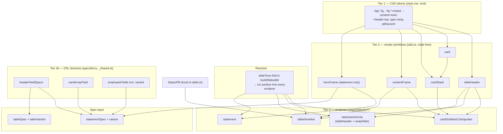

# refactor: Reusable slide-render components + variant model

## Summary

An adversarial review army (47 agents, 54 findings, 27 confirmed) found the slide deck's visual defects trace to **four structural root causes**, not slide-level bugs: `statement` has zero layout knobs (8 of 26 slides are identical), the slide frame is copy-pasted across 9 renderers (drifting headers, 4 padding constants, 2 margin rails), two footer layers render on top of each other, and light/dark polarity tracks `blockType` accident rather than slide role.

This plan fixes them at the source by introducing a **reusable-component layer** in three tiers — CSS design tokens → render primitives (`slideHeader`, `card`, `cardStack`, `contentFrame`, `heroFrame`) → block-spec field factories — plus a **variant-as-data** model so the 8 monotonous statement slides gain variety from one flexible block (no new block types, draft route auto-derives). The earlier per-file overflow band-aids (cardGrid/twoCols) are replaced by the shared `cardStack` crowding logic.

It does **not** redesign the brand, add new block types, change the Slidev build pipeline, or touch the agent-native work from the prior plan.

---

## Problem Frame

The deck renders without crashing but reads as monotonous and inconsistent. The army's confirmed findings collapse into four root causes (RC):

- **RC1 — `statement` is the only narrative block with zero layout knobs.** `src/export/blocks/statement.ts` hardcodes `wrapSlide({ layout: 'center' })` with one `max-w-4xl px-12` wrapper, one `<h1>`, one `text-xl` body; `src/blocks/spec/statement.ts` lacks even the `surface` field cover/section already use. 8 of 26 slides are byte-identical layouts differing only in text.
- **RC2 — the slide frame is copy-pasted, not shared.** Each of 9 content renderers hand-builds `eyebrow + <hN>` at a different heading size (`text-4xl`/`text-5xl`/`<h1>`), wrapper (`px-14`/`px-12`), and top padding (`pt-24`/`pt-28`/`pt-16`/`pt-20`). No `slideHeader`/`card`/`cardStack`/`contentFrame`/`heroFrame` exists. This drives: titles at 3 vertical origins, left margin wandering, `.k-card` markup hand-emitted in 3 renderers, the two ad-hoc overflow heuristics I patched per-file earlier.
- **RC3 — duplicate footer + opacity-based hierarchy.** `statement.ts` emits an inline `.k-foot` div (`bottom: 1.2rem`) that overlaps the deck-level `.k-slide-footer` from `chrome.ts` (`bottom: 1.1rem`) — confirmed as two independently-rendered layers, not a z-index issue. Separately, de-emphasis uses `opacity`/`rgba(...,0.x)` on colored grounds (8 text rules), failing AA contrast.
- **RC4 — polarity/pacing track blockType accident.** `surfaceClass()` defaults everything-not-`light` to dark and each spec picks its surface independently, producing incoherent dark/light runs. The `Section` divider block exists but the AI prompt never emits it (0/26 uses).

---

## Requirements

Each requirement traces to a root cause (RC) and the army's confirmed findings.

- **R1 (RC1)** — `statement` must support multiple layouts via a `variant` field (centered-hero, pull-quote, big-statement, split), projected through the existing DSL → render-type → AI-schema → prompt pipeline. No new block types.
- **R2 (RC2)** — Every content renderer must compose its frame from shared primitives (`slideHeader`, `card`, `cardStack`, `contentFrame`, `heroFrame`); no renderer hand-builds its header, card markup, or padding wrapper.
- **R3 (RC2)** — Title baseline, content rail (left/right inset), and heading scale must be single-sourced as CSS tokens so they cannot drift per block.
- **R4 (RC2)** — Card-stack overflow (crowded grids/columns) must be handled once in `cardStack`, replacing the per-file heuristics in `cardGrid`/`twoCols`.
- **R5 (RC3)** — There must be exactly one footer renderer; the per-block `.k-foot` is removed and a block's `footer` content routes into the deck footer.
- **R6 (RC3)** — Muted/footer/caption text must use solid color tokens at ≥4.5:1 contrast, not `opacity`/`rgba`.
- **R7 (RC4)** — A `slideTone` resolver must set light/dark per slide *role* (and alternate adjacent statements), driving a single `--bg`/`--fg` token pair, replacing the blockType-accident default.
- **R8 (RC4)** — The draft prompt must use `Section` dividers between topic groups and avoid >2 consecutive identical blockTypes, so pacing is built in.
- **R9 (RC2)** — Repeated block-spec field declarations (header fields, card arrays, emphasis bundle) must come from shared factories so render/AI key sets cannot drift.
- **R10 (RC1, info-density)** — `table` must support a `reference` vs `matrix` variant and a shared `StatusPill` primitive (ok/warn/blocked) replacing inline ✅/⚠️/❌.

**Success criteria:** no renderer contains a raw `px-NN`/`pt-NN` literal or hand-built header; the 8 statement slides render as visibly distinct layouts; the footer renders once; every muted-text rule passes AA; `pnpm test` (snapshot + parity) green; `pnpm generate:types` zero-diff after spec changes; a full deck re-render shows no regression and no overflow.

---

## Key Technical Decisions

- **KTD1 — Tokens are the foundation; introduce them first, read them later.** Add `--bg`/`--fg` tone pair, `--fg-dark-muted`/`--fg-light-muted`/`--fg-footer` (solid, AA-verified), a type ramp (`--t-display/hero/title/sub/body/caption`), `--content-inset` (one rail), `--header-top` (one title baseline), and pill/accent tokens to `:root` in `src/export/style.css`. Pure addition — nothing reads them until later units. This lets the P0 AA + header-anchor fixes land on a stable base.
- **KTD2 — Render primitives are pure functions in `src/export/utils.ts`, peers of the existing `eyebrow()`/`wrapSlide()`.** `slideHeader`, `card`, `cardStack`, `contentFrame`, `heroFrame`. They emit the same `K.*` class tokens and consume the KTD1 CSS vars. They must stay node-free (no `node:` imports) because `renderers.ts` is imported by client preview components — confirmed constraint from the consolidation plan.
- **KTD3 — `cardStack` owns the single crowding heuristic.** It replaces both `cardGrid.ts`'s `rows>2 → pt-16` and `twoCols.ts`'s `len>=4 → pt-20/space-y-2/.k-tight` logic (the band-aids from the prior session). One function decides grid-vs-column, gap, and tightness from item count against the fixed 720px canvas.
- **KTD4 — One footer.** Delete the inline `.k-foot` emission from `statement.ts` and the `.k-foot` CSS rule. A block's `footer` field content routes into the existing `.k-slide-footer` (chrome.ts) center cell, or a caption row above the rule. This removes the overlap at the source rather than restacking layers.
- **KTD5 — `slideTone(block, index)` resolves in `src/export/buildSlidesMd.ts`; tone reaches renderers via a new second `ctx` arg.** Role-based: section/cover/cta/divider → dark; table/twoCols/cardGrid/stats → light; statement → alternation. **Blast-radius correction (doc-review):** today every renderer is `render*(block): string` and `RENDERERS` types them `(block: never) => string`; there is *no* call-time channel for tone (`surface` is currently only a per-block field). So U6 must widen **every renderer signature** to `render*(block, ctx?: { surface?: Surface }): string`, widen the `RENDERERS` map type, and thread `ctx` through both `buildSlidesMd` and `preview.ts` call sites — this is a cross-cutting change folded into U5's migration, not a two-file edit. Precedence: an explicit `block.surface` field wins over the resolved tone. Renderers stay index-free (tone resolved upstream).
- **KTD5b — Tone alternation is a running fold over resolved tones, not index parity (doc-review).** `slideTone` decides a statement's tone against the *previously resolved* slide's tone, so the "no two adjacent same tone" invariant survives interleaved `Section` dividers and reordering — index parity would break once U9 inserts dividers between statements.
- **KTD6 — Variant-as-data, not new blocks.** `statementSpec` gains a `variant` select field (+ the `surface` field it lacks) via shared factories. `renderStatement` switches on `block.variant` → one `heroFrame(...)` call per branch. Projects automatically through `renderSchemaOf`/`aiSchemaOf`/`buildSystemPrompt`, so the draft route needs no schema edits (only `promptMeta` prose). `ALL_SPECS` and the `Presentations.slides` blocks array are unchanged. Same pattern later applied to `table` (R10). **No Payload-migration *today*** — migrations are an empty array on this branch; the new `variant`/`surface`/`tableVariant` are additive nullable columns that will generate an ordinary additive migration only at lock-in time (`migrate:create`), never a blocks-array change.
- **KTD6b — Variant adoption needs a deterministic fallback, not just prompt prose (doc-review).** The `Section` block proves a "told but not enforced" capability gets 0/26 adoption. So an *unset* statement variant must resolve **by index** in `buildSlidesMd` (the same seeded mechanism as tone), NOT default to `centered-hero` — guaranteeing visual variety even if the AI ignores the prompt. The prompt prose (U9) is the quality layer on top; the index fallback is the floor. U8/U9 verification asserts variant *distribution* across a real re-draft (≥2 distinct variants, no >2 consecutive identical), not just that hand-authored variants render.
- **KTD6c — `heroFrame` is scoped to `statement`'s variant dispatch only (scope + adversarial agreement).** stats/section/cta do NOT funnel through heroFrame — they each have structurally unique bodies (stat grid, number badge, button row) and only need the `surface + centered-layout` slice that `slideHeader` + `wrapSlide({layout:'center'})` already give. Forcing them through heroFrame would make it a god-function carrying `scale`/`align`/`accentRule` axes only `statement` uses. heroFrame's full param surface is justified by statement's 4 variants alone; stats/section/cta migrate to `slideHeader` + `wrapSlide`.
- **KTD7 — DSL field factories close the L2/L3 duplication `_shared.ts` left open.** `_shared.ts` already shares L1 (Payload field config). Add factories that return full `FieldSpec`s (render Zod + AI Zod + factory) for the repeated header fields and card arrays, so the three projections cannot drift. This is type-level only; the gate is `pnpm generate:types` zero-diff.
- **KTD7b — `StatusPill` stays a local helper in `table.ts`, not a shared `utils.ts` primitive (scope).** It has exactly one consumer (table's matrix variant). A 3-state pill emitter costs nothing to promote later if a second consumer (e.g. timeline status) appears; extracting it to the shared layer now is abstraction-ahead-of-need. R10 is fully satisfied either way.
- **KTD8 — Characterization-first, against assertion-based tests (doc-review correction).** `src/export/__tests__/blocks.test.ts` is **`toContain`/`toBe`-assertion based, not `.snap` snapshot files** — so "review the diff" overstates the safety net: a markup regression the assertions don't check passes silently. Mitigation: (a) the per-phase **full deck re-render** is the real regression catch (it caught the prior overflow bugs), not the unit tests; (b) migrate renderers **one at a time** (U5 split into per-renderer commits) with a re-render between, so blast radius per commit is one renderer; (c) update each renderer's `toContain` assertions to match the new shared-primitive markup as an intentional, reviewed edit. `allSpecs.parity.test.ts` (spec→artifact parity) and `pnpm generate:types` zero-diff are the hard gates for the spec units (U7/U8/U10). Primitives are built and unit-tested *before* renderers migrate onto them.

---

## High-Level Technical Design

### Component layering — what composes from what



### statement variant dispatch (R1/KTD6) — directional

```
renderStatement(block, ctx):
   variant = block.variant ?? indexResolvedVariant   // unset -> by-index, NOT centered-hero (KTD6b)
   switch variant:
     'centered-hero' -> heroFrame({ align:'center', scale:'hero',   surface })
     'big-statement' -> heroFrame({ align:'left',   scale:'display', surface })
     'pull-quote'    -> heroFrame({ align:'left',   scale:'title', accentRule:true, surface })
     'split'         -> heroFrame({ align:'split',  body on right,  surface })
   heroFrame is statement-only; it clamps/scales body against the 720px canvas (overflow contract, KTD6c)
```

### slide tone + variant resolution (R7/KTD5/KTD6b) — directional

```
buildSlidesMd: fold over slides, carrying prevTone:
   for (block, i):
     tone = slideTone(block, prevTone, i)   // running fold, not index parity (KTD5b)
     ctx  = { surface: block.surface ?? tone }  // explicit field wins
     out  = renderer(block, ctx)            // NEW 2nd arg on every renderer (KTD5)
     prevTone = tone
slideTone: section|cover|cta|divider -> 'dark'
           table|twoCols|cardGrid|stats -> 'light'
           statement -> opposite of prevTone (so neighbours differ even across dividers)
```

---

## Implementation Units

Grouped into phases mirroring the brainstorm's sequencing. Each phase composes on the prior.

### U1. CSS token foundation

**Goal:** Add the design tokens every later unit reads; zero behavior change.
**Requirements:** R3, R6 (foundation).
**Dependencies:** none.
**Files:**
- `src/export/style.css` (add `:root` tokens; no rule yet consumes them)
- `src/export/__tests__/styleContract.test.ts` (extend — assert the new tokens exist if the contract test enumerates tokens)

**Approach:** Add to `:root`: tone pair (`--bg`/`--fg` with `.k-dark` setting the dark pair, light default), `--fg-dark-muted: #B8CCCC`, `--fg-light-muted: #5A6B6B`, `--fg-footer` (each AA-verified ≥4.5:1 against its ground), the type ramp, `--content-inset` (the single left/right rail, matching today's `px-14` ≈ 112px), `--header-top` (single title baseline), and pill/accent tokens. Pure addition — existing rules untouched this unit.

**Patterns to follow:** existing `:root` block in `style.css` (lines ~66-79), the `K`-token SSOT discipline.

**Test scenarios:**
- Contract: if `styleContract.test.ts` enumerates required tokens/classes, add assertions that each new token is present.
- Test expectation: none for visual change — this unit adds unused tokens; behavior is verified when later units consume them.

**Verification:** `pnpm test` green; `style.css` parses; no rendered-HTML change (blocks.test.ts unchanged).

---

### U2. Single footer (delete duplicate `.k-foot`; statement footer becomes a caption row)

**Goal:** The footer renders exactly once; the statement's `footer` field renders as a caption inside the slide body, never overlapping the deck footer.
**Requirements:** R5.
**Dependencies:** U1 (`--fg-footer`).
**Files:**
- `src/export/blocks/statement.ts` (remove the absolute `.k-foot` div; render `footer` as an in-flow caption row above the deck footer zone)
- `src/export/style.css` (remove the `.k-foot` rule; ensure the deck `.k-slide-footer` uses `--fg-footer`; add a caption-row class if needed)
- `src/export/__tests__/blocks.test.ts` (statement assertions: footer no longer in an absolute `.k-foot` div)
- `src/export/__tests__/chrome.test.ts` (extend — deck footer still renders once, unchanged)

**Approach (corrected by doc-review):** the original "route the block footer into the deck footer center cell" is **not buildable** — `chrome.ts` sources the deck footer from *presentation-level* `footer` config (`{enabled,left,center,right}` templates resolved in `slide-bottom.vue`), with no per-block input channel. So the fix is: delete the per-block absolute `.k-foot` div (the layer that collides with the deck footer), and render the statement's `footer` richText as an **in-flow caption row inside the slide body** (part of the heroFrame content, above the deck-footer zone) — not as a second absolute-positioned footer. The deck footer (chrome.ts) is left entirely untouched and remains the single absolute footer. This removes the collision at the source without inventing per-block→deck-footer plumbing.

**Patterns to follow:** the existing in-flow content treatment in `heroFrame`/`statement` body; leave `chrome.ts` alone.

**Test scenarios:**
- Happy path: a statement with a footer renders the caption in-flow (assert it is NOT inside an absolute `.k-foot` div and the deck `.k-slide-footer` is unchanged).
- Edge: a statement with no footer renders no caption artifact.
- Regression: the deck footer markup (chrome.ts) is byte-unchanged; other renderers untouched.

**Verification:** re-render a statement slide that has a footer; the caption sits in the body and the deck slug/page footer no longer overlaps it.

---

### U3. AA contrast + header-anchor tokenization

**Goal:** Muted/footer/caption text passes AA; title baseline is single-sourced.
**Requirements:** R6, R3.
**Dependencies:** U1.
**Files:**
- `src/export/style.css` (replace `opacity:`/`rgba(...,0.x)` text rules at the 8 identified sites with `--fg-*-muted` tokens; point header rules at `--header-top`)
- `src/export/__tests__/blocks.test.ts` / `styleContract.test.ts` (update any snapshot/contract touched)

**Approach:** Replace each foreground-text `opacity`/`rgba` rule (`.k-dark p/li/.muted`, `.k-stat .lbl`, `.k-table td`, `.k-tl-desc`, `.k-tl-band`, `.k-hero-sub`, `.k-cta-sub`, dark `.k-foot`→now footer) with the solid muted tokens from U1, each verified ≥4.5:1. Lock the title baseline `--header-top`.

**Test scenarios:**
- Contract: each replaced rule uses a token, not `opacity`/`rgba` (a grep-style assertion in `styleContract.test.ts` if feasible).
- Edge: dark-ground muted text and light-ground muted text both resolve to their respective AA token.
- Verification of contrast is manual (computed ratios documented in the commit), not unit-tested.

**Verification:** re-render dark slides (stats, timeline, cta, cover); captions/sub-labels legible. Document the computed contrast ratios.

---

### U4. Render primitives in `utils.ts`

**Goal:** Build `slideHeader`, `card`, `cardStack`, `contentFrame`, `heroFrame` as pure node-free functions consuming U1 tokens. No renderer changed yet. (StatusPill is a local helper built in U10, not here — KTD7b.)
**Requirements:** R2, R4.
**Dependencies:** U1.
**Files:**
- `src/export/utils.ts` (add the 5 primitives)
- `src/export/__tests__/utils.test.ts` (new or extend — unit-test each primitive's output)

**Approach:** Each primitive emits the existing `K.*` tokens + U1 CSS vars. `slideHeader({eyebrow,title,size,sidebar})` at the fixed `--header-top` (consumed by cardGrid/twoCols/quotes/table/timeline/stats/section/cta — 8 consumers); `card({number,title,body,footer})` owns the `K.card` box + null-safe richtext slot (cardGrid/twoCols/quotes); `cardStack(cards,{layout,cols,count})` centralizes the crowding heuristic (KTD3; cardGrid/twoCols); `contentFrame(body,{topPad,wFull})` the `--content-inset` wrapper (5 consumers); `heroFrame({eyebrow,title,body,footer,scale,align,surface,accentRule})` the **statement-only** variant-dispatch surface that clamps body against the 720px canvas (KTD6c — its full param surface is justified by statement's 4 variants). Keep node-free (the `renderers.ts` client-import constraint).

**Execution note:** Build these test-first against the exact HTML the current renderers emit for matching cases, so the later migration is a provable no-op where shapes align.

**Test scenarios:**
- Happy path: `slideHeader` with eyebrow+title emits one header at the shared anchor; `card` with all fields emits the `K.card` box; `cardStack` with 4 column items applies the crowded treatment, with 3 does not (the boundary the band-aid encoded); `heroFrame` centered vs split.
- Edge: `card` with no body/number omits those slots cleanly; `cardStack` with 0 items returns empty; `slideHeader` with null eyebrow.
- Edge: `heroFrame` `big-statement`/`display` scale with a long body clamps/scales rather than overflowing the 720px canvas (the overflow contract — KTD6c; this is the band-aid-class bug the prior session patched, now owned by heroFrame).

**Verification:** `pnpm test` green; no renderer imports the primitives yet (they're additive).

---

### U5. Widen the renderer signature + migrate content renderers onto primitives

**Goal:** Every renderer takes a `ctx` second arg (carrying `surface`); cardGrid/twoCols/quotes/table/timeline/stats/section/cta compose from the U4 primitives; no raw padding/header/card literals remain.
**Requirements:** R2, R3, R4 (and the signature change that R7/U6 needs).
**Dependencies:** U4.
**Files:**
- `src/export/renderers.ts` (widen the `RENDERERS` map type `(block) => string` → `(block, ctx?: RenderCtx) => string`; define `RenderCtx`)
- `src/export/buildSlidesMd.ts` + `src/export/preview.ts` (pass `ctx` through the `renderer(block, ctx)` call — wiring lands here so U6 only adds the tone *value*)
- `src/export/blocks/cardGrid.ts`, `twoCols.ts`, `quotes.ts` (slideHeader + cardStack + contentFrame; delete the band-aid overflow logic)
- `src/export/blocks/table.ts`, `timeline.ts` (slideHeader + contentFrame)
- `src/export/blocks/stats.ts`, `section.ts`, `cta.ts` (**slideHeader + `wrapSlide({layout:'center', classAttr:surfaceClass(ctx.surface)})`** — NOT heroFrame; KTD6c)
- `src/export/__tests__/blocks.test.ts` (update `toContain` assertions per renderer — reviewed)

**Approach:** First widen the signature/map type and thread `ctx` through both call sites (the blast-radius correction from KTD5 — this is why U5, not U6, owns it). Then migrate each renderer: replace hand-built header/wrapper/card markup with primitive calls; delete the prior-session overflow heuristics in cardGrid/twoCols (now `cardStack`'s job); stats/section/cta use `slideHeader` + `wrapSlide`, not heroFrame. Each renderer reads `ctx.surface` (falling back to `block.surface` then its own default) so U6 can later drive tone without touching renderers again.

**Execution note:** Migrate **one renderer per commit**, full deck re-render between commits (the `toContain` tests don't catch markup the assertion doesn't check — the re-render is the real safety net per KTD8). Land the signature/map change as its own first commit (mechanical, no behavior change) so each renderer migration is isolated.

**Test scenarios:**
- Signature: `RENDERERS` map and both call sites accept the optional `ctx`; calling a renderer with no `ctx` reproduces today's output (the `block.surface`/default fallback).
- Happy path per renderer: output composes the primitive (assert shared header/frame markup present, raw `px-NN`/`pt-NN` absent).
- Edge: cardGrid 5-card / twoCols 4-card crowding handled by `cardStack` — no overflow class divergence, the prior clip is gone.
- Regression: each renderer's `toContain` assertions updated to the new markup; the full deck re-render after each commit shows no visual regression.

**Verification:** **full deck re-render** (e2e build on cached draft) after each renderer — headers aligned, no overflow, cards consistent. `pnpm test` green; `pnpm build` succeeds (node-free constraint holds).

---

### U6. slideTone resolver (running fold)

**Goal:** Light/dark is set per slide *role* and statements alternate against the previously-resolved tone, via one `--bg`/`--fg` pair. Builds on the `ctx` channel U5 already wired.
**Requirements:** R7.
**Dependencies:** U1, U5.
**Files:**
- `src/export/buildSlidesMd.ts` (add `slideTone`; replace `slides.map` with a fold carrying `prevTone`; set `ctx.surface`)
- `src/export/preview.ts` (mirror the same fold so `/preview` matches the build)
- `src/export/__tests__/buildSlidesMd.test.ts` (extend — tone per role + fold-based alternation across dividers)

**Approach:** Add `slideTone(block, prevTone, index)` and fold over the slides carrying `prevTone` (KTD5b — not index parity). Role table: section/cover/cta/divider→dark; table/twoCols/cardGrid/stats→light; statement→opposite of `prevTone`. Set `ctx.surface = block.surface ?? tone` (explicit field wins) and pass it via the U5 `ctx` channel — no renderer changes here.

**Test scenarios:**
- Happy path: section/cover/cta resolve dark; table/stats resolve light (assert `ctx.surface`).
- Edge (the fold's point): `statement → section(dark) → statement` does NOT produce three darks in a row — the second statement resolves light against the dark section.
- Edge: two consecutive statements resolve to different tones.
- Integration: `/preview` and `buildSlidesMd` resolve identical tones for the same deck (shared `slideTone`).

**Verification:** full deck re-render — dark/light reads as intentional rhythm, not noise or strobing.

---

### U7. DSL field factories

**Goal:** Repeated header/card/emphasis field declarations come from shared factories; specs stop copy-pasting.
**Requirements:** R9.
**Dependencies:** none (type-level; can land anytime, sequenced before U8 which consumes `emphasisFields`).
**Files:**
- `src/blocks/spec/dsl.ts` (add `headerFieldSpecs`, `cardArrayField`, `emphasisFields` factories returning full `FieldSpec`s)
- `src/blocks/_shared.ts` (shared render-Zod consts so the precise render schema reuses the same value)
- `src/blocks/spec/*.ts` (refactor specs to call the factories)
- `src/blocks/spec/__tests__/allSpecs.parity.test.ts` (must stay green — parity is the gate)

**Approach:** Factories project all three layers (L1 Payload field, L2 render Zod, L3 AI Zod) from one descriptor so key sets cannot drift. Refactor each spec's repeated `eyebrow/title/surface` opener and card arrays to the factory. Type-level only.

**Test scenarios:**
- Parity: `allSpecs.parity.test.ts` stays green (emitted block === legacy block; `renderSchemaOf(spec)` === exported literal).
- Regression: `pnpm generate:types` produces zero diff in `src/payload-types.ts`.

**Verification:** `pnpm test` green; `pnpm generate:types` zero-diff.

---

### U8. statement variant model

**Goal:** `statement` gains a `variant` (+ `surface`) field; `renderStatement` dispatches to `heroFrame`. The 8 monotonous slides become distinct.
**Requirements:** R1.
**Dependencies:** U4 (heroFrame), U7 (emphasisFields), U6 (tone).
**Files:**
- `src/blocks/spec/statement.ts` (add `variant` select + `surface` via factory; update `renderSchema` literal + `promptMeta`)
- `src/export/blocks/statement.ts` (switch on `block.variant` → `heroFrame`)
- `src/blocks/StatementBlock.ts` (regenerate via `emitPayloadBlock` if hand-mirrored)
- `src/export/__tests__/blocks.test.ts` (variant render cases)
- `src/blocks/spec/__tests__/allSpecs.parity.test.ts` (parity holds)

**Approach:** Add `variant: 'centered-hero'|'pull-quote'|'big-statement'|'split'` and the `surface` field. `renderStatement(block, ctx)` branches to one `heroFrame(...)` per variant. **Critical (KTD6b — the `Section` block's 0/26 adoption proves "told but not enforced" fails):** an *unset* variant must NOT default to `centered-hero` — it resolves **by statement-index in `buildSlidesMd`** (rotating through the 4 variants, same fold that carries tone), so the deck gets visual variety even if the AI never picks a variant. The `promptMeta` line that teaches the AI to choose deliberately is the quality layer on top of that deterministic floor. Draft route untouched (auto-derived). Run `pnpm generate:types` + `pnpm generate:importmap` (statement has richText fields).

**Test scenarios:**
- Happy path: each explicit variant value renders its distinct `heroFrame` layout (assert align/scale markup differs per variant).
- Edge (the load-bearing one): an *unset* variant resolves by index, NOT to a constant — two consecutive unset statements get different variants (assert the index rotation in `buildSlidesMd`).
- Edge: `big-statement` with a long body clamps within the canvas (heroFrame overflow contract, U4).
- Edge: invalid variant value rejected by the render/AI schema.
- Parity: `allSpecs.parity.test.ts` green; `generate:types` diff limited to the intended new field.

**Verification (distribution gate, not just hand-authored render):** re-draft the PI brief and assert the statement slides (2,10,11,12,14,15,16,18) show **≥2 distinct variants with no >2 consecutive identical** — proving the index fallback delivers variety regardless of AI behavior. `pnpm generate:importmap` clean.

---

### U9. Draft-prompt pacing rules

**Goal:** The AI emits `Section` dividers between topic groups and avoids >2 consecutive identical blockTypes; long statements divert to twoCols/markdown; quote-shaped statements route to `quotes`.
**Requirements:** R8.
**Dependencies:** none hard. (Soft: best landed after U8 so the prompt can also mention statement variants, but R8's Section-divider + consecutive-blockType rules are orthogonal to the variant model — confirmed by doc-review. U9 can ship independently of U8 if sequencing shifts.)
**Files:**
- `src/lib/draftPresentation.ts` (extend the outline/system prompt prose)
- `src/lib/__tests__/draftPresentation.test.ts` (assert the prompt contains the pacing rules)

**Approach:** Add prompt rules: mandatory `Section` divider between major topic groups; "no more than 2 consecutive identical blockTypes"; route quote-shaped content to `quotes`; divert >N-line statements to `twoCols`/`markdown`. Prose-only (no schema change).

**Test scenarios:**
- Happy path: the assembled outline/system prompt contains the Section-divider and consecutive-blockType rules (assert on the prompt string).
- Edge: explicit `S1—` briefs still honored (existing fast-path unbroken).
- Regression: existing `draftPresentation.test.ts` green.

**Verification:** a fresh draft of the PI brief uses `Section` dividers and shows no 3-in-a-row identical blockTypes; full re-render confirms improved pacing.

---

### U10. table variants + StatusPill

**Goal:** `table` supports `reference` vs `matrix` variants; status cells use a `StatusPill` helper instead of inline emoji.
**Requirements:** R10.
**Dependencies:** U7 (variant-as-field pattern, proven in U8). Not U4 — StatusPill is local here (KTD7b).
**Files:**
- `src/blocks/spec/table.ts` (add `tableVariant` select via factory; update render schema + promptMeta)
- `src/export/blocks/table.ts` (branch on variant; **define `StatusPill` as a local helper here** and use it for status columns — KTD7b)
- `src/export/style.css` (StatusPill token classes — ok/warn/blocked, reusing the U1 accent/muted tokens)
- `src/blocks/TableBlock.ts` (regenerate if hand-mirrored)
- `src/export/__tests__/blocks.test.ts` (variant + StatusPill cases)
- `src/blocks/spec/__tests__/allSpecs.parity.test.ts` (parity holds)

**Approach:** Add `tableVariant: 'reference'|'matrix'` (default `reference` = today). `matrix` uses a StatusPill column + note-treatment detail column. Replace inline ✅/⚠️/❌ with a `StatusPill(status)` helper defined locally in `table.ts` (promote to `utils.ts` only if a 2nd consumer appears). Run `generate:types`.

**Test scenarios:**
- Happy path: `reference` reproduces today's table; `matrix` renders StatusPill cells.
- Edge: omitted variant defaults to `reference` (regression guard); each status value (ok/warn/blocked) maps to its pill, unknown falls back safely.
- Parity: `allSpecs.parity.test.ts` green; `generate:types` diff only the new field.

**Verification:** full deck re-render — the matrix tables (slides 7, 19) read as scannable status grids; reference tables (3, 8, 21) unchanged.

---

## Scope Boundaries

**In scope:** U1–U10 (full brainstorm scope).

### Deferred to Follow-Up Work
- Generalizing `emphasisFields`/`variant` to `quotes` and `cta` beyond what U7/U8 establish — the pattern lands here; broad rollout is incremental.
- Icon system for content slides (the info-density lens floated icons) — beyond the token/primitive layer.
- Any net-new block type (the whole point is to avoid that).

### Out of scope (non-goals)
- Brand redesign (colors/fonts/logo) — tokens re-express the *existing* brand, not a new one.
- The Slidev build pipeline / PDF export internals.
- The agent-native work from `docs/plans/2026-06-08-001-feat-agent-native-improvements-plan.md`.
- The parallel Organisations/theming WIP.

---

## Risks & Dependencies

- **Markup churn is the main risk — and the tests are NOT a snapshot safety net.** `blocks.test.ts` uses `toContain`/`toBe` assertions, not `.snap` files (doc-review correction), so a regression in markup an assertion doesn't check passes silently. Mitigation (KTD8): the **per-renderer full deck re-render** is the real catch (it caught the prior overflow bugs); migrate one renderer per commit; update each renderer's `toContain` assertions as a reviewed edit. Do not rely on "snapshot diff review" — there is no snapshot.
- **`generate:types` drift.** U7/U8/U10 touch specs. Each must end with `pnpm generate:types` producing a diff limited to the intended new field — byte-identical labels/order otherwise (the established SSOT discipline). U8/U10 also need `pnpm generate:importmap` (statement/table carry richText fields; a missed regen renders the field blank).
- **Node-free constraint.** The new primitives live in `utils.ts` which feeds `renderers.ts`, imported by client preview components. No `node:` imports may leak in, or `pnpm build` breaks. Verify build after U4.
- **`/preview` parity.** U6's tone resolver must be mirrored in `preview.ts` or the live preview diverges from the built deck. Both consume the same `slideTone`.
- **richText fields are pervasive** (cover/section/statement/twoCols/cardGrid/stats/quotes/cta/timeline/table all carry Lexical fields) — primitives that render block content must use `richTextToHTML` with the null-safe pattern, never assume plain strings.

---

## Alternative Approaches Considered

- **Add new block types for each statement layout** (e.g. `bigStatement`, `pullQuote` blocks) instead of a `variant` field. Rejected: explodes `ALL_SPECS`, the Presentations blocks array, and the AI's choice surface; duplicates the field kit per block; violates the "few use-case-agnostic blocks" invariant. Variant-as-data keeps one block and projects through the existing pipeline.
- **Fix each visual defect in place** (per-slide CSS nudges, like the prior overflow band-aids). Rejected — that's what produced the inconsistency; the army confirmed the defects are symptoms of 4 structural causes. The user's explicit goal is fixing the codebase for the long term.
- **Resolve tone inside each renderer** (pass the index in). Rejected in favor of resolving in `buildSlidesMd` (a running fold over resolved tones) and passing `surface` down via the renderer `ctx` arg — keeps renderers index-free, survives interleaved dividers, and keeps `/preview` parity trivial.
- **Funnel stats/section/cta through `heroFrame` too** (the army's original §2B framing). Rejected (scope + adversarial): those three have structurally unique bodies and use none of heroFrame's `scale`/`align`/`accentRule` axes — forcing them through it makes a god-function. They migrate to `slideHeader` + `wrapSlide` instead; heroFrame is statement-only.
- **Default an unset statement variant to `centered-hero`.** Rejected (adversarial): the `Section` block's 0/26 AI adoption proves a told-not-enforced capability goes unused. An unset variant resolves by index so variety is guaranteed regardless of AI behavior.

---

## Phased Delivery

- **Phase A — foundation (U1, U2, U3):** tokens, single footer (caption-row, deck footer untouched), AA — the P0 correctness fixes, no primitive consumers yet. Re-render after U2/U3.
- **Phase B — primitives + migration (U4, U5, U6):** build the shared layer (5 primitives), widen the renderer signature + migrate renderers one-per-commit, role-based tone fold. The bulk of RC2/RC4. Full deck re-render after **each renderer** in U5, and after U6.
- **Phase C — variant model (U7, U8, U9):** DSL factories, statement variants with index-fallback, prompt pacing — the monotony fix (RC1). Re-render + fresh-draft distribution gate after U8; U9 is independently sequenceable.
- **Phase D — table variants (U10):** reuses the U8 variant-as-field pattern; sequenced after U8 (its only real dependency). Re-render after.

Each phase is independently shippable; if a later phase is paused, earlier phases still net-improve the deck. Per-phase verification gate: `pnpm test` (assertions + parity), `pnpm generate:types` zero-diff (+`generate:importmap` for U8/U10), `pnpm build` (node-free), and a full deck re-render reviewed against the prior render.

---

## Deferred Implementation-Time Unknowns

- Exact token values for the type ramp and `--header-top` (tune against the rendered deck in U1/U3).
- The precise `cardStack` crowding thresholds (carry forward the prior session's findings: 2-col >2 rows, column ≥4 items — refine in U4 against the canvas).
- Whether `heroFrame`'s `split` variant reuses `.k-split` directly or needs a variant-specific class scoped to statement (settle in U4; if new CSS is needed, scope it to a statement class, not a generic heroFrame split — scope-guardian note).
- The exact heroFrame body-clamp mechanism for `big-statement`/`display` overflow (CSS line-clamp vs scale-down — settle in U4 against the canvas).

*(Resolved by doc-review, no longer open: statement footer → in-flow caption row, deck footer untouched, U2; tone → running fold over resolved tones, not index parity, U6; statement unset-variant → index rotation, not centered-hero default, U8.)*

---

## Sources & Research

- Origin: `docs/brainstorms/slides-reusable-components-requirements.md` (the 47-agent adversarial synthesis — 4 root causes, 27 confirmed defects, the 3-tier component layer).
- Codebase research (this session): `utils.ts`/`wrapSlide` surface, per-renderer frame inventory, `classNames.ts` K-tokens, the 8 AA-failure CSS sites, `.k-foot` vs `.k-slide-footer` collision, `dsl.ts`/`_shared.ts` factory surface, statement spec+renderer, the test contract (`blocks.test.ts`, `allSpecs.parity.test.ts`).
- Learnings: `docs/plans/2026-06-03-001-duplication-consolidation-plan.md` (Phases 1-3 done, Tier-4 schema-as-source deferred — this plan is that Tier 4 for the render layer); `docs/solutions/2026-06-05-magic-string-ssot-consts.md` (the `as const` SSOT discipline, byte-identical-value gate); CLAUDE.md block invariants + `generate:types`/`generate:importmap` rules.
- Prior session: the cardGrid/twoCols overflow band-aids (`c685e89`, `8c3f013`) that U4's `cardStack` supersedes.
