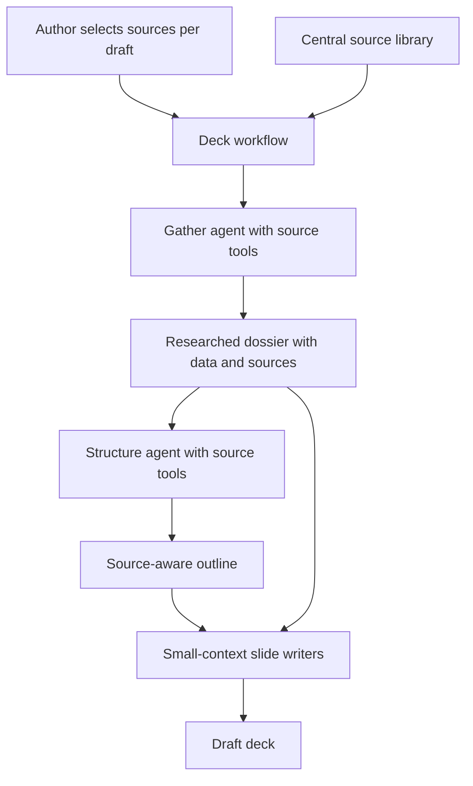

# Source-Aware Agentic Decks - Plan

## Goal Capsule

- **Objective:** Let authors choose external knowledge sources for an agentic deck draft so the generated dossier, outline, and final slides are more factual, better cited, and more useful.
- **Product authority:** This plan captures the confirmed requirements from the brainstorm; implementation planning may choose exact APIs, storage, and connector details as long as the product behavior below is preserved.
- **Open blockers:** None that block planning.

---

## Product Contract

### Summary

The agentic deck builder will become source-aware: authors can select external knowledge sources per draft, and Mastra agents use those sources to improve research quality before slides are written.
External-source tools are available to the gather and structure phases, while per-slide writers continue to work from the dossier, outline intent, and deck titles.

### Problem Frame

The current agentic build distills a user brief into a dossier and then plans and writes slides from that internal context.
That is enough for clean structure, but it cannot consult trusted knowledge bases, MCP servers, or other external data sources when the brief is incomplete or fact-heavy.
For expert decks, especially decks that need citations or domain-specific references, the value is not simply more tools; it is better factual grounding at the moment where the deck's claims are selected and organized.

### Key Decisions

- **Deck quality first.** The first version optimizes for better dossiers, outlines, citations, and factual usefulness rather than building a broad connector marketplace.
- **Per-brief source control.** Authors choose which sources inform a draft; the workflow should not silently use every configured source for every deck.
- **Agent-driven research in early phases.** Gather and structure may use source tools actively, instead of relying only on deterministic prefetch, because research needs depend on the brief and the emerging outline.
- **Small-context slide writing remains intact.** Writers should not independently query sources in v1; they inherit the researched dossier and outline so slide content stays consistent and reproducible.
- **MCP is a connector family, not the whole product.** MCP is a strong first integration path, but the product abstraction is “source available to the deck workflow,” not “MCP-only workflow.”

### Actors

- A1. **Presentation author** chooses source access for a draft and judges whether the generated deck is grounded enough to edit or publish.
- A2. **Workspace administrator** configures which external sources are available and trusted for authors.
- A3. **Gather agent** researches the brief and emits the dossier that anchors downstream steps.
- A4. **Structure agent** turns the researched dossier into an outline and may consult selected sources to improve coverage or resolve gaps.
- A5. **Writer agents** draft individual slides from the dossier and outline without direct external-source access in v1.
- A6. **External source connector** represents a knowledge base, MCP server, web/data service, or future source type exposed through a common source selection surface.

### Requirements

**Author-facing source selection**

- R1. The draft flow lets an author choose which available sources should inform a specific deck build.
- R2. The workflow can run with no selected sources and should behave like the current brief-only agentic build in that case.
- R3. Selected sources are treated as build inputs so a future reader can understand which knowledge bases influenced the generated deck.

**Source-aware research behavior**

- R4. The gather phase can call selected source tools before emitting the dossier.
- R5. The structure phase can call selected source tools when outline coverage or source-backed organization needs more evidence.
- R6. Source calls are used to improve claims, data points, examples, and citations, not to add generic filler or broaden the deck beyond the author’s brief.
- R7. The final dossier keeps facts and references traceable enough for downstream structure, writing, and review.

**Controlled tool surface**

- R8. External-source tools are not exposed to every slide writer in v1.
- R9. The source abstraction supports MCP-backed sources first while leaving room for other connector types later.
- R10. A centrally managed source library defines which source connectors are available to authors, without forcing every configured source into every build.

**Quality and reproducibility**

- R11. The workflow should preserve the current structured-output guarantees for phases that do not need source tools.
- R12. Source-aware phases may use a different multi-step tool-capable generation path if needed to call tools before emitting structured data.
- R13. Generated decks should prefer sourced, specific facts over unsourced claims when relevant sources are selected.
- R14. When selected sources cannot answer the brief’s factual need, the workflow should avoid pretending they did and should fall back to clear assumptions or brief-only content.

### Key Flows

- F1. **Draft with selected sources**
  - **Trigger:** An author starts an agentic draft and chooses one or more available sources.
  - **Actors:** A1, A3, A4, A5, A6.
  - **Steps:** The workflow passes the selected source set into gather; gather calls relevant tools and emits a sourced dossier; structure may call the same selected sources while planning coverage; writers draft slides from the resulting dossier and outline.
  - **Outcome:** The deck reflects the selected sources without giving every writer independent research access.
  - **Covers:** R1, R3, R4, R5, R7, R8.

- F2. **Draft without selected sources**
  - **Trigger:** An author starts an agentic draft without choosing external sources.
  - **Actors:** A1, A3, A4, A5.
  - **Steps:** The workflow runs the current brief-only path; gather distills the brief, structure plans the deck, and writers draft slides from internal context.
  - **Outcome:** Existing draft behavior remains available and does not depend on connector configuration.
  - **Covers:** R2, R11.

- F3. **Source library management**
  - **Trigger:** An administrator makes a trusted source available to authors.
  - **Actors:** A2, A6.
  - **Steps:** The source is registered in a central library with enough metadata for authors to choose it and enough policy for the workflow to expose its tools safely.
  - **Outcome:** Authors see a governed source option without needing to understand the source’s underlying connector technology.
  - **Covers:** R9, R10.

### Acceptance Examples

- AE1. **Selected KB improves dossier.**
  - **Covers:** R1, R4, R7, R13.
  - **Given:** An author selects a trusted fiscal knowledge base for a tax-heavy brief.
  - **When:** The agentic build reaches the gather phase.
  - **Then:** The dossier includes relevant facts or references from that source when the source contains useful material.

- AE2. **No source preserves current behavior.**
  - **Covers:** R2, R11.
  - **Given:** An author starts a draft without selecting sources.
  - **When:** The workflow runs.
  - **Then:** The build completes through the brief-only gather, structure, writer, validation, and assemble path.

- AE3. **Writers do not research independently.**
  - **Covers:** R8, R11.
  - **Given:** A source-aware deck reaches per-slide drafting.
  - **When:** Writer agents draft individual slides.
  - **Then:** They use the dossier, slide intent, and other slide titles rather than calling source connectors directly.

- AE4. **Unhelpful source does not create fake certainty.**
  - **Covers:** R6, R14.
  - **Given:** A selected source has no relevant information for a claim the brief implies.
  - **When:** Gather or structure tries to use the source.
  - **Then:** The workflow should not invent a source-backed citation for that claim.

### Success Criteria

- Generated dossiers contain more specific data points, examples, or references when selected sources contain relevant material.
- Authors can tell which sources were selected for a generated draft.
- The source-aware path does not degrade the no-source path.
- The structure and writer phases keep the deck coherent instead of producing source-by-source fragments.
- Planning can extend the current Mastra workflow without replacing the whole agentic build architecture.

### Scope Boundaries

- Per-slide writer source access is deferred beyond v1.
- A full data-ingestion product or dlt-like connector marketplace is outside v1.
- Automatic use of every configured source for every draft is outside scope.
- The plan does not require replacing Mastra, the current Payload draft trigger, or the Slidev build/export pipeline.
- Fine-grained implementation choices such as storage shape, UI fields, exact MCP server configuration format, and tracing schema are deferred to planning.

### Dependencies / Assumptions

- The project keeps Mastra as the agent workflow runtime.
- The existing workflow can accept selected-source context as part of the draft/build input.
- At least one external source type, likely MCP-backed, can be configured in the runtime environment used by the Payload worker.
- Tool-capable phases can coexist with the current forced structured-output path instead of requiring every agent call to become multi-step.

### Outstanding Questions

#### Deferred to Planning

- Which source metadata belongs in Payload versus environment configuration.
- How authors select sources in the admin draft UI.
- How selected sources are persisted for traceability and future rebuilds.
- How to cap tool-call latency and failure behavior during queued builds.
- Whether source citations should appear only in internal build metadata, in the generated deck, or both.

### Sources / Research

- The central Mastra singleton currently registers the workflow, storage, and scorers at `src/agents/mastra.ts:27`.
- The current structured generation surface creates a throwaway `Agent` with only the forced `emit` tool at `src/agents/model.ts:98` and `src/agents/model.ts:105`.
- The generate call uses `toolChoice: 'required'` and `maxSteps: 1` at `src/agents/model.ts:149`, which is incompatible with arbitrary multi-step research tool use unless a separate path is introduced.
- The gather phase already names research tools as future work at `src/agents/agents/gather.ts:4`.
- Structure currently plans from a dossier and includes dossier sources in its prompt at `src/agents/agents/structure.ts:42`.
- Writers currently see only the dossier excerpt, the current slide intent, and other slide titles at `src/agents/agents/writer.ts:70`.
- Current Mastra documentation shows MCP-backed tools are exposed to agents through `MCPClient` and `tools: await mcp.listTools()`, while the Mastra instance can proxy MCP servers through `mcpServers`.