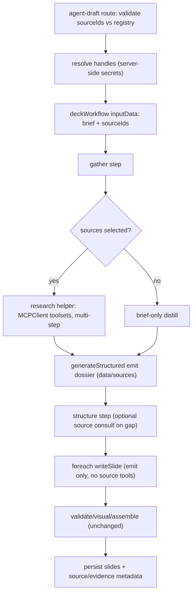

# Source-Aware Agentic Decks - Plan

## Goal Capsule

- **Objective:** Let authors choose external knowledge sources for an agentic deck draft so the generated dossier, outline, and slides are more factual and better cited, with source evidence persisted for traceability.
- **Authority hierarchy:** The Product Contract below is the source of truth for behavior. Where this plan's technical choices conflict with existing repo conventions, repo conventions win; surface the conflict rather than diverging silently.
- **Stop conditions:** Stop and surface a blocker if a change would require per-slide writers to call sources directly, would replace the forced `emit` structured-output contract, or would push MCP connector secrets into Payload — all are out of scope for v1.
- **Tail ownership:** Whoever lands the final unit updates `.env.example`, `AGENTS.md` AI-drafting notes, and runs `pnpm generate:types` for the new draft fields.
- **Product Contract preservation:** Product Contract unchanged. Two requirements-only open questions are now resolved as decisions: source library is runtime-configured (KTD1), evidence is build-metadata only (KTD5).

---

## Product Contract

### Summary

The agentic deck builder becomes source-aware: authors select external knowledge sources per draft, and Mastra agents use those sources to improve factual grounding before slides are written.
External-source tools are available to the gather and structure phases; per-slide writers continue to work from the dossier, outline intent, and deck titles.

### Problem Frame

The current agentic build distills a user brief into a dossier (`src/agents/agents/gather.ts`) and then plans and writes slides from that internal context.
That is enough for clean structure, but it cannot consult trusted knowledge bases, MCP servers, or other external data sources when the brief is incomplete or fact-heavy.
For expert decks that need citations or domain references, the value is not simply more tools; it is better factual grounding at the moment where the deck's claims are selected and organized.

### Key Decisions

- **Deck quality first.** v1 optimizes for better dossiers, outlines, and persisted citations rather than building a broad connector marketplace.
- **Per-brief source control.** Authors choose which sources inform a draft; the workflow never silently uses every configured source.
- **Agent-driven research in early phases.** Gather and structure may actively query selected source tools rather than relying only on deterministic prefetch.
- **Small-context slide writing stays intact.** Writers do not query sources in v1; they inherit the researched dossier and outline.
- **MCP is a connector family, not the whole product.** MCP is the first integration path, but the source abstraction is "a source available to the deck workflow," not "MCP-only."

### Actors

- A1. Presentation author chooses source access for a draft and judges whether the generated deck is grounded enough to edit or publish.
- A2. Workspace administrator (operator) configures which external source connectors are available and trusted, via runtime config.
- A3. Gather agent researches the brief and emits the dossier that anchors downstream steps.
- A4. Structure agent turns the researched dossier into an outline and may consult selected sources to close coverage gaps.
- A5. Writer agents draft individual slides from the dossier and outline without direct external-source access in v1.
- A6. External source connector represents a knowledge base, MCP server, or future source type exposed through a common selection surface.

### Requirements

**Author-facing source selection**

- R1. The draft flow lets an author choose which available sources should inform a specific deck build.
- R2. The workflow can run with no selected sources and behaves like the current brief-only agentic build in that case.
- R3. Selected sources are persisted as build metadata so a future reader can see which sources influenced the generated deck.

**Source-aware research behavior**

- R4. The gather phase can call selected source tools before emitting the dossier.
- R5. The structure phase can call selected source tools when outline coverage needs more evidence.
- R6. Source calls improve claims, data points, examples, and citations, not generic filler that broadens the deck beyond the brief.
- R7. The final dossier keeps facts and references traceable enough for downstream structure, writing, and review.

**Controlled tool surface**

- R8. External-source tools are not exposed to per-slide writers in v1.
- R9. The source abstraction supports MCP-backed sources first while leaving room for other connector types.
- R10. A runtime-configured source library defines which connectors are available to authors, without forcing every configured source into every build.

**Quality and reproducibility**

- R11. The workflow preserves the current forced `emit` structured-output guarantees for phases that do not need source tools.
- R12. Source-aware phases use a separate multi-step tool-capable generation path so tool calls precede structured emission.
- R13. Generated decks prefer sourced, specific facts over unsourced claims when relevant sources are selected.
- R14. When selected sources cannot answer the brief's factual need, the workflow falls back to clear assumptions or brief-only content rather than fabricating source-backed citations.

### Key Flows

- F1. Draft with selected sources
  - **Trigger:** An author starts an agentic draft and selects one or more available sources.
  - **Actors:** A1, A3, A4, A5, A6.
  - **Steps:** The route validates selected source IDs against the registry and threads them into the workflow; gather calls relevant source tools and emits a sourced dossier; structure may call the same sources while closing coverage gaps; writers draft slides from the resulting dossier and outline; selected sources and collected evidence persist as build metadata.
  - **Outcome:** The deck reflects the selected sources without giving writers independent research access.
  - **Covers:** R1, R3, R4, R5, R7, R8.

- F2. Draft without selected sources
  - **Trigger:** An author starts an agentic draft without selecting external sources.
  - **Actors:** A1, A3, A4, A5.
  - **Steps:** The workflow runs the current brief-only path; gather distills the brief, structure plans the deck, writers draft slides.
  - **Outcome:** Existing draft behavior is unchanged and does not depend on connector configuration.
  - **Covers:** R2, R11.

- F3. Source library configuration
  - **Trigger:** An operator adds a trusted source connector to runtime config.
  - **Actors:** A2, A6.
  - **Steps:** The connector is declared in runtime config with an id, label, and transport; the registry exposes safe author-facing metadata (id + label) while keeping secrets server-side.
  - **Outcome:** Authors see a governed source option without seeing or managing connector secrets.
  - **Covers:** R9, R10.

### Acceptance Examples

- AE1. Selected KB improves dossier.
  - **Covers:** R1, R4, R7, R13.
  - **Given:** An author selects a trusted knowledge base for a fact-heavy brief.
  - **When:** The agentic build reaches the gather phase.
  - **Then:** The dossier's `data`/`sources` include relevant material drawn from that source when the source contains useful material.

- AE2. No source preserves current behavior.
  - **Covers:** R2, R11.
  - **Given:** An author starts a draft without selecting sources.
  - **When:** The workflow runs.
  - **Then:** The build completes through the brief-only gather, structure, writer, validate, and assemble path with no tool-capable agent invoked.

- AE3. Writers do not research independently.
  - **Covers:** R8, R11.
  - **Given:** A source-aware deck reaches per-slide drafting.
  - **When:** Writer agents draft individual slides.
  - **Then:** They use only the dossier excerpt, slide intent, and other slide titles — no source connectors and no tools other than `emit`.

- AE4. Unhelpful source does not create fake certainty.
  - **Covers:** R6, R14.
  - **Given:** A selected source has no relevant information for a claim the brief implies.
  - **When:** Gather or structure queries the source.
  - **Then:** The dossier does not gain a fabricated source-backed citation for that claim.

- AE5. Invalid source id is rejected.
  - **Covers:** R10.
  - **Given:** A draft request names a source id not present in the runtime registry.
  - **When:** The agent-draft route validates the request.
  - **Then:** The route rejects the request (or drops the unknown id) rather than constructing an unconfigured connector.

### Success Criteria

- Dossiers contain more specific data points, examples, or references when selected sources hold relevant material.
- Authors can tell from the persisted draft metadata which sources were selected for a generated draft.
- The source-aware path does not change behavior or output of the no-source path.
- Structure and writers keep the deck coherent rather than producing source-by-source fragments.
- The change extends the current Mastra workflow without replacing the deck pipeline or the forced `emit` contract.

### Scope Boundaries

- Per-slide writer source access — deferred beyond v1.
- A full data-ingestion product or dlt-like connector marketplace — outside v1.
- Automatic use of every configured source for every draft — outside scope.
- Visible citation rendering in slides — deferred (evidence is build metadata only in v1).
- Replacing Mastra, the Payload draft trigger, or the Slidev build/export pipeline — out of scope.

#### Deferred to Follow-Up Work

- A Payload-managed source collection with admin UI for connector metadata (v1 uses runtime config).
- Rendering citations/footnotes onto slides via block-spec changes.
- Non-MCP connector adapters (HTTP/REST data services, uploaded-corpus retrieval).
- Caching/rate-limit policy for source tool calls under queued builds.

### Dependencies / Assumptions

- The project keeps Mastra (`@mastra/core@1.41.0`) as the agent workflow runtime.
- `@mastra/mcp` is added as a new dependency (latest compatible `^1.12.x`; peer range allows core `1.41`).
- At least one MCP server is reachable from both the web process and the `payload-worker` process that runs queued builds.
- The forced `emit` structured-output path can coexist with a separate tool-capable agent path in the same module.

### Outstanding Questions

#### Deferred to Planning — resolved

- Source library location → runtime config (KTD1).
- Citation surface → build metadata only in v1 (KTD5).

#### Deferred to Implementation

- Exact MCP transport per environment (stdio `command`/`args` vs remote `url`) — depends on the deployment's available MCP servers.
- Per-source tool-call timeout tuning under the existing `RUN_TIMEOUT_MS` envelope.

---

## Planning Contract

### Key Technical Decisions

- KTD1. **Runtime-configured source registry.** Sources are declared in server-side runtime config (env-driven, mirroring `src/lib/agentConfig.ts` and `src/lib/env.ts`), not a Payload collection. The registry exposes only `{ id, label }` to clients; transport details and secrets stay server-side. Rationale: MCP secrets/commands belong in deployment config and must be identical in the web and worker processes; a Payload collection would add schema, UI, and secret-handling scope for no v1 benefit.
- KTD2. **MCP via `@mastra/mcp` `listToolsets()`, request-scoped.** Build a per-run `MCPClient` for the selected sources and pass tools via `toolsets` at generate time, calling `disconnect()` when the run ends. Rationale: selected sources vary per request; `listToolsets()` is the documented dynamic path, and request-scoped clients avoid holding connections open across idle time in the worker.
- KTD3. **Separate tool-capable generation path; do not touch the forced-`emit` path.** Add a research helper alongside `generateStructured` in `src/agents/model.ts` that runs a multi-step tool-using Agent (no `toolChoice: 'required'`, `maxSteps > 1`) and returns researched text/notes. `generateStructured` stays exactly as-is for the final structured emission. Rationale: the repo invariant (`src/agents/model.ts:149`, `toolChoice:'required'` + `maxSteps:1`) is incompatible with free tool use; mixing source tools into the forced `emit` call would never let the model call them.
- KTD4. **Research feeds the dossier, not the writers.** Gather runs optional research first, then `generateStructured` emits the dossier whose `data`/`sources` arrays absorb the findings (`src/agents/schemas.ts:24`). Structure consults sources only to close coverage gaps. Writers are untouched. Rationale: keeps the small-context writer discipline and the alignBatch invariant intact.
- KTD5. **Evidence persisted as build metadata only.** Persist selected source ids and a compact evidence list on the presentation's draft fields (alongside `draftStatus`/`draftEvents`/`draftRunId`), not into slide content. No renderer or block-spec changes in v1. Rationale: confirmed scope; avoids visual-design and block-spec churn while still delivering traceability.
- KTD6. **Selected sources thread through workflow input, not state.** Extend `InputSchema` in `src/agents/workflow.ts` with an optional `sourceIds` array (and resolved source handles passed in `inputData`), consumed by the gather and structure steps. Rationale: sources are per-run inputs the early steps consume, mirroring how `brief` flows; run-level booleans like `visual` stay in state.

### High-Level Technical Design

The deck workflow graph is unchanged in shape; only gather and structure gain an optional research pre-step driven by resolved source handles.



Source resolution boundary (directional, not implementation spec):

```text
registry (runtime):  id -> { id, label, transport(secret) }
client surface:      id -> { id, label }              // safe to send to admin UI
run resolution:      sourceIds[] -> handles[]          // server-side, includes transport
research helper:     handles[] -> MCPClient.toolsets   // disconnect() after run
```

### Output Structure

New `src/lib/sources/` module:

```text
src/lib/sources/
  registry.ts            # runtime source declarations + client-safe projection
  resolve.ts             # sourceIds -> server-side handles; unknown-id handling
  mcpConnector.ts        # @mastra/mcp client lifecycle, toolsets, disconnect
  types.ts               # SourceId, SourceDescriptor, ResolvedSource, Evidence
  __tests__/registry.test.ts
  __tests__/resolve.test.ts
  __tests__/mcpConnector.test.ts
```

---

## Implementation Units

### U1. Source registry and types (runtime config)

- **Goal:** Declare available source connectors in runtime config and expose a client-safe `{ id, label }` projection.
- **Requirements:** R9, R10; A2, A6.
- **Dependencies:** none.
- **Files:** `src/lib/sources/types.ts`, `src/lib/sources/registry.ts`, `src/lib/sources/__tests__/registry.test.ts`, `.env.example` (document the source env vars).
- **Approach:** Parse source declarations from env (mirror the `numberEnv` pattern in `src/lib/agentConfig.ts:5` and the production-vs-dev posture of `src/lib/env.ts:11`). Each descriptor carries `id`, `label`, and transport config (stdio `command`/`args` or remote `url`). Export `listSourceDescriptors()` (server-side, full) and `listSourceOptions()` (client-safe `{ id, label }`). Never include transport/secret fields in the client projection.
- **Patterns to follow:** `src/lib/agentConfig.ts`, `src/lib/env.ts`.
- **Test scenarios:**
  - Covers R10. Given two declared sources in env, `listSourceOptions()` returns exactly their `{ id, label }` with no transport fields.
  - Given no source env configured, both lists are empty and no throw.
  - Given a malformed source declaration, it is skipped (or rejected) deterministically, not partially constructed.
  - `listSourceDescriptors()` exposes transport while `listSourceOptions()` does not (redaction assertion).
- **Verification:** `pnpm test src/lib/sources/__tests__/registry.test.ts` passes; `listSourceOptions` output contains no secret keys.

### U2. Source resolution and unknown-id handling

- **Goal:** Turn requested `sourceIds` into server-side resolved handles, rejecting/dropping unknown ids.
- **Requirements:** R10; AE5.
- **Dependencies:** U1.
- **Files:** `src/lib/sources/resolve.ts`, `src/lib/sources/__tests__/resolve.test.ts`.
- **Approach:** `resolveSources(ids)` maps ids to descriptors from the registry. Define one explicit policy for unknown ids (reject vs drop-and-report) and document it in the function; the route (U7) surfaces it. Deduplicate ids; cap the count to a small configurable max.
- **Patterns to follow:** validation posture in `src/app/(payload)/api/agent-draft/route.ts:23`.
- **Test scenarios:**
  - Covers AE5. Given an id not in the registry, resolve rejects (or returns it in an `unknown` list) — assert the chosen policy explicitly.
  - Given duplicate ids, the resolved set is deduplicated.
  - Given more ids than the cap, the excess is rejected/truncated deterministically.
  - Given an empty id list, resolves to an empty handle set (drives the no-source path).
- **Verification:** `pnpm test src/lib/sources/__tests__/resolve.test.ts` passes.

### U3. MCP connector lifecycle

- **Goal:** Build a request-scoped `MCPClient` from resolved handles, expose `toolsets`, and guarantee cleanup.
- **Requirements:** R9, R12.
- **Dependencies:** U2.
- **Files:** `src/lib/sources/mcpConnector.ts`, `src/lib/sources/__tests__/mcpConnector.test.ts`, `package.json` (add `@mastra/mcp`).
- **Approach:** Add `@mastra/mcp@^1.12.x`. `openSourceToolsets(handles)` constructs `new MCPClient({ servers })` from resolved transports, returns `{ toolsets, disconnect }` using `listToolsets()`. Always `disconnect()` in a `finally`. Apply a per-call timeout consistent with the route's `RUN_TIMEOUT_MS` envelope. Never log transport secrets.
- **Patterns to follow:** Mastra MCP client reference (`listToolsets`, `disconnect`, `toMCPServerProxies`); timeout posture in `src/agents/model.ts:31`.
- **Test scenarios:**
  - Given resolved handles, `openSourceToolsets` constructs a client with one server entry per handle (MCPClient mocked).
  - `disconnect` is called even when toolset listing throws.
  - Returned toolsets are namespaced per source; no secret appears in returned metadata or logs.
  - Empty handle set returns empty toolsets without constructing a client.
- **Verification:** `pnpm test src/lib/sources/__tests__/mcpConnector.test.ts` passes; `pnpm typecheck` clean with the new dependency.

### U4. Tool-capable research helper in the agent model layer

- **Goal:** Add a multi-step tool-using generation path that does NOT disturb the forced-`emit` path.
- **Requirements:** R12, R11.
- **Dependencies:** U3.
- **Files:** `src/agents/model.ts`, `src/agents/__tests__/model.test.ts`.
- **Approach:** Add `researchWithSources({ name, instructions, prompt, toolsets, timeoutMs })` that builds an `Agent` and calls `agent.generate(..., { toolsets, maxSteps: N })` WITHOUT `toolChoice: 'required'`, returning the model's researched notes/text. Keep `generateStructured` byte-for-byte on its forced-`emit`, `maxSteps:1` contract. Reuse the transient-retry wrapper.
- **Patterns to follow:** existing Agent construction and `withTransientRetry` in `src/agents/model.ts`.
- **Test scenarios:**
  - `generateStructured` still rejects non-`emit` responses and parses `emit` args (existing cases in `src/agents/__tests__/model.test.ts` stay green).
  - `researchWithSources` passes `toolsets` and a `maxSteps > 1` to `agent.generate` (mock asserts options).
  - `researchWithSources` does NOT set `toolChoice: 'required'`.
  - Transient gateway error triggers one retry then succeeds.
- **Verification:** `pnpm test src/agents/__tests__/model.test.ts` passes.

### U5. Source-aware gather

- **Goal:** Optionally research selected sources before emitting the dossier, enriching `data`/`sources`.
- **Requirements:** R4, R6, R7, R13, R14; AE1, AE4.
- **Dependencies:** U4.
- **Files:** `src/agents/agents/gather.ts`, `src/agents/__tests__/gather.test.ts` (new).
- **Approach:** Extend `gather(brief, resolvedSources?)`. When sources are present, run `researchWithSources` to collect grounded notes, then feed those notes into the existing `generateStructured` dossier prompt so the model folds verified facts into `data`/`sources`. Add an instruction enforcing R6/R14 (no filler, no fabricated citations). When no sources, behavior is identical to today. Collect a compact evidence list for persistence (U9).
- **Patterns to follow:** current `gather` distillation and `INFORMATIONAL_STYLE_PROMPT` validation in `src/agents/agents/gather.ts`.
- **Test scenarios:**
  - Covers AE1. Given source notes containing a fact, the dossier prompt includes those notes and the emitted `data`/`sources` carry them (mock `researchWithSources` + `generateStructured`).
  - Covers AE2/R2. Given no sources, `researchWithSources` is not called and output equals the brief-only path.
  - Covers AE4. Given empty/irrelevant source notes, no fabricated source string is forced into `sources`.
  - `rawBrief` is still injected after the LLM call.
- **Verification:** `pnpm test src/agents/__tests__/gather.test.ts` passes.

### U6. Source-aware structure (coverage gaps only)

- **Goal:** Let structure consult selected sources when key points are uncovered, without changing the fast-path.
- **Requirements:** R5, R6.
- **Dependencies:** U4.
- **Files:** `src/agents/agents/structure.ts`, `src/agents/__tests__/structure.test.ts`.
- **Approach:** Thread resolved sources into `structure(dossier, resolvedSources?)`. The deterministic `S1—…Sn—` fast-path is unchanged. In the LLM coverage-retry loop (`uncoveredKeyPoints`), when sources exist and points remain uncovered, allow a source-consult research turn before re-planning. No tool access when sources are absent.
- **Patterns to follow:** coverage-retry loop in `src/agents/agents/structure.ts:131`.
- **Test scenarios:**
  - Existing fast-path tests remain green (no LLM, no tools) — `src/agents/__tests__/structure.test.ts`.
  - Given uncovered key points and a source, a research consult runs before the re-plan attempt (mocked).
  - Given full coverage on first plan, no source consult runs.
  - Given no sources, behavior is identical to today even when points are uncovered.
- **Verification:** `pnpm test src/agents/__tests__/structure.test.ts` passes.

### U7. Thread sources through the workflow and entry points

- **Goal:** Carry `sourceIds`/resolved handles into the workflow and the gather/structure steps.
- **Requirements:** R1, R2, R4, R5.
- **Dependencies:** U5, U6, U2.
- **Files:** `src/agents/workflow.ts`, `src/agents/runFromBrief.ts`.
- **Approach:** Extend `InputSchema` (`src/agents/workflow.ts:211`) with optional `sourceIds`/resolved handles in `inputData`; pass them into the `gather` and `structure` step executes. `visual`/`title` stay in state. Update `runDeckFromBrief` to accept optional sources for diagnostic scripts.
- **Patterns to follow:** how `brief` flows through `gatherStep`/`structureStep` and how `visual` is read from state.
- **Test scenarios:**
  - Test expectation: covered by U5/U6 step tests plus U8 integration test; assert no-source input still runs the existing graph unchanged.
  - `runDeckFromBrief` without sources behaves exactly as today.
- **Verification:** `pnpm test src/agents` passes; `pnpm typecheck` clean.

### U8. agent-draft route: accept and validate sources

- **Goal:** Accept `sourceIds`, validate against the registry, and thread resolved handles into the run.
- **Requirements:** R1, R3, R10; AE5.
- **Dependencies:** U2, U7.
- **Files:** `src/app/(payload)/api/agent-draft/route.ts`, `src/app/(payload)/api/agent-draft/__tests__/route.test.ts` (new).
- **Approach:** Extend `requestSchema` (`route.ts:23`) with `sourceIds: z.array(z.string()).optional()`. After auth and the existing access check, resolve sources via U2; on unknown ids apply the U2 policy and return 400 when rejecting. Pass resolved handles into `run.stream({ inputData })`. Keep the fire-and-forget + `RUN_TIMEOUT_MS` structure intact. Stash selected source ids for persistence (U9).
- **Patterns to follow:** existing auth/access/re-entrancy guards in `route.ts:50`.
- **Test scenarios:**
  - Covers AE5. Given an unknown source id, the route responds 400 (or drops per policy) and does not start a run with an unconfigured source.
  - Given valid ids, resolved handles reach `inputData` (mock the workflow run).
  - Given no `sourceIds`, the request behaves like today (no-source path).
  - Unauthenticated and unauthorized requests still return 401/403 before any source resolution.
- **Verification:** `pnpm test src/app/(payload)/api/agent-draft/__tests__/route.test.ts` passes.

### U9. Persist selected sources and evidence as build metadata

- **Goal:** Store selected source ids and a compact evidence list on the presentation's draft fields.
- **Requirements:** R3, R7; Success Criteria (author can tell which sources were used).
- **Dependencies:** U8, U5.
- **Files:** `src/collections/Presentations.ts` (IA tab fields), `src/agents/tools/persist.ts`, `src/payload-types.ts` (regen), `src/lib/buildFingerprint.ts` (review only).
- **Approach:** Add read-only `draftSources` (json) and `draftEvidence` (json, hidden) fields next to `draftStatus`/`draftEvents`/`draftRunId` in the IA tab (`Presentations.ts:215`). Persist them via the existing `persistSlides`/route update path under `CTX.skipBuildQueue`. Do NOT add these to `buildFingerprint` (`src/lib/buildFingerprint.ts:14`) — they are provenance, not build-affecting input; confirm in review. Run `pnpm generate:types`.
- **Patterns to follow:** existing draft fields and `context: { [CTX.skipBuildQueue]: true }` updates in `route.ts:110`.
- **Test scenarios:**
  - Test expectation: schema/field presence covered by a Presentations field test if one exists; otherwise assert persistence in the route test (U8) that `draftSources` is written after a successful run.
  - Persisting draft metadata does not change `buildFingerprint` output (regression assertion).
- **Verification:** `pnpm generate:types` succeeds; `pnpm test` green; fingerprint unchanged for metadata-only edits.

### U10. Admin UI source selection

- **Goal:** Let authors pick available sources in the IA tab before launching a build.
- **Requirements:** R1, R2.
- **Dependencies:** U1, U8.
- **Files:** `src/components/AgentDraftButton.tsx`, a small read endpoint or registry-options fetch for `listSourceOptions()`.
- **Approach:** Fetch client-safe `{ id, label }` options and render a multi-select (checkbox list) above the launch button, mirroring the existing `mode`/`visual` controls (`AgentDraftButton.tsx:257`). Include selected ids in the `adminPost('/api/agent-draft', …)` body. When no sources are configured, hide the control entirely so the no-source path is the default.
- **Patterns to follow:** the existing radio/checkbox control block and `adminPost` call in `AgentDraftButton.tsx:169`.
- **Test scenarios:**
  - Test expectation: none (admin UI panel, no behavioral unit test harness today) — manual verification: with sources configured, the selector appears and selected ids reach the request; with none configured, the selector is absent.
- **Verification:** Manual smoke in the admin IA tab; build a deck with and without a selected source and confirm `draftSources` persists.

### U11. Docs and env wiring

- **Goal:** Document the source env contract and the gather/structure source path.
- **Requirements:** R9, R10.
- **Dependencies:** U1, U3.
- **Files:** `.env.example`, `AGENTS.md` (AI drafting section).
- **Approach:** Document the source-declaration env vars (id/label/transport) and the requirement that the same MCP config is present in both the web and `payload-worker` processes. Add a short note in `AGENTS.md` that source-aware gather/structure use a separate tool-capable path while final emission stays on forced `emit`.
- **Patterns to follow:** existing AI section in `.env.example:9` and the AI-drafting notes in `AGENTS.md`.
- **Test scenarios:** Test expectation: none — docs only.
- **Verification:** `.env.example` documents every new var; `AGENTS.md` reflects the two-path generation model.

---

## Verification Contract

| Gate | Command | Applies to |
|---|---|---|
| Unit tests | `pnpm test` | U1–U9 |
| Targeted source tests | `pnpm test src/lib/sources` | U1–U3 |
| Targeted agent tests | `pnpm test src/agents` | U4–U7 |
| Route test | `pnpm test src/app/(payload)/api/agent-draft/__tests__/route.test.ts` | U8 |
| Types | `pnpm generate:types` then `pnpm typecheck` | U9 (new draft fields), U3 (new dep) |
| Lint/format | `pnpm check` / `pnpm format:check` | all |
| Manual smoke | Build a deck in the IA tab with and without a selected source | U10, U9 |

Behavioral gates worth asserting explicitly: AE2/AE3 (no-source and writer-isolation) must hold — a source-aware change that alters the no-source output or grants writers tools is a failure regardless of green unit tests.

---

## Definition of Done

- All Implementation Units complete with their test scenarios passing; `pnpm test` and `pnpm typecheck` green.
- No-source drafts produce byte-identical behavior to the current pipeline (AE2), and writers receive only the `emit` tool (AE3).
- Selected sources and evidence persist as build metadata and are visible on the presentation doc (R3); `buildFingerprint` is unaffected by metadata-only edits.
- `generateStructured`'s forced-`emit` contract is unchanged (R11).
- `.env.example` and `AGENTS.md` document the runtime source registry and the two-path generation model.
- Abandoned/experimental code paths removed; no dead tool-capable scaffolding left in the diff.

---

## System-Wide Impact

- **Process parity:** MCP connector config must be present in both the web process and the `payload-worker` (queued builds run there). A source reachable only from the web process will fail in worker-driven builds.
- **Secret handling:** Connector transport/secrets live in runtime config only; the client projection and persisted metadata must never carry them.
- **Latency envelope:** Source tool calls add latency inside the existing `RUN_TIMEOUT_MS` window; per-source timeouts must keep the whole run under it.

---

## Sources / Research

- Central Mastra singleton registers the workflow/storage/scorers: `src/agents/mastra.ts:27`.
- Forced `emit` structured-output path (`toolChoice:'required'`, `maxSteps:1`): `src/agents/model.ts:149`; throwaway Agent with single `emit` tool around `src/agents/model.ts:98`.
- Gather names research tooling as future work and emits `data`/`sources`: `src/agents/agents/gather.ts:4`, `src/agents/schemas.ts:24`.
- Structure coverage-retry loop: `src/agents/agents/structure.ts:131`.
- Writers' small-context contract: `src/agents/agents/writer.ts:70`.
- Workflow input/state shape: `src/agents/workflow.ts:211`; diagnostic entry `src/agents/runFromBrief.ts`.
- Draft route request schema, auth/access, fire-and-forget run, `RUN_TIMEOUT_MS`: `src/app/(payload)/api/agent-draft/route.ts:23`.
- Admin IA tab draft fields and UI panel: `src/collections/Presentations.ts:215`, `src/components/AgentDraftButton.tsx:169`.
- Build fingerprint inputs (provenance must stay out): `src/lib/buildFingerprint.ts:14`.
- Env/config patterns: `src/lib/agentConfig.ts:5`, `src/lib/env.ts:11`, `.env.example:9`.
- Mastra MCP API: `@mastra/mcp` `MCPClient`, `listTools()` (static) vs `listToolsets()` (dynamic), `toMCPServerProxies()`; `@mastra/mcp` latest `^1.12.x` with peer `@mastra/core >=1.0 <2.0`.