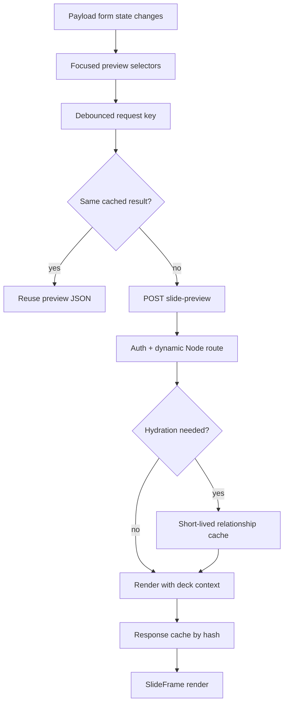
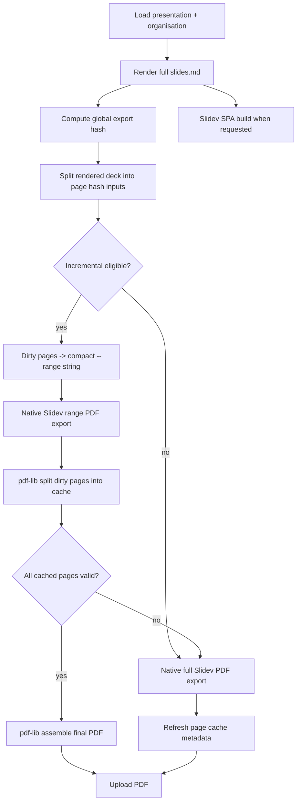
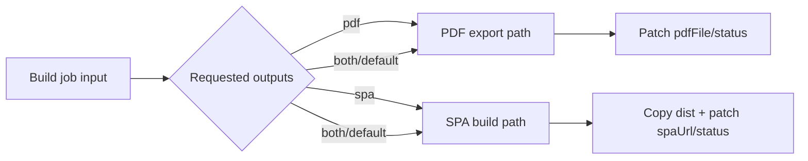

# Preview and Export Performance Pipeline - Plan

## Goal Capsule

- **Objective:** Make slide preview and export faster, cleaner, and more native to Slidev while preserving visual parity between admin preview, Slidev SPA output, and PDF export.
- **Authority:** User-confirmed scope covers every identified preview/export improvement, including the larger partial-PDF cache path with safe fallback.
- **Execution profile:** Deep performance plan across Payload admin preview, Slidev export jobs, agent PNG scoring export, build observability, and deployment/runtime configuration.
- **Stop conditions:** Stop and surface a blocker if an optimization would make preview diverge from final Slidev output, require a new external binary in Docker, or make generated PDF artifacts incomplete without an automatic full-export fallback.

---

## Product Contract

### Summary

This plan reduces preview churn, removes repeated hydration work, aligns preview render context with final deck rendering, and extends the export pipeline around native Slidev features. Phase 1 keeps full export as the correctness baseline; Phase 2 adds a default-off incremental PDF cache using Slidev `--range` plus in-process PDF assembly only after measurement and smoke gates pass.

### Problem Frame

The main build path has already moved toward native Slidev export flags, single-pass PDF export, and current Slidev/Playwright versions. Remaining cost sits in two places: admin preview fires server renders aggressively while editing, and export still treats every full-deck PDF as all-or-nothing even though Slidev supports page ranges.

Preview correctness also has hidden performance impact. `renderBlockPreview` currently resolves tone as if every block were first in the deck, while `buildSlidesMd` folds across the real deck for tone alternation, statement variants, and agenda section context. Fixing performance must not increase that divergence.

### Requirements

**Preview performance and parity**

- R1. Debounce live preview requests so typing in a slide field does not issue one POST per form-state render.
- R2. Avoid repeated database hydration for unchanged organisation and cover intervenant relationships during preview editing.
- R3. Cache server preview responses by a safe request hash so repeated redraws and tab switches reuse identical render output.
- R4. Preserve server-rendered relationship hydration as the canonical preview path while adding a no-extra-hydration fast path for blocks that do not need relationship population.
- R5. Compute preview tone, statement variant, agenda section context, footer page, and footer total from the same deck context rules used by final export.
- R6. Reduce repeated full-form scans and `JSON.stringify` churn in the admin preview component by extracting focused, testable selectors.
- R7. Mark the slide-preview route as dynamic Node runtime work so Next/Turbopack does not treat the authenticated Payload route as a static-compatible surface.
- R19. Require `presentationId` on preview requests and verify `Presentations.read` access before rendering or caching preview output; responses are private/no-store.

**Export performance and native Slidev usage**

- R8. Keep native Slidev export flags centralized and shared across PDF and PNG export paths.
- R9. Update the agent PNG export path to use the same `--wait-until` and Mermaid-aware settle strategy as the main PDF export path.
- R10. Add timing instrumentation for hydration, markdown render, staging, Slidev build, Slidev export, upload, SPA copy, and cache assembly.
- R11. Support explicit output policy so jobs can request PDF, SPA, or both instead of always running both artifacts when the caller only needs one.
- R12. Make the existing Vite/Slidev cache posture explicit and observable rather than adding an unproven cache override.
- R13. Add a safe, default-off incremental PDF path that uses Slidev `--range` to render dirty pages and `pdf-lib` to split/assemble cached page PDFs only after measurement and smoke gates pass.
- R14. Preserve automatic full-export fallback whenever page cache state is incomplete, invalid, corrupt, or slower than the measured full-export path.

**Operations and verification**

- R15. Document operator controls for export tuning: environment switches for per-slide fallback, export timeout, PDF TOC, and incremental PDF cache; and the job-input/admin controls for output policy (output policy is a per-job input, not an env switch).
- R16. Keep worker parallelism compatible with Payload job locking and stale build-token skips.
- R17. Add tests for cache keys, dirty-range computation, preview debounce/selectors, hydration-cache behavior, and export arg generation.
- R18. Verify with both unit tests and real Slidev smoke exports for full PDF, range PDF, and PNG output.
- R20. Generated PDFs, SPAs, and page-cache artifacts must not bypass presentation-level read access; generic logged-in media access is not sufficient for deck artifacts.

### Scope Boundaries

#### In Scope

- Admin slide preview responsiveness and correctness.
- Server preview hydration/cache behavior.
- Main Slidev PDF/SPA build job.
- Agentic PNG export used for visual scoring.
- Native Slidev export flags: `--wait-until`, `--wait`, `--timeout`, `--range`, `--with-toc`, and `--per-slide` only as fallback.
- In-process PDF assembly using a Node dependency rather than relying on host-only PDF CLI binaries.

#### Deferred to Follow-Up Work

- Full client-side preview rendering migration. The plan first reduces server churn and preserves relationship-hydrated preview parity; a browser-only renderer can be reconsidered once server request volume and hydration cost are measured.
- CDN or HTTP cache headers for published SPA/PDF assets. This plan focuses on generation and preview paths, not public delivery optimization.
- Cross-deck cache sharing. Page caches stay scoped to a presentation/version to avoid accidental reuse across themes or organisations.

---

## Planning Contract

### Key Technical Decisions

- KTD1. **Server preview remains canonical.** Keep `/api/slide-preview` as the relationship-aware preview authority, then reduce request volume and repeated hydration before considering a client-only renderer.
- KTD2. **Preview context comes from one render-context helper.** Extract deck-context computation from `buildSlidesMd` so preview and final export share tone, statement variant, and section derivation instead of duplicating partial logic.
- KTD3. **Export flags stay native and centralized.** Extend the existing `slidevExportArgs` helper rather than reintroducing ad-hoc CLI arrays in export tools.
- KTD4. **Partial PDF caching hashes rendered page inputs.** Compute page hashes from generated per-page markdown plus global export dependencies, not from hand-modeled slide fields; this automatically captures total-page changes, tone-chain shifts, footer changes, theme CSS, and setup assets.
- KTD5. **PDF assembly uses `pdf-lib`.** The host has `qpdf`, `pdfunite`, `mutool`, and `gs`, but the Docker image does not install them. `pdf-lib` is MIT-licensed, pure JavaScript, and supports `copyPages`, so it keeps production portable.
- KTD6. **Incremental PDF has full-export fallback by default.** Any missing cached page, page-count mismatch, invalid PDF, merge failure, stale token, or disabled cache flag falls back to a normal full Slidev export and refreshes cache metadata.
- KTD7. **Measurement precedes threshold tuning.** Add timing logs first, then choose when incremental export defaults on based on observed deck sizes and dirty-page ratios.
- KTD8. **Preview hydration cache is keyed per authenticated user.** Payload access control is role-based, not user-id-based, so the only safe cache scope is `[user.id, collection, id, depth]`. A broader org-scoped key could cross role boundaries and leak data; per-user keying is conservative and correct, and can be revisited only with an explicit role-rank check if profiling shows churn between co-admins.
- KTD9. **Slidev `--range` page-order behavior is verified before incremental PDF is enabled.** Whether a range export renumbers pages from 1 or preserves source page positions is an external, unverified Slidev behavior. U6 smoke coverage pins it experimentally and, if Slidev renumbers, the assembly maps the N-th range-output page back to the N-th dirty slide index. Incremental PDF stays disabled by default until this is proven.
- KTD10. **Generated deck artifacts inherit presentation access.** Optimizing export must not preserve or expand any current artifact leak. SPAs are served only after a `Presentations.read` check, generated PDFs are either served through a gated route or tagged with presentation ownership and access rules, and page-cache PDFs live outside any public/media-served tree.

### High-Level Technical Design

Preview request flow:

Export flow with safe incremental PDF path:

Output policy flow:

### Phased Delivery

- **Phase 1 — confirmed performance and parity work:** U1-U8, U10, and U11. This phase reduces preview/export waste, fixes preview parity, adds timing evidence, shares native Slidev arg policy, documents cache posture, and hardens artifact access without introducing page-level PDF caching.
- **Phase 2 — gated incremental PDF cache:** U9 only. Start this phase after Phase 1 timing logs show full PDF export still dominates meaningful deck builds and range smoke tests prove page order/count behavior. Keep the feature flag off by default until warm-cache measurements beat full export for the configured deck-size/dirty-ratio envelope.

### Assumptions

- Slidev `--range` output order is not assumed; tests and smoke exports lock the mapping before enabling incremental assembly.
- Decks do not use click-step exports today; if `--with-clicks` becomes required, page hashing must incorporate click pages before incremental PDF caching can be enabled.
- The existing shared `node_modules/.vite` cache through the staged symlink remains the correct cache posture unless timing logs show repeated dependency pre-bundling.

### Risks & Dependencies

- Partial PDF caching can silently corrupt output if page hashes miss global dependencies. Mitigation: hash rendered page chunks plus global assets and always validate page count before upload.
- In-memory preview caches can leak user-specific content if keyed too broadly. Mitigation: include authenticated user or access-relevant relationship IDs in cache scope, and keep TTL short.
- Multiple worker replicas can race on the same page cache directory. Mitigation: write cache artifacts to build-token-scoped temp files and rename atomically, or scope cache refresh to the active build token.
- `pdf-lib` adds a dependency in the main app workspace. Mitigation: keep it server-only under jobs modules and verify Next bundle does not pull it into client components.

---

## Implementation Units

### U1. Export Timing and Observability Baseline

- **Goal:** Add structured timings around every build-stage boundary before changing more behavior.
- **Requirements:** R10, R12, R14, R18.
- **Dependencies:** None.
- **Files:**
  - `src/jobs/buildSlidesRunner.ts`
  - `src/jobs/buildTiming.ts`
  - `src/jobs/__tests__/buildTiming.test.ts`
- **Approach:** Introduce a small timing helper that records named stage durations and emits one compact log line with presentation ID, build token, requested outputs, slide count, Mermaid presence, cache mode, and stage durations. Keep logs data-only; do not log slide content or prompt material.
- **Patterns to follow:** Existing Payload logger usage in `src/jobs/buildSlidesRunner.ts`; status/error patching with `CTX.skipBuildQueue`.
- **Test scenarios:**
  - Given a fake clock and two timed stages, the helper returns both durations and total elapsed time.
  - Given a stage throws, the helper still records elapsed time before rethrowing.
  - Given build metadata with no optional values, the log payload omits undefined fields rather than serializing noisy placeholders.
- **Verification:** Build logs identify whether export, SPA build, hydration, upload, or cache assembly dominates a real run.

### U2. Preview Request Debounce and Focused Selectors

- **Goal:** Reduce admin preview POST volume and form-state serialization work while preserving live feedback.
- **Requirements:** R1, R6, R17.
- **Dependencies:** None.
- **Files:**
  - `src/components/SlidePreview.tsx`
  - `src/components/slidePreviewState.ts`
  - `src/components/__tests__/slidePreviewState.test.ts`
- **Approach:** Extract pure helpers for block payload, section titles, slide index, total slide count, and chrome fields. Debounce the computed request key by 150-250ms before fetch. Keep the existing `AbortController` so an in-flight request is still canceled when a newer debounced request starts.
- **Patterns to follow:** Current `useFormFields` subscription style in `src/components/SlidePreview.tsx`; pure utility test style in nearby `src/lib/__tests__` files.
- **Test scenarios:**
  - Given form fields with three sections out of order, selector returns titles sorted by slide index.
  - Given unrelated form fields change, selector output for a slide preview remains stable.
  - Given rapid changes inside the debounce window, only the final request key becomes eligible for fetch.
  - Given an empty block type, the component clears preview state and does not enqueue a fetch.
- **Verification:** Typing in one field produces materially fewer preview API calls while still updating after the debounce delay.

### U3. Dynamic Preview Route and Relationship Hydration Cache

- **Goal:** Make the preview API explicitly dynamic, access-checked, and free of repeated relationship fetches during edit bursts.
- **Requirements:** R2, R4, R7, R17, R19.
- **Dependencies:** U2.
- **Files:**
  - `src/app/(payload)/api/slide-preview/route.ts`
  - `src/lib/previewHydrationCache.ts`
  - `src/app/(payload)/api/slide-preview/__tests__/previewHydration.test.ts`
- **Approach:** Declare the route as Node/dynamic. Require the client to send `presentationId`; the route reads that presentation with the authenticated `user` and `overrideAccess: false` before rendering, so it cannot act as a generic SSR oracle for arbitrary block data. Add a short-lived server cache keyed by authenticated user, collection, id, and depth for organisation and cover intervenant hydration. Fast-path hydration only for server-verified relationship snapshots already present in the hydration cache; never trust client-supplied populated logo/avatar objects as authoritative. Keep `overrideAccess: false` and authenticated `user` on Payload reads, and set `Cache-Control: private, no-store` on preview responses.
- **Patterns to follow:** Relationship ID extraction already in `route.ts`; access-safe Payload `findByID` calls in the same route.
- **Test scenarios:**
  - Given two preview requests for the same organisation and user, only one hydration read is needed inside the TTL.
  - Given a request from a different authenticated user, cache entries do not cross user scope.
  - Given a server-verified organisation snapshot already exists in the hydration cache, hydration is skipped.
  - Given an unauthenticated request, the route still returns 401 and does not read cache data.
  - Given a `presentationId` the user cannot read, the route returns 403/404 and renders nothing.
  - Given a hydration failure, preview falls back to the original relationship value and still renders when possible.
- **Verification:** Repeated edits on a cover slide stop issuing redundant organisation/user hydration reads.

### U4. Shared Render Context for Preview and Export

- **Goal:** Make preview tone, statement variant, sections, page, and total match final deck rendering.
- **Requirements:** R5, R17.
- **Dependencies:** U2.
- **Files:**
  - `src/export/renderContext.ts`
  - `src/export/buildSlidesMd.ts`
  - `src/export/preview.ts`
  - `src/export/__tests__/buildSlidesMd.test.ts`
  - `src/export/__tests__/preview.test.ts`
- **Approach:** Extract the fold logic that computes per-slide surface, statement variant index, sections, page, and total into a pure helper. `buildSlidesMd` consumes the full context array. The client sends a compact ordered block-type array plus current slide index in the preview request, so the server can compute the same tone chain and statement indexes without trusting the whole deck body. `renderBlockPreview` accepts a resolved context for the current slide and falls back to current behavior only when no deck context is supplied.
- **Patterns to follow:** Existing `slideTone` fold and `statementIndex` handling in `buildSlidesMd`; current `sections` threading into `renderBlockPreview`.
- **Test scenarios:**
  - Given a dark cover followed by a statement, preview context for that statement produces a light surface matching `buildSlidesMd`.
  - Given multiple statements separated by section slides, statement variant indexes match final deck output.
  - Given an agenda block with no authored items, preview receives the same section list as final export.
  - Given an ordered block-type array and a current slide index, the server computes the same surface and statement variant the export fold produces for that position.
  - Given a single block preview without deck context, fallback remains safe and returns a preview rather than null.
- **Verification:** Admin preview for statement and agenda slides visually matches PDF/SPA output for the same deck position.

### U5. Preview Response Cache and No-Extra-Hydration Fast Path

- **Goal:** Reuse identical rendered preview JSON and avoid unnecessary server work for simple blocks.
- **Requirements:** R3, R4, R17.
- **Dependencies:** U3, U4.
- **Files:**
  - `src/app/(payload)/api/slide-preview/route.ts`
  - `src/lib/previewResponseCache.ts`
  - `src/app/(payload)/api/slide-preview/__tests__/previewResponseCache.test.ts`
- **Approach:** Hash the authenticated user scope, block payload, preview field path, sections, chrome fields, and relationship IDs/populated relationship versions. Cache the final `{ chrome, preview }` JSON for a short TTL. Route simple blocks through render without relationship hydration while still requiring auth and using the same response shape.
- **Patterns to follow:** Hash-based build fingerprint pattern in `src/lib/buildFingerprint.ts`; null-safe preview degradation in `src/export/preview.ts`.
- **Test scenarios:**
  - Given identical request bodies under the same user, second request returns cached preview JSON.
  - Given the same body under a different user, cache miss occurs.
  - Given a changed footer template, cache miss occurs and chrome updates.
  - Given a non-cover block with no organisation logo needed, hydration functions are not called.
  - Given cache TTL expiry, the next request recomputes preview output.
- **Verification:** Preview route CPU/DB work drops under repeated identical admin redraws without returning stale chrome or relationship data.

### U6. Native Slidev Export Args for PNG Scoring

- **Goal:** Bring `exportSlidePngs` under the same native Slidev flag policy as PDF export.
- **Requirements:** R8, R9, R18.
- **Dependencies:** U1.
- **Files:**
  - `src/jobs/slidevExportArgs.ts`
  - `src/jobs/__tests__/slidevExportArgs.test.ts`
  - `src/agents/tools/exportSlidePngs.ts`
  - `src/agents/tools/__tests__/exportSlidePngs.test.ts`
- **Approach:** Generalize the export-arg helper with a `format` option for PDF and PNG output while keeping PDF-specific TOC/range behavior separate. Use `--wait-until load` for ordinary decks and Mermaid-aware `networkidle` plus settle wait for diagram decks. Keep `--per-slide` for PNG only if smoke tests prove Slidev omits global/per-slide layers without it; otherwise drop it there too. Add range smoke tests here, before U9, so the plan knows how Slidev maps `--range` output pages back to source slide indexes.
- **Patterns to follow:** Existing `slidevExportArgs.ts` tests; current staging pattern in `exportSlidePngs.ts`.
- **Test scenarios:**
  - Given PNG export with no Mermaid, args include `--format png` and `--wait-until load` but no fixed wait.
  - Given PNG export with Mermaid, args include `--wait-until networkidle` and Mermaid settle wait.
  - Given a deck with no Mermaid fence, Mermaid detection returns false.
  - Given a deck with a top-level Mermaid fence, Mermaid detection returns true.
  - Given a six-slide smoke deck exported with `--range 2-4`, output contains exactly slides 2, 3, and 4 in order.
  - Given a six-slide smoke deck exported with `--range 2,4,6`, output contains exactly slides 2, 4, and 6 in order, and the result documents whether Slidev renumbers output pages from 1.
- **Verification:** Visual scoring PNG export still returns images in page order and uses the same wait policy as PDF export.

### U7. Output Policy for PDF, SPA, or Both

- **Goal:** Avoid launching both Slidev processes when the caller only needs one artifact.
- **Requirements:** R11, R15, R18.
- **Dependencies:** U1.
- **Files:**
  - `src/jobs/buildSlides.ts`
  - `src/jobs/buildSlidesRunner.ts`
  - `src/hooks/afterPresentationChange.ts`
  - `src/components/RebuildMenuItem.tsx`
  - `src/components/BuildStatusField.tsx`
  - `src/collections/Presentations.ts`
  - `src/hooks/__tests__/afterPresentationChange.test.ts`
  - `src/jobs/__tests__/buildSlidesRunner.outputs.test.ts`
- **Approach:** Extend job input with an output policy such as `both`, `pdf`, or `spa`. Publishing remains `both` to preserve PDF/SPA parity for normal content changes. Targeted rebuilds are explicit maintenance/debug actions only. Store per-artifact freshness metadata (content fingerprint/build token) for PDF and SPA; the admin UI warns when targeted rebuilds leave artifacts on different fingerprints. Runner patches only artifacts that were requested, while status reflects the requested job outcome. Stale-token and fingerprint checks remain unchanged.
- **Patterns to follow:** Existing build token queueing in `afterPresentationChange`; existing status patching in `buildSlidesRunner`.
- **Test scenarios:**
  - Given default queue input, runner builds both PDF and SPA.
  - Given PDF-only input, runner does not call `slidev build` and does not overwrite `spaUrl`.
  - Given SPA-only input, runner does not create media PDF and does not delete previous PDF.
  - Given PDF-only input after slide changes, UI/metadata marks SPA as stale instead of implying parity.
  - Given normal publish/update queueing, output policy is always `both`.
  - Given a stale token, no artifact writes happen regardless of requested output policy.
  - Given a failed requested artifact, status becomes failed with the error message.
- **Verification:** Targeted rebuild actions save one Slidev process when only one artifact is needed.

### U8. Explicit Slidev Cache Posture

- **Goal:** Make the current Vite/Slidev cache behavior clear, measurable, and protected by tests.
- **Requirements:** R12, R15.
- **Dependencies:** U1.
- **Files:**
  - `src/jobs/buildSlidesRunner.ts`
  - `src/jobs/__tests__/stageBuildDir.test.ts`
  - `.env.example`
  - `CLAUDE.md`
- **Approach:** Keep the existing `node_modules` symlink staging because it preserves Vite's default `node_modules/.vite` cache across temp workdirs. Add a small staging contract test that verifies the symlinked `node_modules` path is used. Document why a custom cache directory is not introduced unless timing data shows dependency pre-bundling remains expensive.
- **Patterns to follow:** Current staging helper in `buildSlidesRunner`; project instruction style in `CLAUDE.md`.
- **Test scenarios:**
  - Given a staged workdir, `node_modules` is a symlink to `slidev-workspace/node_modules`.
  - Given media exists, staged workdir links media without copying it.
  - Given fonts exist, staged workdir copies fonts into public fonts as before.
- **Verification:** Export logs and tests show cache posture is stable and intentional.

### U11. Generated Artifact Access Boundary

- **Goal:** Ensure PDF, SPA, and future cache artifacts cannot be read outside presentation-level access rules.
- **Requirements:** R20, R14, R16.
- **Dependencies:** U1.
- **Files:**
  - `src/app/(frontend)/spa/[slug]/[[...path]]/route.ts`
  - `src/collections/Media.ts`
  - `src/jobs/buildSlidesRunner.ts`
  - `src/jobs/pdfPageCache.ts`
  - `src/app/(frontend)/spa/[slug]/[[...path]]/__tests__/route.test.ts`
  - `src/collections/__tests__/Media.access.test.ts`
  - `src/jobs/__tests__/pdfPageCache.test.ts`
- **Approach:** Replace any slug-only SPA authorization with a `Presentations.find`/`findByID` read check using the authenticated `user` and `overrideAccess: false`. For generated PDFs, either move serving behind a presentation-gated route or tag media records with the presentation and enforce media read access by matching `Presentations.read`; use opaque filenames rather than slug-only names. Keep incremental page-cache files under a private cache root outside `media/`, `public/`, staged `dist/`, or any upload-served directory.
- **Patterns to follow:** Existing presentation access helpers in `src/access/roles.ts`; Payload relationship/access patterns in collections; `MEDIA_DIR` path constants in `src/lib/paths.ts`.
- **Test scenarios:**
  - Given a user without read access to a presentation slug, SPA route returns not found/forbidden and does not serve files.
  - Given a user without read access to a presentation, generated PDF media/route is not readable even if filename or media id is known.
  - Given a cache path request, page-cache files are not under `MEDIA_DIR`, `public`, or SPA `dist`.
  - Given a generated PDF filename, it is opaque enough not to be slug-predictable.
- **Verification:** Deck artifacts are at least as restricted as their presentation records before any cache optimization runs.

### U9. Incremental PDF Cache with Native Slidev Range Export

- **Goal:** Re-render only dirty PDF pages when safe, then assemble a full PDF from cached one-page PDFs.
- **Requirements:** R13, R14, R15, R17, R18, R20.
- **Dependencies:** U1, U4, U6, U7, U8, U11.
- **Files:**
  - `package.json`
  - `pnpm-lock.yaml`
  - `src/lib/paths.ts`
  - `src/jobs/pdfPageCache.ts`
  - `src/jobs/pdfPageHash.ts`
  - `src/jobs/pdfAssemble.ts`
  - `src/jobs/renderedDeckPages.ts`
  - `src/jobs/buildSlidesRunner.ts`
  - `src/jobs/__tests__/pdfPageHash.test.ts`
  - `src/jobs/__tests__/pdfAssemble.test.ts`
  - `src/jobs/__tests__/pdfPageCache.test.ts`
  - `src/jobs/__tests__/incrementalPdfExport.test.ts`
  - `.env.example`
- **Approach:** Add `pdf-lib` behind a server-only module guard for page copying. After full `slides.md` generation, split rendered pages and compute page hashes from each rendered page chunk plus a global dependency hash: base headmatter, themed headmatter, chrome headmatter, base CSS, theme CSS, setup file content hashes, font file hashes, Slidev/Playwright/pdf-lib versions, export args excluding output/range, and media fingerprints for every referenced logo/avatar/image (`id`, `updatedAt`, filename, filesize, mime type, or content digest when available). Dirty pages become a compact Slidev `--range` string only when incremental mode is enabled and eligibility gates pass: minimum slide count, maximum dirty-page ratio, warm-cache completeness, validated range smoke behavior, and measured/estimated incremental time below full-export baseline. Slidev exports dirty pages into one partial PDF; `pdf-lib` maps the N-th range-output page back to the N-th dirty slide index, splits it into private one-page cache entries, validates total cached pages, and assembles final PDF in deck order. Cache writes use build-token-scoped temporary files/directories, validate, then atomic rename; readers ignore temp files; stale build tokens never refresh shared cache. Any validation failure, missing dependency fingerprint, page-count mismatch, corrupt PDF, high dirty ratio, or slower estimate falls back to full native export and refreshes cache safely.
- **Patterns to follow:** `buildFingerprint` stable hashing style; `slidevExportArgs` range support; Payload media upload path in `buildSlidesRunner`.
- **Test scenarios:**
  - Given two identical rendered pages and identical global deps, page hashes are stable across runs.
  - Given the same logo filename but changed media `updatedAt`/filesize/content, the affected pages are marked dirty.
  - Given only slide 3 body changes in a five-slide deck, dirty range is `3`.
  - Given slides 2, 3, and 5 dirty, dirty range is `2-3,5`.
  - Given slide count changes, every page is marked dirty and cache assembly requires a full cache set before upload.
  - Given missing cached page 4, incremental path falls back to full export.
  - Given partial PDF page count does not match dirty range count, incremental path fails closed and falls back.
  - Given a dirty ratio above the configured maximum, the runner uses full export.
  - Given an estimated incremental time above the full-export baseline, the runner uses full export.
  - Given a concurrent stale build token, its cache writes are skipped and shared cache is not refreshed.
  - Given a partial temp cache file from an interrupted run, readers ignore it.
  - Given valid cached pages and one dirty range PDF, assembled PDF page count equals deck page count.
  - Given `SLIDEV_EXPORT_INCREMENTAL_PDF` unset or `0` (the default), runner always uses full export.
  - Given `SLIDEV_EXPORT_INCREMENTAL_PDF=1`, eligibility gates pass, and cache warm, runner uses `--range` only for dirty pages.
- **Verification:** A one-slide edit in a large warm-cache deck uses one Slidev range export and produces a final PDF with the same page count as full export.

### U10. Operational Documentation and Smoke Coverage

- **Goal:** Make the new performance controls understandable and safe to operate.
- **Requirements:** R15, R16, R18.
- **Dependencies:** U1-U9, U11.
- **Files:**
  - `.env.example`
  - `CLAUDE.md`
  - `slidev-workspace/package.json`
  - `slidev-workspace/pnpm-lock.yaml`
  - `src/jobs/__tests__/slidevExportArgs.test.ts`
- **Approach:** Document export controls: timeout, TOC, per-slide fallback, output policy, incremental PDF cache enable/threshold, and worker replica guidance. Keep Slidev and Playwright versions pinned to known-good latest versions. Add smoke-test notes for full PDF, range PDF, PNG export, and compose validation.
- **Patterns to follow:** Existing command documentation in `CLAUDE.md`; existing env commentary in `.env.example`.
- **Test scenarios:**
  - Test expectation: documentation-only changes do not need unit tests beyond the smoke/verification commands listed in the Verification Contract.
- **Verification:** New env controls are discoverable without reading source code, and smoke commands prove the native Slidev flags work on the installed version.

---

## Verification Contract

| Gate | Scope | Expected Signal |
|---|---|---|
| Typecheck | All TypeScript changes | `pnpm typecheck` passes. |
| Targeted preview tests | Preview selectors, context, route helpers, caches | `pnpm test src/components 'src/app/(payload)/api/slide-preview' src/export/__tests__/preview.test.ts` passes. |
| Targeted export tests | Slidev args, PDF cache/hash/assembly, runner output policy, PNG export args | `pnpm test src/jobs src/agents/tools src/export` passes. |
| Full test suite | Regression coverage | `pnpm test` passes. |
| Slidev version check | Native flag assumptions | `pnpm --dir slidev-workspace exec slidev export --help` shows `--range`, `--wait-until`, `--timeout`, `--with-toc`, and `--per-slide`. |
| PDF smoke | Native full export | Minimal `slidev export --format pdf --wait-until load` produces non-empty PDF. |
| Range smoke | Native partial export | Minimal multi-slide deck exported with `--range` produces expected page count. |
| PNG smoke | Agent scoring export | `exportSlidePngs` returns page-ordered PNGs for a small deck. |
| Compose validation | Worker/env changes | `docker compose -f docker-compose.yaml config` succeeds, ignoring warnings for unset local env variables. |
| Performance evidence | Optimization result | Build logs show stage timings and at least one warm-cache single-slide edit uses less PDF export time than full export, or incremental mode remains disabled with documented reason. |

---

## Definition of Done

- Preview fetches are debounced and repeated identical preview requests reuse cache without leaking data across users.
- Preview visual context for tone, statement variants, agenda sections, page, and total matches final deck rendering rules.
- The slide-preview route is explicitly dynamic Node runtime work and keeps authentication/access checks intact.
- Main PDF export, PNG scoring export, and future range export paths share one native Slidev argument policy.
- Build logs include actionable timings for every major stage.
- Output policy can skip unused PDF or SPA work only for explicit targeted rebuilds; normal publish/update builds both, and mixed-fingerprint artifacts are visible in admin metadata.
- Existing Vite/Slidev cache posture is documented, tested, and observable.
- Generated PDF, SPA, and page-cache artifacts inherit presentation-level access boundaries.
- Incremental PDF export is disabled by default until timing/range smoke gates pass; when enabled, it uses Slidev `--range` and `pdf-lib` assembly only when cache state is complete, valid, private, and expected faster; otherwise it falls back to full native export.
- Environment variables and operational notes explain every export fallback and tuning switch.
- All verification gates in the Verification Contract pass, or any skipped gate has a written reason tied to an environment limitation.
- Abandoned experiments from implementation are removed before completion.

---

## Sources / Research

- `src/components/SlidePreview.tsx` currently computes multiple JSON strings from Payload form fields and POSTs on each relevant render.
- `src/app/(payload)/api/slide-preview/route.ts` currently hydrates organisation and cover intervenant relationships per request and has no explicit `dynamic`/`runtime` route declaration.
- `src/export/preview.ts` currently computes preview tone with `slideTone(blockType, null)`, while `src/export/buildSlidesMd.ts` folds over the full deck with previous tone and statement variant state.
- `src/jobs/buildSlidesRunner.ts` is the main PDF/SPA build path and already centralizes native PDF args through `src/jobs/slidevExportArgs.ts`.
- `src/agents/tools/exportSlidePngs.ts` still uses a bespoke Slidev PNG export command with fixed wait and per-slide behavior.
- Pinned Slidev `52.16.0` exposes native export flags `--range`, `--wait-until`, `--timeout`, `--with-toc`, and `--per-slide`.
- `pdf-lib` `1.17.1` is MIT-licensed and supports `PDFDocument.copyPages`, which is sufficient for page extraction and assembly without adding OS-level PDF tools to Docker.
